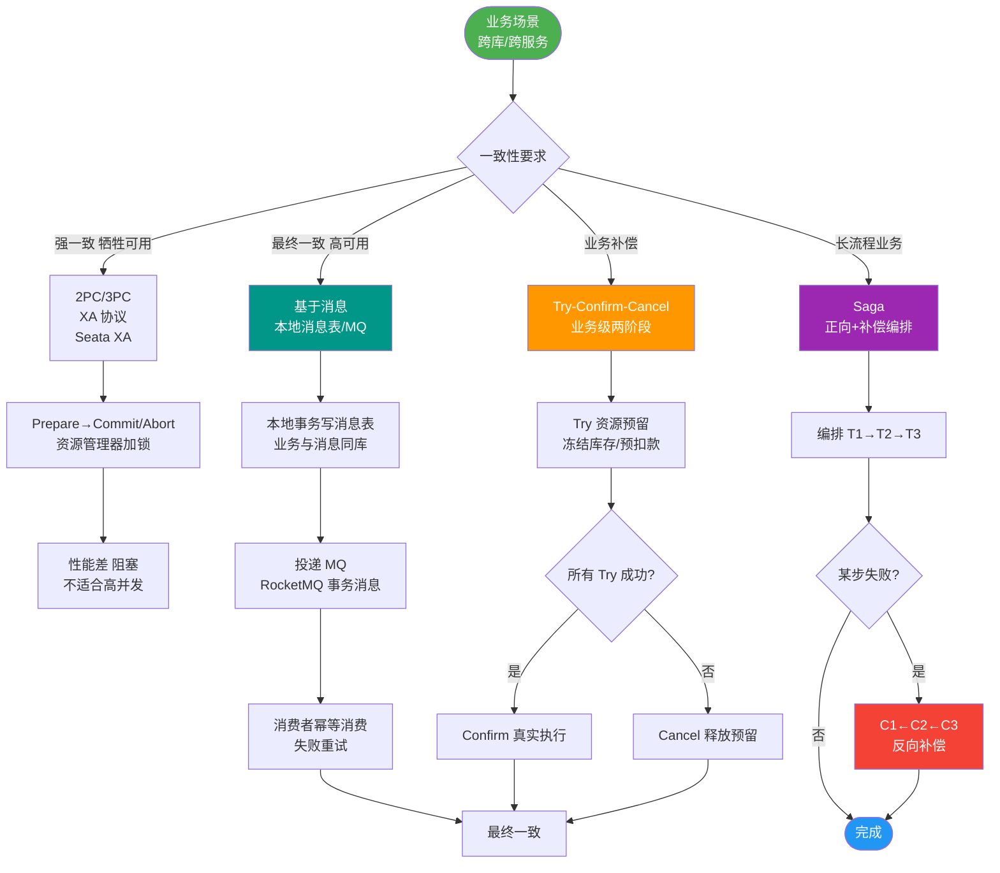

# Saga分布式事务模式是什么？补偿事务如何设计？

🎯 本质：Saga是一系列本地事务的序列，每个本地事务更新数据并发布消息/事件触发下一个事务，如果某步失败则执行前面所有事务的补偿操作。

📊 Saga vs 2PC/XA：
| 特性 | 2PC/XA | Saga |
|------|--------|------|
| 一致性 | 强一致 | 最终一致 |
| 性能 | 差(锁等待) | 好(无全局锁) |
| 可用性 | 低(参与者全可用) | 高(部分可用也可运行) |
| 复杂度 | 低(标准协议) | 中(需设计补偿) |

两种实现方式：

1. 编排式(Choreography) - 事件驱动，无中心协调者
```text
  [Service A] --OrderCreated--> [Service B]
       ^                        |
       | (Compensate)           | (StockReserved)
       |                        v
  [Service C] <--PaymentFailed-- [Service B]
```
T1(创建订单) → 发布OrderCreated事件 → T2(扣减库存) → T3(扣款)
如果T3失败 → 发布PaymentFailed事件 → C2(恢复库存) → C1(取消订单)

2. 协调式(Orchestration) - 中心协调器
```text
       ┌───────────────────┐
       │ Saga Coordinator │
       └────────┬──────────┘
                │ T1 (Start)
       ┌────────▼──────────┐
       │   Service A      │
       └────────┬──────────┘
                │ (T1 Success) / (T1 Fail -> C1)
       ┌────────▼──────────┐
       │   Service B      │
       └───────────────────┘
```
协调器按顺序调用T1->T2->T3，失败时反向调用C2->C1。

补偿设计要点：
1. **幂等性**：补偿操作必须幂等（可能因重试被多次调用），如SQL使用 `UPDATE ... WHERE status='DEDUCTED'`。
2. **恢复性**：补偿操作应尽量恢复到事务前状态，若无法完全恢复需记录人工介入日志。
3. **悬挂与空补偿**：在网络极端情况下，需防止“业务执行成功但补偿也执行了”的情况（空补偿防悬挂检查）。
4. **不可补偿操作**：发邮件等不可逆操作不可补偿，应用“语义锁”标记中间状态（如订单状态`Paying`），延迟执行或人工确认。

实际案例（电商下单）：
T1: createOrder() → C1: cancelOrder()
T2: deductStock() → C2: restoreStock()
T3: chargePayment() → C3: refundPayment()
T4: shipOrder() → C4: cancelShipment()

🛠️ **实战案例**：
在“秒杀”场景下，库存扣减可能因网络超时导致Saga协调器判定失败从而触发“回滚库存”。如果此时扣减其实已成功，会导致库存“变多”（少卖多补）。通常通过在数据库层面设置`tx_id`唯一索引来保证扣减动作与回滚动作的互斥，或在回滚时检查当前流水状态。

💻 **代码示例（Java - 防悬挂补偿逻辑）**：
```java
public void compensateInventory(String orderId, int quantity) {
    // 利用数据库行锁或唯一索引防止悬挂
    int rows = inventoryMapper.releaseStock(orderId, quantity);
    if (rows == 0) {
        log.warn("Compensation skipped: transaction not found or already compensated, orderId={}", orderId);
    }
}
// Mapper SQL: UPDATE inventory SET stock = stock + #{qty} 
// WHERE order_id = #{oid} AND status = 'DEDUCTED'
```

📊 **Saga vs TCC 选型对比**：
| 维度 | Saga 模式 | TCC 模式 |
|------|-----------|----------|
| 一致性 | 最终一致 | 最终一致 (但资源预留期更短) |
| 实现复杂度 | 中 (正向+反向逻辑) | 高 (Try-Confirm-Cancel三个接口) |
| 锁定机制 | 无全局锁，直接提交 | Try阶段预留资源 (隔离性好) |
| 适用场景 | 长事务、业务流程长 | 高并发、对资源隔离性要求高 |
| 代码侵入性 | 较低 (可复用业务逻辑) | 高 (需改造原有业务逻辑) |

## 常见考点
1. **Saga的并发问题**：如果并发操作同一资源，如何避免脏写？（引入乐观锁version或悲观锁）
2. **长时间事务问题**：Saga流程如果不结束，数据库锁/中间状态如何处理？（设置超时TTL，自动触发补偿）
3. **乱序事件处理**：在编排模式下，如何处理消息乱序？（使用版本号或因果ID检测乱序，丢弃过期消息）
4. **与TCC的区别**：Saga是正向业务+反向补偿；TCC是Try-Confirm-Cancel三个阶段，要求Try阶段资源预留，Saga通常直接扣减。


## 核心流程图



## 记忆要点

- 核心定义：Saga是长事务的最终一致方案，某步失败则反向执行已成功步骤的补偿操作。
- 一致性对比：2PC是强一致且阻塞资源，而Saga是最终一致且无全局锁性能高。
- 实现方式对比：编排式去中心化靠事件驱动，而协调式有中心协调器统一调度状态流转。
- 防悬挂要点：因为网络重试不可避免，所以补偿操作必须保证幂等性且防空补偿。

## 结构化回答


**30 秒电梯演讲：** 订票流程：先占座再付款，付款失败则自动取消占座。

**展开框架：**
1. **由一系列本地事务组成** — 由一系列本地事务组成，无全局锁
2. **正向操作失败时** — 正向操作失败时，逆向执行已成功事务的补偿
3. **分为编排式（** — 分为编排式（事件驱动）和协调式（中央控制）

**收尾：** 这是我实战中的理解，您想深入哪一段？


## 视频脚本

> 预计时长：3 分钟 | 由浅入深

| 时间 | 画面/字幕 | 口播台词 | 讲解要点 |
|------|----------|----------|----------|
| 0:00 | 标题卡：Saga分布式事务模式 | "Saga分布式事务模式，这题我会分三步讲。" | 开场钩子 |
| 0:41 | 概念定义动画 | "一句话：将长事务拆分为多个本地事务，定义正向操作和逆向补偿，实现最终一致性。" | 核心定义 |
| 1:22 | 生活类比动画 | "打个比方——订票流程：先占座再付款，付款失败则自动取消占座。" | 核心类比 |
| 2:03 | 由一系列本地事务组成 图解 | "由一系列本地事务组成，无全局锁。" | 由一系列本地事务组成 |
| 2:50 | 正向操作失败时 图解 | "正向操作失败时，逆向执行已成功事务的补偿。" | 正向操作失败时 |

---

## 延伸：SAGA的案例

> 合并自 `dst-053`（相似度 68%）

SAGA 是一种长事务解决方案，核心思想是将长事务拆分为多个本地短事务，每个短事务都有对应的补偿事务。它不需要业务端提供消息查询接口，只需修改业务逻辑，侵入性小。

### 适用场景
适用于无需立即返回最终状态的场景，例如“请求已提交，请稍后查询”类的异步业务，以及业务流程长、涉及服务多的系统（如旅游预订、供应链采购）。

### 执行流程（以订单为例）
1. **订单服务**：创建初始状态（如“处理中”）的订单，提交本地事务。
2. **现金服务**：扣除所需金额，提交本地事务。
3. **订单服务**：更新订单状态为成功，提交本地事务。

若现金服务扣款失败，订单服务将执行补偿逻辑，更新订单状态为失败。

### 架构流程图
```text
   开始
     │
     ▼
┌─────────────┐     成功      ┌─────────────┐     成功      ┌─────────────┐
│   订单服务   │ ───────────> │   现金服务   │ ───────────> │   库存服务   │
│ (创建订单)   │               │ (扣除金额)   │               │ (扣减库存)   │
└─────────────┘               └─────────────┘               └─────────────┘
     │                           │                           │
     │ 失败                      │ 失败                      │ 失败
     ▼                           ▼                           ▼
┌─────────────┐             ┌─────────────┐             ┌─────────────┐
│  订单补偿    │             │  现金补偿    │             │  库存补偿    │
│(关闭/取消订单)│             │ (退还金额)   │             │ (恢复库存)   │
└─────────────┘             └─────────────┘             └─────────────┘
```

### 实战案例
在物流系统中涉及“接单->指派司机->扣费”三个步骤。曾出现指派司机成功但第三方支付网关超时，系统触发补偿取消了订单。然而此时司机已经赶往起点，造成了资源浪费和客诉。优化方案是引入“人工介入”缓冲区，对于不可逆的物理操作（如指派），不自动回滚而是转为异常工单处理。

### 代码示例（Go - 简易补偿逻辑）**：
```go
// 正向操作
func (s *OrderService) CreateOrder(o *Order) error {
    return s.repo.SaveStatus(o.ID, "PROCESSING")
}

// 补偿操作 (需幂等)
func (s *OrderService) CancelOrder(o *Order) error {
    // 只有处理中或扣款失败的订单才能取消
    rows, _ := s.repo.UpdateStatus(o.ID, "PROCESSING", "CANCELLED")
    if rows == 0 { return errors.New("order already completed") }
    return nil
}
```

### 优缺点分析
**编码工作量**：相比简单的补偿事务，SAGA 需要编写正向逻辑（创建订单、扣现金）和逆向补偿逻辑（确认成功、确认失败、退还现金），代码量稍多。且需保证补偿逻辑的幂等性。

**性能优势**：
- 本地子事务执行过程中无需等待下游子事务，减少锁持有时间。
- 利用队列进行异步通讯，具有削峰填谷的作用。
- 适用于业务流程长、节点多的场景。

**注意事项**：
- **缺乏隔离性**：由于所有子事务直接提交，可能会发生脏读。例如订单创建成功但现金扣款失败时，外部查询可能短暂看到“已扣款”的中间状态。
- **无限循环风险**：若补偿失败，系统可能陷入死循环，需设置最大重试次数或引入人工介入机制。

### 模式对比
| 维度 | SAGA 模式 | TCC (Try-Confirm-Cancel) 模式 |
| :--- | :--- | :--- |
| **代码侵入性** | 中（需写补偿逻辑） | 高（需写 Try/Confirm/Cancel 三个接口） |
| **隔离性保证** | 无（中间状态可见） | 好（Try 阶段预留资源，软隔离） |
| **性能** | 高（一阶段直接提交） | 中低（两阶段，锁资源时间长） |
| **适用场景** | 长事务、异步流程 | 对一致性要求高、资源敏感的短事务 |

## 常见考点
1. **Saga 如何保证原子性？**
   通过日志表（Event Sourcing）或状态机记录每一步执行状态，一旦失败则按相反顺序执行补偿操作。

2. **Saga 与 TCC 的区别？**
   Saga 直接提交本地事务，无预留阶段；TCC 有 Try 预留阶段，隔离性更好，但开发成本高。

3. **如果补偿操作也失败了怎么办？**
   需引入重试机制，若重试多次仍失败，需记录日志并报警，转入人工介入处理流程。

## 记忆要点

- 执行流程：长链路按序执行本地事务并直接提交，失败触发逆向补偿
- 架构优势：无需长锁等待，异步队列通信，极高吞吐量适合长流程业务
- 对比TCC：Saga无Try预留，直接改状态；TCC隔离性更好但性能低于Saga
- 容错兜底：补偿操作若多次重试失败，必须转人工介入处理异常工单

## 结构化回答


**30 秒电梯演讲：** 像预订行程，先订票再订房，若订房失败就打电话取消票。

**展开框架：**
1. **每个步骤正常执行** — 每个步骤正常执行并提交本地事务
2. **失败时按相反顺序** — 失败时按相反顺序执行补偿事务
3. **适用于长流程、可** — 适用于长流程、可异步处理的业务

**收尾：** 这是我实战中的理解，您想深入哪一段？


## 视频脚本

> 预计时长：2 分钟 | 由浅入深

| 时间 | 画面/字幕 | 口播台词 | 讲解要点 |
|------|----------|----------|----------|
| 0:00 | 标题卡：SAGA的案例 | "SAGA的案例，一分钟讲透。" | 开场钩子 |
| 0:35 | 生活类比动画 | "打个比方——像预订行程，先订票再订房，若订房失败就打电话取消票。" | 核心类比 |
| 1:10 | 概念定义动画 | "一句话：将长事务拆分为多个本地短事务，并定义补偿操作以回滚。" | 核心定义 |
| 1:50 | 每个步骤正常执行 图解 | "每个步骤正常执行并提交本地事务。" | 每个步骤正常执行 |
