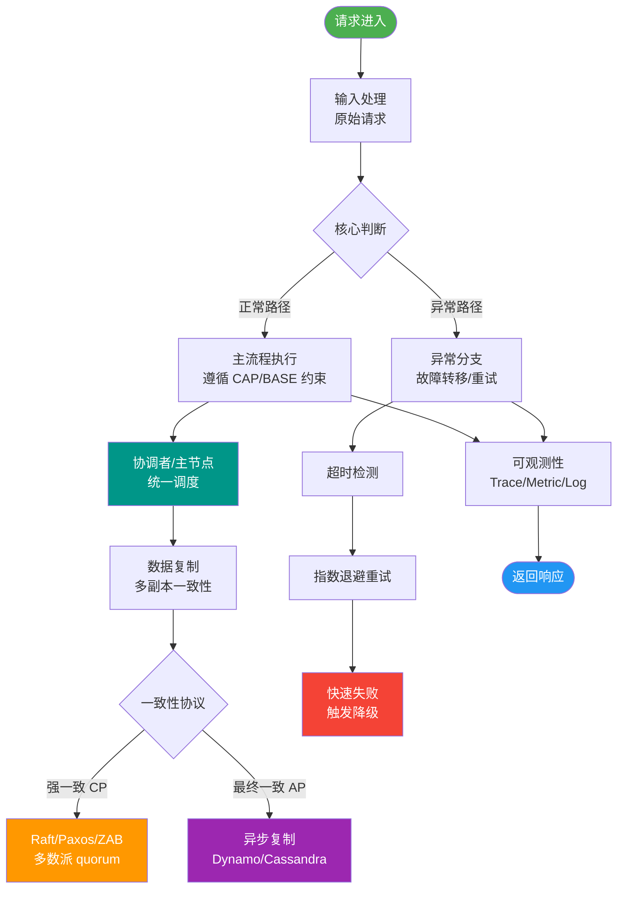

# CQRS模式是什么？它和Event Sourcing有什么关系？

🎯 本质：CQRS(Command Query Responsibility Segregation)将写操作和读操作分离到不同的模型中，各自独立优化。

🧒 类比：一个餐厅里，点菜和查看菜单由不同的人负责。点菜走厨房(写模型)，看菜单走前台展示(读模型)。

CQRS架构与Event Sourcing关系图：
```text
            [Command]             [Event]
User ────► Write Model ────────► Event Store ◄──────────┐
 (写操作)     (业务逻辑)        (事件存储)   │          │
                                       │          │
                              (重放事件)│          │(订阅事件)
                                       ▼          │
User ◄─── Read Model ◄─────── Projector ◄───────────┘
 (读操作)   (物化视图)          (投影器)
```

CQRS架构：
Command侧（写模型）：处理业务命令，更新状态，使用充血领域模型。
Query侧（读模型）：优化查询性能，使用物化视图、缓存，通常是贫血模型或DTO。
数据同步：Command更新后发布领域事件 → Query侧监听事件（Event Handler）更新读模型。

与Event Sourcing的关系：
Event Sourcing是一种持久化方式——不存储当前状态，而是存储所有状态变更事件。重放事件即可重建状态。

两者经常一起使用：
1. Command产生领域事件（Event）。
2. 事件存储在Event Store（如Kafka/EventStoreDB），是事实的唯一来源。
3. Query侧从Event Stream消费事件，构建多个物化视图（Projections），如针对列表查询的SQL视图，针对搜索的ES索引。
4. 可以随时回溯和重建任意时刻的状态。

优势：
- 读写独立扩展（读多写少场景下，读库可分片）
- 完整的审计日志
- 时旅行调试（重放历史事件排查Bug）
- 多视图（同一数据源支持不同查询需求）
劣势：
- 架构复杂度显著增加（需要处理最终一致性、事件版本演进）
- 最终一致性带来的UX挑战（写入后立刻读取可能读到旧数据）
- 学习曲线陡峭

适用场景：高读写比、复杂领域逻辑、需要审计、需要时旅行调试。

🛠️ **实战案例**：
在一个电商订单系统中，为了应对复杂的报表查询（如按时间、地区、品类聚合），我们在CQRS的读端使用了Elasticsearch。某次修改写端业务逻辑（订单状态机变更），却导致ES读端映射更新失败，进而阻塞了消费线程。教训是：读端更新逻辑必须具备“容错降级”能力，当读模型更新失败时，应记录死信队列而非阻塞主流程，保证写端高可用。

💻 **代码示例（Java - Spring Event 同步更新简易实现）**：
```java
// Service层处理Command
@Transactional
public void createOrder(CreateOrderCmd cmd) {
    // 1. 写模型逻辑
    Order order = new Order(cmd);
    orderRepository.save(order);
    
    // 2. 发布领域事件 (简易版：同步更新读模型)
    // 实际生产中建议使用消息队列异步处理
    eventPublisher.publishEvent(new OrderCreatedEvent(order.getId(), order.getProductNames()));
}

// 读模型监听器
@EventListener
public void handleOrderCreated(OrderCreatedEvent event) {
    // 直接更新Redis缓存或读库，用户立刻能读到
    readModelCache.set(event.getOrderId(), event.getViewDto());
}
```

📊 **CQRS 与 传统 CRUD 架构对比**：
| 特性 | 传统 CRUD 架构 | CQRS 架构 |
|------|----------------|----------|
| 数据模型 | 读写共享一套模型 (一张大表) | 读写分离模型 (写规范化/读反范式) |
| 复杂度 | 低 (简单直接) | 高 (需维护数据同步) |
| 性能 | 读写互相制约 (锁冲突) | 极致读性能 (读库可无限扩展) |
| 一致性 | 强一致 (ACID) | 最终一致 (BASE) |
| 适用规模 | 中小型项目，业务简单 | 大型分布式系统，高并发查询 |

## 常见考点
1. **最终一致性处理**：CQRS下写完马上读怎么办？（可以使用简单的内存同步更新，或者提示用户延迟查看）
2. **Event Sourcing快照**：如果事件累积了100万条，如何快速加载状态？（定期生成Snapshot，加载Snapshot+重放增量事件）
3. **事件版本演进**：如果业务变了，Event结构变了，旧事件怎么处理？（利用Upcaster模式在读取时转换旧事件格式）
4. **幂等性保证**：消费端如果重复处理事件，读模型会不会出错？（Handler必须幂等，如基于EventId去重或使用 Upsert 语句）。


## 核心流程图



## 记忆要点

- 核心思想：CQRS将写模型与读模型彻底分离，写走规范化的充血模型，而读走反范式的物化视图。
- Event Sourcing关联：不存最终状态，而是存储所有变更事件，通过重放事件重建任意时刻状态。
- 一致性挑战：传统CRUD是强一致，而CQRS读写分离必然导致最终一致(写后读需处理延迟)。
- 适用场景：因为读写分离能独立扩容，所以适合高读写比和极其复杂的查询场景。

## 结构化回答

**30 秒电梯演讲：** 读写模型分离，通过事件同步，独立优化读写性能。打比方——餐厅前台负责看菜单(读)，后厨负责做菜(写)，各司其职。落到工程上，Command负责写，Query负责读，物理分离。

**展开框架：**
1. **Command负责写** — Command负责写，Query负责读，物理分离
2. **通常配合Event ** — 通常配合Event Sourcing存储状态变更事件
3. **读模型** — 读模型可有多份，适应不同查询场景

**收尾：** 以上三点都能配合实战聊。我可以展开任一要点，您想先深入哪一块？

## 视频脚本

> 预计时长：3 分钟 | 由浅入深

| 时间 | 画面/字幕 | 口播台词 | 讲解要点 |
|------|----------|----------|----------|
| 0:00 | 标题卡：CQRS模式 | "CQRS模式，这题我会分三步讲。" | 开场钩子 |
| 0:41 | 概念定义动画 | "一句话：读写模型分离，通过事件同步，独立优化读写性能。" | 核心定义 |
| 1:22 | 生活类比动画 | "打个比方——餐厅前台负责看菜单(读)，后厨负责做菜(写)，各司其职。" | 核心类比 |
| 2:03 | Command负责写 图解 | "Command负责写，Query负责读，物理分离。" | Command负责写 |
| 2:50 | 通常配合Event 图解 | "通常配合Event Sourcing存储状态变更事件。" | 通常配合Event |
