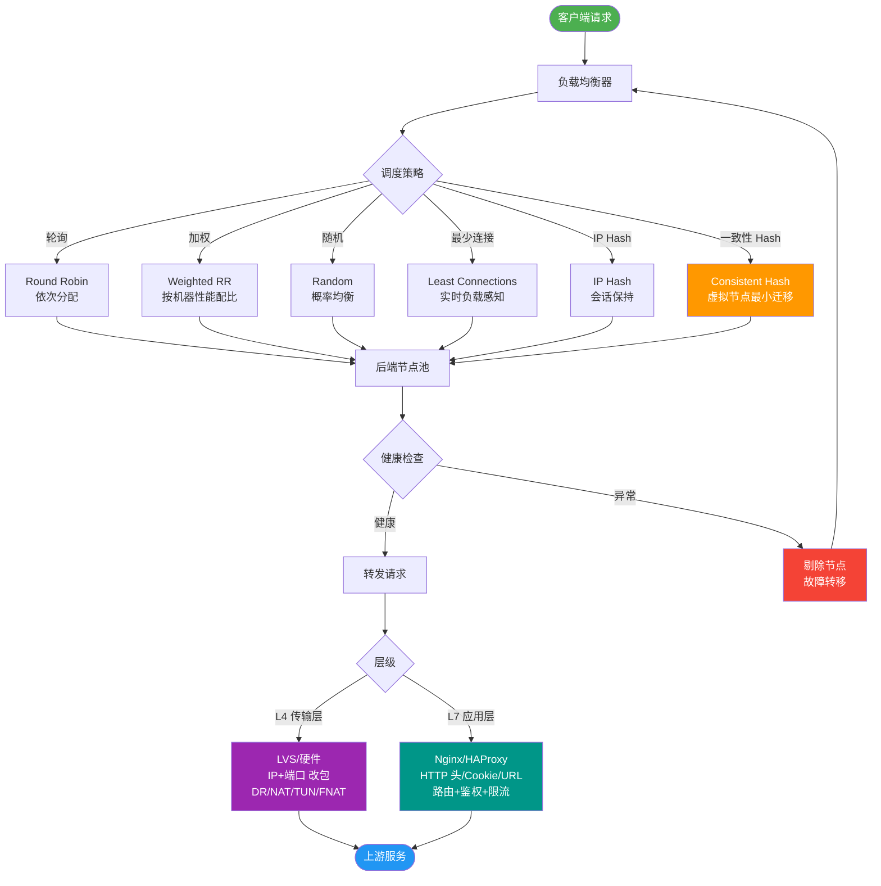

# 微服务中的API网关模式是什么？有哪些核心功能？

🎯 本质：API网关是微服务架构的统一入口点，负责请求路由、协议转换、认证授权、限流熔断等横切关注点。

架构图：
```text
         Client (Web/App)
               │
               ▼
       ┌───────────────────┐
       │  API Gateway      │ ◄───────┐ (动态配置)
       │  (Auth/Route/     │         │
       │   RateLimit)      │         │
       └────────┬──────────┘         │
                │                   │
      ┌─────────┼─────────┐         │
      ▼         ▼         ▼         │
 [Service A] [Service B] [Service C]  Control Plane (e.g. Nacos)
```

核心功能：
1. **请求路由** - 将请求路由到正确的微服务（基于URL、Header）
2. **认证授权** - 统一鉴权，解析JWT/OAuth Token，向后透传用户信息
3. **限流熔断** - 保护后端服务（如令牌桶算法、Sentinel集成）
4. **协议转换** - HTTP转gRPC，REST转GraphQL
5. **请求聚合** - 多个微服务的结果合并返回，减少客户端请求次数
6. **日志监控** - 统一访问日志，TraceID透传生成调用链
7. **缓存** - 边缘缓存减少后端压力（适合读多写少数据）
8. **灰度发布** - 基于Header/Cookie/权重路由到不同版本服务

**实战案例**：在电商大促场景中，我们曾通过网关层的"请求聚合"功能，将商品详情、库存、营销活动的三个接口聚合为一个，将移动端首屏加载耗时从 600ms 降低至 200ms。

**关键代码**：
```java
// Spring Cloud Gateway 全局过滤器透传 TraceId
@Component
public class TraceFilter implements GlobalFilter, Ordered {
    @Override
    public Mono<Void> filter(ServerWebExchange exchange, GatewayFilterChain chain) {
        String traceId = exchange.getRequest().getHeaders().getFirst("X-TraceId");
        if (StringUtils.isEmpty(traceId)) {
            traceId = UUID.randomUUID().toString();
        }
        return chain.filter(exchange.mutate()
                .request(r -> r.header("X-TraceId", traceId)).build());
    }
}
```

主流方案：
| 方案 | 特点 | 适用场景 |
|------|------|---------|
| Spring Cloud Gateway | Java生态、响应式、易集成 | Spring Cloud微服务 |
| Kong | 插件丰富、基于OpenResty、性能高 | 多语言、大规模、需定制插件 |
| APISIX | 动态路由、云原生、高性能 | K8s环境、高并发 |
| Nginx+Lua | 高性能、成熟但配置复杂 | 传统架构、静态路由 |

设计要点：
1. **无状态**：网关本身不存会话，支持水平扩展。
2. **逻辑剥离**：避免在网关中放复杂的业务逻辑（如数据计算），应专注于路由和控制。
3. **高可用**：注意网关单点故障，前端配合LVS/Keepalived，后端集群部署。
4. **性能**：网关是必经之路，需注意长连接（Keep-Alive）复用和SSL卸载开销。

## 常见考点
1. **限流算法**：网关常用的限流算法有哪些？（令牌桶、漏桶、固定窗口、滑动窗口）
2. **过滤器链执行顺序**：Spring Cloud Gateway中Pre/Post过滤器是如何工作的？
3. **路由动态更新**：不重启网关如何更新路由规则？（结合配置中心如Nacos/Apollo监听变更）
4. **重试与幂等**：网关层自动重试可能引发什么问题？（需确保下游服务幂等，防止重复扣款等）


## 核心流程图



## 记忆要点

- 本质是统一入口：因为要解耦客户端与微服务，所以网关负责路由、鉴权等横切关注点。
- 核心功能口诀：路认（路由认证）限聚（限流聚合）转日（协议转换日志）灰（灰度发布）。
- 设计两原则：逻辑要剥离不放复杂业务，自身要无状态以支持水平扩展。
- 主流方案对比：Spring Cloud Gateway重Java生态，Kong/APISIX基于Nginx重高并发。

## 结构化回答


**30 秒电梯演讲：** 公司前台，负责安检、指路、拦截无关人员，不让访客直接进入办公区。

**展开框架：**
1. **统一入口** — 统一入口，收敛外部请求
2. **处理鉴权** — 处理鉴权、限流、路由等通用逻辑
3. **支持协议转换** — 支持协议转换和请求聚合

**收尾：** 这是我实战中的理解，您想深入哪一段？


## 视频脚本

> 预计时长：2 分钟 | 由浅入深

| 时间 | 画面/字幕 | 口播台词 | 讲解要点 |
|------|----------|----------|----------|
| 0:00 | 标题卡：微服务中的API网关模式 | "微服务中的API网关模式，一分钟讲透。" | 开场钩子 |
| 0:35 | 生活类比动画 | "打个比方——公司前台，负责安检、指路、拦截无关人员，不让访客直接进入办公区。" | 核心类比 |
| 1:10 | 概念定义动画 | "一句话：系统的统一大门，处理所有非业务逻辑的横切关注点。" | 核心定义 |
| 1:50 | 统一入口 图解 | "统一入口，收敛外部请求。" | 统一入口 |
