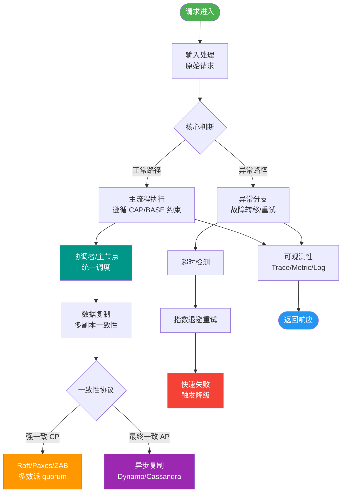

# 微服务中的Sidecar模式是什么？有哪些应用场景？

🎯 本质：Sidecar模式将辅助功能部署在独立的容器/进程中，与主应用进程并行运行，共享生命周期和网络命名空间。

Sidecar 模式架构图：
```text
┌─────────────────────────────────────────────────────┐
│                      Pod (K8s)                      │
│  ┌───────────────────────┐  ┌──────────────────────┐│
│  │    Main Application   │  │     Sidecar Proxy    ││
│  │   (Business Logic)    │  │   (Infra/Cross-cut)  ││
│  │   Port: 8080          │  │   Port: 8081, 9090   ││
│  │                       │  │                      ││
│  │   ┌─────────────────┐ │  │  ┌────────────────┐  ││
│  │   │   Java/Go App   │ │  │  │ Envoy / Log Agent│  ││
│  │   └────────┬────────┘ │  │  └───────┬────────┘  ││
│  └────────────┼───────────┘  └──────────┼───────────┘│
│               │                       │              │
│               │    (Localhost/IPC)    │              │
│               ▼                       ▼              │
│       ┌───────────────┐       ┌───────────────┐      │
│       │ Shared Network│       │ Shared Volume│      │
│       │   (eth0)      │       │   (/var/log)  │      │
│       └───────────────┘       └───────────────┘      │
└─────────────────────────────────────────────────────┘
```

🧒 类比：摩托车边车。摩托车是主应用，边车是辅助功能。一起跑，但边车不干扰驾驶，可以随时更换。

**实战案例**：在云原生迁移中，针对老版本无法修改代码的C++服务，我们在其Pod中注入一个Envoy Sidecar代理，不仅实现了mTLS安全加密，还解决了服务发现问题，无需改动一行二进制代码。

**关键代码**：
```yaml
# Kubernetes Pod 定义示例 (Sidecar 模式)
apiVersion: v1
kind: Pod
metadata:
  name: app-with-sidecar
spec:
  containers:
  - name: main-app
    image: my-app:v1
    ports:
    - containerPort: 8080
  - name: log-agent
    image: fluentd:v1.12  # 日志采集 Sidecar
    volumeMounts:
    - name: log-volume
      mountPath: /var/log/app
  volumes:
  - name: log-volume
    emptyDir: {} # 共享存储卷
```

Sidecar vs 侵入式SDK：
| 对比维度 | 侵入式SDK | Sidecar 模式 |
|---------|----------|-------------|
| **代码耦合度** | 高（依赖库直接引入代码） | 低（独立进程，网络通信） |
| **多语言支持** | 差（需为每门语言开发SDK） | 好（所有语言共享同一Sidecar） |
| **升级与运维** | 需重启主应用，版本绑定困难 | 独立升级Sidecar，不影响主业务 |
| **资源消耗** | 较低（同一进程） | 较高（独立进程+通信开销） |
| **网络延迟** | 无 | 本地Loopback通信，极低延迟 |

应用场景：
1. **Service Mesh（Istio Envoy Sidecar）** - 服务发现、负载均衡、熔断、TLS通信。
2. **日志收集（Fluentd/Filebeat Sidecar）** - 采集宿主机或容器日志，发送到ES/Kafka，共享volume挂载日志目录。
3. **配置代理** - Sidecar连接配置中心，主应用通过localhost获取配置，实现热更新。
4. **安全代理** - 处理mTLS证书认证、鉴权，主应用只需处理明文流量。
5. **可观测性** - Prometheus Exporter作为Sidecar，暴露主应用指标。
6. **协议适配** - 将主应用的gRPC流转换为HTTP接口供外部调用。

K8s Pod中的Sidecar：
主应用容器 + Sidecar容器共享Pod的Network Namespace（同一个IP）和存储卷。

优势：关注点分离、多语言支持、独立演进、流量拦截透明。
劣势：资源开销（每个服务多跑一个代理）、网络延迟（多一次本地回路转发）、运维复杂度增加。

## 常见考点
1. **资源共享机制**：Sidecar和主容器如何共享日志文件？（利用emptyDir或hostPath挂载到同一目录）
2. **启动顺序控制**：如何保证Sidecar先于主应用启动？（K8s原生不支持，需用PostStart hook或Init Containers间接实现，或利用DependsOn特性）
3. **通信开销**：Sidecar通常通过localhost通信，这种IPC（进程间通信）的性能损耗是多少？（通常<1ms，但对于超高吞吐内部服务需权衡）


## 核心流程图



## 记忆要点

- 一句话定义：Sidecar是伴随主应用运行的独立进程，共享Pod网络与存储。
- 核心优势：因为独立于语言，所以能无侵入地实现多语言微服务的治理与日志收集。
- 对比侵入式SDK：SDK重耦合且升级需重启，而Sidecar低耦合且支持独立演进升级。
- 核心劣势：因为多进程通信，所以会增加一定的资源开销与网络延迟。

## 结构化回答


**30 秒电梯演讲：** 摩托车边车，为主车提供额外载重或功能，不干扰主车驾驶。

**展开框架：**
1. **与主应用共享网络和存储** — 与主应用共享网络和存储，但独立进程
2. **将监控、日志、代** — 理等能力从业务中剥离
3. **支持异构技术栈** — 支持异构技术栈，屏蔽语言差异

**收尾：** 这是我实战中的理解，您想深入哪一段？


## 视频脚本

> 预计时长：2 分钟 | 由浅入深

| 时间 | 画面/字幕 | 口播台词 | 讲解要点 |
|------|----------|----------|----------|
| 0:00 | 标题卡：微服务中的Sidecar模式 | "微服务中的Sidecar模式，一分钟讲透。" | 开场钩子 |
| 0:35 | 生活类比动画 | "打个比方——摩托车边车，为主车提供额外载重或功能，不干扰主车驾驶。" | 核心类比 |
| 1:10 | 概念定义动画 | "一句话：以Sidecar容器形式伴随主应用运行，接管辅助功能。" | 核心定义 |
| 1:50 | 与主应用共享网络 图解 | "与主应用共享网络和存储，但独立进程。" | 与主应用共享网络 |
