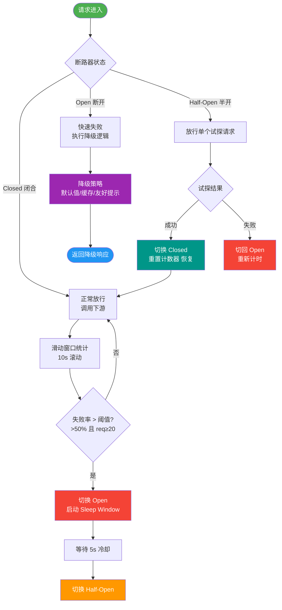

# 微服务中的Bulkhead（舱壁隔离）模式是什么？

🎯 本质：Bulkhead模式借鉴船舱设计——将船体分为多个水密舱，一个舱进水不会导致整船沉没。在微服务中，将资源（线程池/信号量）隔离，一个服务的故障（如线程耗尽）不会影响其他服务的调用。

**问题场景（无隔离）：**
```text
[ Tomcat 线程池 (200) ]
    |      |      |
    v      v      v
[ 服务A ] [ 服务B-慢 ] [ 服务C ]
             ^
             | (响应慢，线程阻塞)
             |
结果：B服务变慢，占满所有Tomcat线程，导致服务C也无法处理新请求。
```

**解决方案：**

1. **线程池隔离**
   - **原理**：为每个依赖服务分配独立的线程池。
   - **架构图**：
```text
主线程 
    | 
    +---> [ 线程池 B (大小10) ] ---> [ 服务 B ]
    |            |
    |            +---> (如果满了，主线程直接拒绝/降级，不阻塞)
    |
    +---> [ 线程池 C (大小20) ] ---> [ 服务 C ]
```
   - **优点**：可以设置超时时间，即便依赖服务挂了，主线程也能快速释放；隔离性好。
   - **缺点**：线程上下文切换开销大，占用内存较多。

2. **信号量隔离**
   - **原理**：不创建新线程，使用计数器限制并发量。请求进入先获取信号量，执行完后释放。
   - **优点**：轻量级，无线程切换开销。
   - **缺点**：无法设置超时（因为同步调用），一旦依赖服务阻塞，调用线程也会一直阻塞直到信号量释放（通常依赖线程本身能处理超时，不如线程池隔离彻底）。

**Resilience4j 实现：**
```java
// 线程池隔离配置
BulkheadConfig config = BulkheadConfig.custom()
    .maxConcurrentCalls(20)            // 最大并发数
    .maxWaitDuration(Duration.ofMillis(500)) // 获取信号量最大等待时间
    .build();
```

### 💡 实战深化

**1. 实战案例**
某推荐服务同时调用“商品详情”和“用户画像”接口。由于“用户画像”服务升级导致大量超时，未做隔离时阻塞了所有Tomcat线程，导致“商品详情”接口也完全不可用。实施信号量隔离后，画像服务故障仅影响自身，商品详情接口正常响应。

**2. 代码示例**
```java
// Resilience4j 信号量隔离
BulkheadConfig config = BulkheadConfig.custom()
    .maxConcurrentCalls(10) // 限制并发数10
    .maxWaitDuration(Duration.ofSeconds(1)) // 排队等待1秒
    .build();

Bulkhead bulkhead = Bulkhead.of("userProfile", config);

// 装饰受保护的方法
Supplier<UserInfo> supplier = Bulkhead.decorateSupplier(bulkhead, () -> userProfileClient.getInfo());
try {
    return supplier.get();
} catch (BulkheadFullException e) {
    return null; // 降级逻辑
}
```

**3. 对比表格：线程池隔离 vs 信号量隔离**

| 维度 | 线程池隔离 | 信号量隔离 |
| :--- | :--- | :--- |
| **资源模型** | 独立线程池（物理隔离） | 共享线程池 + 计数器（逻辑隔离） |
| **超时控制** | 支持独立超时，可强制中断 | 依赖业务设置超时，无法强制中断 |
| **上下文切换** | 重（跨线程传递ThreadLocal需处理） | 轻（当前线程直接执行） |
| **吞吐量** | 较低（受限于线程池大小） | 较高（仅受限于信号量） |
| **适用场景** | 网络IO调用、第三方不可靠服务 | 高频本地调用、客户端内存计算 |

**选择建议：**
- **网络 I/O 密集型**（远程调用）：推荐 **线程池隔离**。主要为了保护调用方，能够拒绝超时请求，防止线程池耗尽。
- **本地计算密集型**或**高频低延迟调用**：推荐 **信号量隔离**。避免线程切换开销，性能更高。

**补充：Feign 的隔离策略**
- Hystrix 默认线程池，可配置信号量。
- Sentinel 默认信号量，也可配置并发线程数限制。

## 常见考点
1. **线程池隔离和信号量隔离的核心区别是什么？**
   答：最核心的区别在于 **“超时控制”** 和 **“上下文切换”**。线程池隔离可以独立设置超时，即使下游服务不响应也能强制中断，但开销大；信号量隔离开销小，但无法独立中断阻塞的请求，依赖业务线程的超时设置。
2. **Hystrix 为什么废弃了？**
   答：官方停止维护，不再支持新特性；且 Hystrix 的线程池模型在高吞吐下由于线程切换开销较大，被 Resilience4j（轻量级、响应式友好）或 Sentinel（功能更丰富，如流控、热参数限流）取代。
3. **如何判断是否需要资源隔离？**
   答：并非所有调用都需要隔离。通常针对 **非核心依赖**、**不确定稳定性的第三方API**、**耗时的IO操作** 进行隔离。核心强一致依赖通常不需要，因为挂了业务本身也就不可用了。


## 核心流程图



## 记忆要点

- 核心理念：船舱水密隔断，隔离资源使得单服务故障不影响全局。
- 方案对比：线程池隔离物理强且支持超时控制，信号量隔离逻辑轻且无切换开销。
- 选择建议：网络IO密集选线程池可强制超时，本地计算高频调选信号量性能高。

## 结构化回答


**30 秒电梯演讲：** 泰坦尼克号隔水舱，一个舱进水不会导致全船沉没。

**展开框架：**
1. **分为线程池隔离和** — 分为线程池隔离和信号量隔离
2. **防止某个慢服务耗** — 防止某个慢服务耗尽整个容器资源
3. **线程池隔离适合耗** — 线程池隔离适合耗时IO操作

**收尾：** 这是我实战中的理解，您想深入哪一段？


## 视频脚本

> 预计时长：2 分钟 | 由浅入深

| 时间 | 画面/字幕 | 口播台词 | 讲解要点 |
|------|----------|----------|----------|
| 0:00 | 标题卡：微服务中的Bulkhead（舱壁隔离）模 | "微服务中的Bulkhead（舱壁隔离）模，一分钟讲透。" | 开场钩子 |
| 0:35 | 生活类比动画 | "打个比方——泰坦尼克号隔水舱，一个舱进水不会导致全船沉没。" | 核心类比 |
| 1:10 | 概念定义动画 | "一句话：资源隔离，限制单个依赖故障对整体资源的耗尽。" | 核心定义 |
| 1:50 | 线程池隔离和信号 图解 | "分为线程池隔离和信号量隔离。" | 线程池隔离和信号 |
