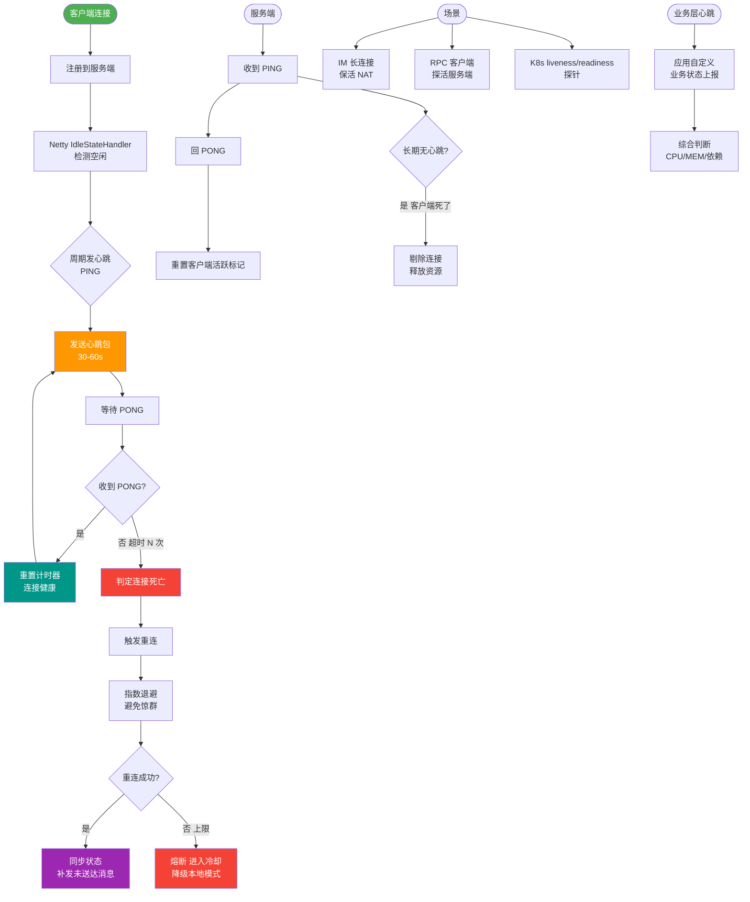

# 在RPC框架设计中，如何基于Netty的IdleStateHandler实现心跳检测与自动断连机制？

Netty的`IdleStateHandler`用于检测通道的读写空闲状态。实现心跳机制通常分为两端：1. 客户端：初始化Pipeline时加入`IdleStateHandler(0, 0, 30)`（30秒读写空闲），并重写`userEventTriggered`方法。当触发`IdleStateEvent`时，发送心跳Ping包给服务端；2. 服务端：同样加入IdleStateHandler检测读空闲。如果超过规定时间未收到数据（包括心跳），则视为连接异常，触发`IdleStateEvent`，在`userEventTriggered`中关闭连接。这种机制能有效避免因网络闪断或客户端崩溃导致的僵尸连接占用服务端文件句柄。需要注意的是，心跳发送间隔需结合TCP KeepAlive设置，避免频繁的心跳包造成网络拥塞。

## 技术原理

- **客户端定时发送心跳包（写空闲触发）**：客户端在 Pipeline 加 `IdleStateHandler(0, 30, 0)`（30 秒写空闲）。当 30 秒内没有业务数据写出，触发 `WRITER_IDLE` 事件，`userEventTriggered` 里捕获该事件并发送 Ping 包。这样心跳发送频率自动跟随业务流量——忙时少发、闲时定时保活。
- **服务端检测读空闲，超时未收到数据则断开**：服务端加 `IdleStateHandler(60, 0, 0)`（60 秒读空闲，通常设为客户端的 2-3 倍容忍丢包）。若 60 秒内既无业务数据也无心跳 Ping，认定连接已死（网络闪断/客户端崩溃），主动 `ctx.close()` 释放文件句柄和内存，防止僵尸连接堆积。
- **需合理设置心跳间隔避免网络拥塞**：心跳间隔通常取 30 秒（客户端）→ 90 秒（服务端断连阈值），需大于一次 RTT 且小于 NAT 超时（运营商 NAT 表默认 60-120 秒过期，太长连接会被静默断开）。同时不要与 TCP 自带的 KeepAlive（默认 2 小时）冲突，KeepAlive 太慢主要靠应用层心跳兜底。

## 代码示例

客户端 Pipeline 与心跳处理：

```java
bootstrap.handler(new ChannelInitializer<SocketChannel>() {
    protected void initChannel(SocketChannel ch) {
        ch.pipeline()
          .addLast(new IdleStateHandler(0, 30, 0, TimeUnit.SECONDS))  // 30s 写空闲
          .addLast(new HeartbeatClientHandler())
          .addLast(new BizDecoder());
    }
});

public class HeartbeatClientHandler extends ChannelInboundHandlerAdapter {
    @Override
    public void userEventTriggered(ChannelHandlerContext ctx, Object evt) {
        if (evt instanceof IdleStateEvent &&
            ((IdleStateEvent) evt).state() == IdleState.WRITER_IDLE) {
            ctx.writeAndFlush(new HeartbeatPing());    // 写空闲触发发心跳
        }
    }
    @Override
    public void channelInactive(ChannelHandlerContext ctx) {
        // 连接断开，触发重连
        scheduleReconnect(ctx);
    }
}
```

服务端读空闲检测与断连：

```java
serverBootstrap.childHandler(new ChannelInitializer<SocketChannel>() {
    protected void initChannel(SocketChannel ch) {
        ch.pipeline()
          .addLast(new IdleStateHandler(90, 0, 0, TimeUnit.SECONDS))  // 90s 读空闲
          .addLast(new HeartbeatServerHandler());
    }
});

public class HeartbeatServerHandler extends ChannelInboundHandlerAdapter {
    @Override
    public void userEventTriggered(ChannelHandlerContext ctx, Object evt) {
        if (evt instanceof IdleStateEvent &&
            ((IdleStateEvent) evt).state() == IdleState.READER_IDLE) {
            log.warn("读空闲超时，判定为僵尸连接，关闭 {}", ctx.channel().remoteAddress());
            ctx.close();                               // 释放句柄，防泄漏
        }
    }
    @Override
    public void channelRead(ChannelHandlerContext ctx, Object msg) {
        if (msg instanceof HeartbeatPing) {
            ctx.writeAndFlush(new HeartbeatPong());    // 响应心跳，不传业务
            return;
        }
        ctx.fireChannelRead(msg);
    }
}
```

## 对比/选型

| IdleStateHandler 参数 | 含义 | 典型取值 |
|-----------------------|------|----------|
| readerIdleTime | 读空闲（多久没收到数据） | 服务端 60-90s |
| writerIdleTime | 写空闲（多久没写出数据） | 客户端 30s |
| allIdleTime | 读写都空闲 | 长连接保活场景 |

## 常见坑/注意事项

- **客户端间隔必须小于服务端阈值**：客户端写空闲 30s 发心跳，服务端读空闲应 ≥ 2-3 倍（如 90s），否则一次丢包就误判。
- **NAT 超时陷阱**：移动网络/公网网关的 NAT 表项 60-120 秒无流量会过期，心跳间隔必须小于该值，否则连接被静默断开。建议公网心跳 ≤ 60 秒。
- **不要只依赖 TCP KeepAlive**：操作系统 KeepAlive 默认 2 小时才开始探测，对 RPC 这种短连接敏感场景完全不够，必须用应用层心跳。
- **心跳丢失要降级**：连续 N 次心跳无 Pong 应主动断连重连，避免半开连接；重连要有指数退避防雪崩。
- ** IdleStateHandler 的检测粒度是 channel 级**：一个连接一个 Event，不会因为多 channel 共享 Handler 而串扰，但仍要保证 Handler 是 `@Sharable` 或每连接 new 一个。


## 核心流程图



## 记忆要点

- 角色分工：客户端主要测读写空闲并发Ping包，服务端重点测读空闲并主动关闭僵尸连接
- 核心参数：IdleStateHandler通常传三个参数(读空闲, 写空闲, 读写空闲)，如(0,0,30)表示30秒无双向交互
- 触发机制：通过重写userEventTriggered方法捕获IdleStateEvent，以此发送心跳或断连
- 防死锁：心跳发送间隔需结合TCP KeepAlive设置，避免频繁心跳引发网络拥塞

## 结构化回答


**30 秒电梯演讲：** 就像异地恋情侣定闹钟互发晚安，一方长时间没动静，另一方就默认分手。

**展开框架：**
1. **客户端定时发** — 客户端定时发送心跳包（写空闲触发）
2. **服务端检测读空闲** — 服务端检测读空闲，超时未收到数据则断开
3. **需合理设置心** — 需合理设置心跳间隔避免网络拥塞

**收尾：** 这是我实战中的理解，您想深入哪一段？


## 视频脚本

> 预计时长：2 分钟 | 由浅入深

| 时间 | 画面/字幕 | 口播台词 | 讲解要点 |
|------|----------|----------|----------|
| 0:00 | 标题卡：在RPC框架设计中，如何基于Netty的 | "在RPC框架设计中，如何基于Netty的，一分钟讲透。" | 开场钩子 |
| 0:35 | 生活类比动画 | "打个比方——就像异地恋情侣定闹钟互发晚安，一方长时间没动静，另一方就默认分手。" | 核心类比 |
| 1:10 | 概念定义动画 | "一句话：基于空闲状态检测，定时Ping保活，超时自动断连。" | 核心定义 |
| 1:50 | 客户端定时发送心跳包 图解 | "客户端定时发送心跳包(写空闲触发)。" | 客户端定时发送心跳包 |
