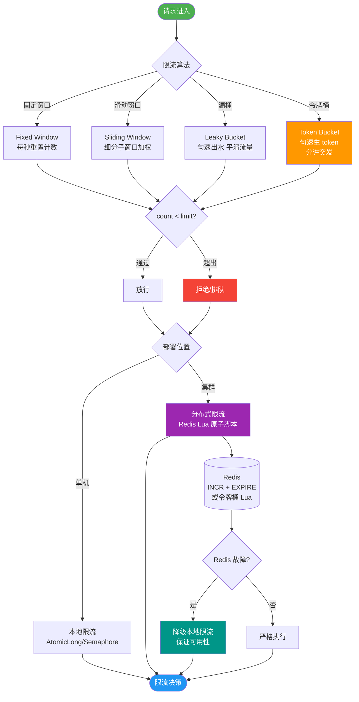

# 在分布式系统中，如何基于Redis实现高效的限流算法？对比令牌桶与漏桶算法的优劣。

Redis限流常用于API流量控制。两种常见算法实现如下：

1. **令牌桶算法**：系统以恒定速率向桶中放入令牌，请求到达时从桶中获取令牌，获取成功则通过。Redis实现通常结合Lua脚本，利用String结构的过期时间作为桶的周期。优势在于允许一定的突发流量（只要桶中有积攒的令牌），适合处理瞬时高峰。
2. **漏桶算法**：请求像水一样注入桶中，桶底以恒定速率漏水，如果请求过快导致桶满，则溢出（拒绝）。Redis可用List实现，入队（LPUSH）模拟注水，出队（RPOP）模拟漏水。劣势是无法应对突发流量，强行削峰填谷，可能造成延迟。

**优劣对比**：令牌桶限制的是**平均速率**，且允许弹性突发，在互联网业务中更为常用；漏桶限制的是**恒定流出速率**，用于保护下游系统的处理能力不被打满，但对用户体验可能有影响（排队等待）。工程中常结合Redis+Lua保证原子性。

### 1. 实战案例
在秒杀抢购场景中，为了避免瞬时流量打垮后端数据库，我们曾采用**令牌桶算法**在Redis网关层做预热限流。但在极端流量下，单纯依赖Redis计数会导致“竞态抢锁”现象，部分合法请求被误判超限。解决方案是将令牌桶与本地缓存（如Guava RateLimiter）结合，Redis只做二级校验，大幅降低了网络IO和误判率。

### 2. 代码示例
以下是基于Redis + Lua实现的令牌桶限流关键代码片段：

```lua
-- redis_token_bucket.lua
local key = KEYS[1]      -- 限流Key
local capacity = tonumber(ARGV[1]) -- 桶容量
local tokens = tonumber(redis.call('get', key) or capacity)
local requested = tonumber(ARGV[2]) -- 请求令牌数

if tokens >= requested then
    -- 剩余令牌足够，扣除并返回成功
    return redis.call('decrby', key, requested)
else
    -- 令牌不足，拒绝请求
    return -1
end
```
### 3. 对比表格

| 特性 | 令牌桶 | 漏桶 |
| :--- | :--- | :--- |
| **核心机制** | 恒定速率放入令牌，请求动态消耗 | 恒定速率处理请求，请求强行排队 |
| **突发流量处理** | **友好**（允许消耗积攒令牌） | **差**（强制削峰，请求排队或溢出） |
| **限流对象** | 限制平均速率 | 限制流出速率（保护下游） |
| **适用场景** | 秒杀、API防刷（应对突发） | 消息队列推送、数据库保护（削峰填谷） |
| **性能消耗** | 低（仅需原子计数） | 较高（需维护队列或定时任务） |

## 技术原理

Redis 限流的核心难点是**多实例并发下的原子性**——多个网关线程/进程同时扣减令牌或计数，不加锁会超卖。Redis 单线程模型 + Lua 脚本恰好解决这个问题：

- **为什么必须用 Lua 脚本**：限流判断是"读当前计数 → 比较 → 写回新计数"的复合操作。如果用 Redis 的 GET + 业务代码判断 + DECR 三步，两个并发请求可能同时读到旧值，都判断通过，导致超限。Lua 脚本在 Redis 单线程内**原子执行**（不会被其他命令打断），把判断和扣减合为一个不可分割的操作。这是 Redis 做分布式限流的根本优势。
- **令牌桶的漏桶算法数学模型**：令牌以恒定速率 r（个/秒）填充，桶容量 c 决定最大突发量。请求消耗 n 个令牌。状态是 `(last_refill_time, tokens)`，每次请求时按当前时间差补令牌：`tokens = min(c, tokens + (now - last_refill_time) * r)`，再判断 `tokens >= n`。这个"按时间补令牌"的惰性计算让令牌桶无需后台线程持续填令牌，只在请求到来时计算。
- **漏桶的恒定速率实现**：漏桶要求请求以恒定速率 r 出队。单机用定时线程或 DelayQueue 实现；分布式用 Redis List（LPUSH 入队，RPOP 出队）+ 定时任务按固定间隔 RPOP，或用 Redis Stream 的消费者组按速率拉取。漏桶的复杂度在于"恒定出队"需要后台驱动，不如令牌桶的"惰性计算"简洁。
- **滑动窗口的进阶实现**：令牌桶和漏桶是"容量限制"，滑动窗口是"时间维度限制"。用 Redis 的 Sorted Set 实现——score 是时间戳，每次请求 ZADD 当前时间，再用 ZREMRANGEBYSCORE 清掉窗口外的旧请求，ZCARD 统计窗口内请求数。滑动窗口精度高但内存和计算开销大。

## 代码示例

```lua
-- redis_token_bucket.lua (生产可用版：惰性补令牌)
local key = KEYS[1]
local capacity = tonumber(ARGV[1])   -- 桶容量 c
local rate = tonumber(ARGV[2])       -- 令牌生成速率 r (个/秒)
local requested = tonumber(ARGV[3])  -- 本次请求消耗令牌数
local now = tonumber(ARGV[4])        -- 当前时间戳(秒)
local ttl = tonumber(ARGV[5])        -- key 过期时间(秒)

local bucket = redis.call('HMGET', key, 'tokens', 'last_time')
local tokens = tonumber(bucket[1]) or capacity
local last_time = tonumber(bucket[2]) or now

-- 惰性补充：按时间差补令牌，上限为 capacity
local delta = math.max(0, now - last_time)
tokens = math.min(capacity, tokens + delta * rate)

local allowed = 0
if tokens >= requested then
    tokens = tokens - requested
    allowed = 1
end

-- 写回状态并续期
redis.call('HMSET', key, 'tokens', tokens, 'last_time', now)
redis.call('EXPIRE', key, ttl)
return allowed
```

## 注意事项

1. **必须用 Lua 保证原子性**：GET + 业务判断 + SET 三步分离会超卖，必须用 Lua 脚本把判断和扣减合并。Lua 脚本本身是原子的（Redis 单线程），这是分布式限流的根本。
2. **时钟漂移问题**：令牌桶按时间差补令牌，若各节点时钟不同步（NTP 未同步），会导致补的令牌数不准。建议以 Redis 的 `TIME` 命令取时间，或要求各节点 NTP 严格同步。
3. **Redis 单点瓶颈**：所有限流请求都打到 Redis，高 QPS 下 Redis 成为瓶颈。解决：本地缓存（Guava RateLimiter）做一级校验，Redis 做二级校验，减少 Redis 访问；或用 Redis Cluster 分片。
4. **令牌桶 vs 漏桶按场景选**：业务侧（API 防刷、秒杀）允许突发选令牌桶；保护脆弱下游（数据库、第三方接口）强制匀速选漏桶。选错会让用户体验差（漏桶导致正常请求排队）或打垮下游（令牌桶放突发流量）。


## 核心流程图



## 记忆要点

- 令牌桶优势：以恒定速率放令牌，允许消耗积攒的令牌应对突发流量，互联网秒杀最常用
- 漏桶特性：以恒定速率漏水（处理请求），强行削峰填谷，适合保护下游脆弱系统
- 底层实现：在Redis中必须结合Lua脚本执行限流判断，以保证并发扣减令牌或计数的原子性

## 结构化回答

**30 秒电梯演讲：** Redis利用Lua原子操作，通过令牌桶弹性应对突发，或漏桶恒定保护下游。打比方——令牌桶就像发号牌，有号就过，没号排队，攒了一堆号就能突然放进很多人；漏桶就像漏斗，水倒得再猛，下面也只能一滴一滴流，多了就溢出。落到工程上，令牌桶允许突发流量，限制平均速率，适合秒杀场景。

**展开框架：**
1. **令牌桶允许突发流量** — 令牌桶允许突发流量，限制平均速率，适合秒杀场景
2. **漏桶强制削峰填谷** — 漏桶强制削峰填谷，限制恒定流出，保护下游系统
3. **用Redis+** — 使用Redis+Lua脚本保证计数扣减的原子性

**收尾：** 以上三点都能配合实战聊。我可以展开任一要点，您想先深入哪一块？

## 视频脚本

> 预计时长：2 分钟 | 由浅入深

| 时间 | 画面/字幕 | 口播台词 | 讲解要点 |
|------|----------|----------|----------|
| 0:00 | 标题卡：在分布式系统中，如何基于Redis实现高 | "在分布式系统中，如何基于Redis实现高，一分钟讲透。" | 开场钩子 |
| 0:35 | 生活类比动画 | "打个比方——令牌桶就像发号牌，有号就过，没号排队，攒了一堆号就能突然放进很多人；漏桶就像漏斗，水倒得再猛，下面也只能一滴一滴流，多了就溢出。" | 核心类比 |
| 1:10 | 概念定义动画 | "一句话：Redis利用Lua原子操作，通过令牌桶弹性应对突发，或漏桶恒定保护下游。" | 核心定义 |
| 1:50 | 令牌桶允许突发流量 图解 | "令牌桶允许突发流量，限制平均速率，适合秒杀场景。" | 令牌桶允许突发流量 |
