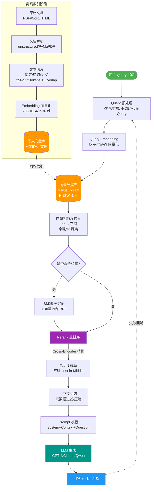
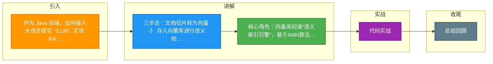

# 作为 Java 后端，如何接入大语言模型（LLM）实现 RAG（检索增强生成）？Vector Database 在其中扮演什么角色？

实现 RAG 分三步：1. 数据处理：将文档切片并转化为向量；2. 向量存储：存入 Vector Database 进行高效语义检索；3. 生成回答：将检索结果作为上下文发送给 LLM。Java 端常用 Spring AI 或 LangChain4j 实现。

### 实战案例
在构建企业知识库助手时，直接将长篇 PDF 切割成固定 500 token 的块导致上下文断裂（如表格被切成两半）。实战中采用了“语义切分”策略，结合 Markdown 标题层级进行分段，并在向量中额外存储该段落所属的“文件名”和“页码”，在 LLM 生成回答时附带引用来源，大幅提升了回答的可信度。

### 代码示例 (Java + LangChain4j)
```java
// 使用 LangChain4j 进行文档嵌入与存储
EmbeddingModel embeddingModel = new AllMiniLmL6V2EmbeddingModel();
EmbeddingStore<TextSegment> store = new InMemoryEmbeddingStore<>();

Document document = loadPdf("knowledge_base.pdf");
TextSegmentSplitter splitter = new DocumentByParagraphSplitter(); 
List<TextSegment> segments = splitter.split(document);

for (TextSegment segment : segments) {
    Response<Embedding> embedding = embeddingModel.embed(segment).content();
    store.add(embedding.content(), segment); // 存入向量数据库
}
```

### Vector Database 角色与选型对比

Vector Database 在 RAG 中扮演 **“语义索引引擎”** 的角色。它通过 ANN（近似最近邻）算法（如 HNSW），在海量向量中毫秒级找回与用户问题语义最相似的文本片段，解决了传统关键词搜索（如 Elasticsearch）无法理解“同义词”或“意图”的问题。

| 维度 | Vector DB (如 Milvus/Pinecone) | 传统全文搜索 (如 Elasticsearch) | 关系型数据库 (如 MySQL/PG) |
| :--- | :--- | :--- | :--- |
| **检索原理** | 余弦相似度/欧氏距离（语义） | 倒排索引（关键词匹配） | B+树（精确匹配） |
| **性能** | 极高（ANN 算法，支持百万级向量） | 高（关键词匹配快，语义需插件） | 低（缺乏向量索引，全表扫描） |
| **成本** | 较高（通常需独立部署集群） | 中 | 低（已有基础设施） |
| **适用场景** | 海量非结构化数据语义检索 | 结构化字段+关键词检索 | 少量向量（<10万）或 PoC 阶段 |

## 技术原理

RAG 的本质是**把"参数化记忆"（模型权重里的知识）改为"检索增强"（外挂知识库）**，解决 LLM 幻觉和知识时效性问题。三个环节各有技术原理：

- **文档切片（Chunking）的语义边界问题**：朴素按固定 token 数切片会切断语义（表格被切两半、定义和例子分离）。工程上用三种策略：①按 Markdown 标题/段落语义切分；②重叠切片（overlap 10-20%），相邻块共享一段文本防止边界信息丢失；③递归切分（先按段落，段落过长再按句子）。切片大小权衡：太大稀释相关性（Top-K 召回精度下降），太小丢失上下文（LLM 无法理解片段含义），通常 200-500 token。
- **向量检索的 ANN 原理**：朴素计算是"query 向量与库中 N 个向量逐一算余弦相似度"，复杂度 O(N*d)，百万级数据秒级延迟不可用。ANN（近似最近邻）算法牺牲少量精度换性能：**HNSW**（分层小世界图）把向量构建成多层近邻图，查询时从顶层稀疏图快速定位区域再下钻，复杂度 O(log N)；**IVF**（倒排文件）先用 k-means 聚类，查询时只搜最近的几个簇。Milvus/Pinecone 内置这些算法，毫秒级检索百万向量。
- **语义检索 vs 关键词检索**：ES 的倒排索引基于词频（TF-IDF/BM25），"手机"和"移动电话"是两个不同 token，无法匹配。向量检索把文本编码成高维向量，语义相近的文本向量也相近（余弦相似度高），"手机"和"移动电话"向量接近能匹配。这是 RAG 用向量库而非 ES 的根本原因。工程上常做**混合检索**：向量召回语义相关 + BM25 召回关键词精确匹配，结果融合（RRF 算法）。
- **上下文组装与幻觉抑制**：检索到 Top-K 片段后，拼入 Prompt 的格式很关键——"仅根据以下资料回答，不知道就说不知道"。这一句 system prompt 能显著降低幻觉。还要处理上下文超长：Top-K 太多超出 LLM 窗口，需做二次 rerank（用 Cross-Encoder 重排）只保留最相关的 3-5 条。

## 注意事项

1. **切片质量决定 RAG 效果**：垃圾进垃圾出，切片切断语义（表格、代码、定义被切两半）会让检索召回的片段无法理解。优先用语义切分（按标题/段落）+ 重叠，而非固定 token 切分。
2. **向量模型要和查询语言匹配**：中文用 BGE-large-zh、M3E；英文用 text-embedding-3、bge-large-en。用英文模型编码中文文档，语义相似度计算不准，召回质量差。
3. **向量库不是银弹**：百万级以下向量用 MySQL 9/PG 的 pgvector 即可，无需引入 Milvus 增加运维成本。只有到千万级以上、QPS 高时才值得独立向量库。
4. **必须做 rerank**：向量召回的 Top-K 里常有相关性低的片段（向量相似但语义不对题）。用 Cross-Encoder（如 bge-reranker）对 Top-20 重排后取 Top-5，准确率提升显著。
5. **评估指标不可省**：用 Recall@K、MRR、答案的 Faithfulness（是否忠于检索内容）量化 RAG 效果，靠主观感受调参是盲调。

## 代码示例

```java
// Java + LangChain4j 实现 RAG 完整流程
EmbeddingModel embedder = new AllMiniLmL6V2EmbeddingModel();      // 384维，英文
EmbeddingStore<TextSegment> store = new MilvusEmbeddingStore(     // 生产用 Milvus
    "localhost", 19530);

// 1. 文档处理：语义切片（按段落，带重叠防边界信息丢失）
Document doc = loadPdf("knowledge.pdf");
DocumentSplitter splitter = DocumentSplitters.recursive(500, 50); // 500 token, 50 重叠
List<TextSegment> chunks = splitter.split(doc);

// 2. 向量化并存入向量库
for (TextSegment chunk : chunks) {
    Embedding emb = embedder.embed(chunk).content();
    store.add(emb, chunk);  // 内部 HNSW 索引，毫秒级可检索
}

// 3. 检索 + 生成（RAG 核心）
String question = "退款流程是什么？";
Embedding queryEmb = embedder.embed(question).content();
List<EmbeddingMatch<TextSegment>> matches = store.findRelevant(
    queryEmb, 20);  // Top-20 召回
List<TextSegment> top5 = rerank(matches, question, 5);  // Cross-Encoder 重排取 Top-5

String context = top5.stream().map(TextSegment::text)
    .collect(Collectors.joining("\n---\n"));
String prompt = String.format(
    "仅根据以下资料回答，不知道就说不知道。\n资料:\n%s\n\n问题:%s", context, question);
String answer = chatModel.generate(prompt);  // LLM 生成
```


## 核心流程图



## 记忆要点

- 三步走：文档切片转为向量 -> 存入向量库进行语义检索 -> 组装上下文交由LLM生成回答
- 核心角色：向量库扮演“语义索引引擎”，基于ANN算法（如HNSW）在海量向量中毫秒级检索相似文本
- 技术差异：传统ES依赖关键词倒排索引匹配；向量库基于余弦相似度计算语义意图，解决同义词问题

## 结构化回答

**30 秒电梯演讲：** 将私有资料向量化存库，让大模型基于检索到的知识回答问题。打比方——就像开卷考试，学生(LLM)不知道答案时，先去图书馆(Vector Database)快速翻阅相关教材(Top-K 文档)，然后根据教材内容回答问题。落到工程上，文档需切片并转向量(Embedding)，保留重叠以防语义截断。

**展开框架：**
1. **数据处理** — 文档需切片并转向量(Embedding)，保留重叠以防语义截断
2. **Vector** — 核心是利用 ANN 算法(如 HNSW)实现毫秒级的高维向量相似度检索
3. **LLM 生成** — 将检索到的片段拼入 Prompt，在模型上下文窗口限制内生成回答

**收尾：** 以上三点都能配合实战聊。我可以展开任一要点，您想先深入哪一块？

## 视频脚本

> 预计时长：2 分钟 | 由浅入深

| 时间 | 画面/字幕 | 口播台词 | 讲解要点 |
|------|----------|----------|----------|
| 0:00 | 标题卡：作为 Java 后端，如何接入大语言模型 | "作为 Java 后端，如何接入大语言模型，一分钟讲透。" | 开场钩子 |
| 0:35 | 生活类比动画 | "打个比方——就像开卷考试，学生(LLM)不知道答案时，先去图书馆(Vector Database)快速翻阅相关教材(Top-K 文档)，然后根据教材内容回答问题。" | 核心类比 |
| 1:10 | 概念定义动画 | "一句话：将私有资料向量化存库，让大模型基于检索到的知识回答问题。" | 核心定义 |
| 1:50 | 数据处理 图解 | "文档需切片并转向量(Embedding)，保留重叠以防语义截断。" | 数据处理 |

### 视频流程图



