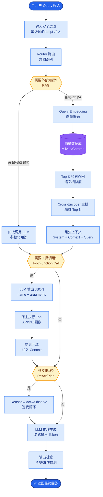

# 为什么选择 ReAct 模式而不是 Plan-and-Execute

**Situation：** 在设计企业级 AI Agent 系统时,需要在 ReAct(Reasoning + Acting)和 Plan-and-Execute 两种主流 Agent 范式之间做出架构决策.业务场景包括客服问答、知识检索、工具调用等多种任务类型.

**Task：** 选择一种既能满足实时交互需求,又能处理复杂多步任务的 Agent 架构范式.

**Action：** 
1. 对比分析两种范式:

**ReAct：** 思考-行动-观察的循环模式,每一步都基于当前观察做出决策,具有强交互性和动态适应能力.

Plan-and-Execute:先制定完整计划,再按步骤执行,适合任务结构明确、步骤可预见的场景.

2. 基于业务场景评估:
企业客服场景中,用户意图经常在对话中变化(如从查订单变成要退款),ReAct 能实时调整策略.
Plan-and-Execute 在计划阶段就需要确定所有步骤,一旦中间步骤失败,整个计划需要重做.
ReAct 的流式特性天然支持“边思考边输出”,用户体验更好.

3. 技术可行性评估:
ReAct 的 Prompt 模板更灵活,可以通过 few-shot 快速调整行为.
ReAct 与 Function Calling 天然兼容,每次思考后可以调用工具.
通过设置最大迭代次数和超时机制,可有效防止死循环.

4. 混合方案设计:
实际落地中采用 ReAct 为主、Plan 为辅的混合方案.
简单查询(单步任务):直接走 ReAct 单次循环.
复杂任务(多步骤):先用 LLM 生成粗粒度 Plan,每个步骤内部用 ReAct 执行.

**架构流程图：**
```text
用户输入
   │
   ▼
┌─────────────────────────────┐
│       混合控制器 Router       │
└──────────────┬──────────────┘
               │
     ┌─────────┴─────────┐
     │ 判断任务复杂度      │
     └─────────┬─────────┘
               │
   ┌───────────┴───────────┐
   │                       │
   ▼                       ▼
简单任务                 复杂任务
   │                       │
   ▼                       ▼
┌─────────┐           ┌──────────────────┐
│ ReAct  │           │ LLM 生成粗粒度    │
│ 循环    │           │ Plan (步骤列表)   │
└────┬────┘           └────────┬─────────┘
     │                         │
     │                  ┌──────┴──────┐
     │                  │             │
     │             步骤1 (ReAct) ... 步骤N (ReAct)
     │                  │             │
     └──────────────────┴─────────────┘
               │
               ▼
          最终输出
```

**Result：** 
系统平均响应时间从纯 Plan-and-Execute 的 8s 降低到 ReAct 模式的 3.2s(简单任务直接缩短为单步).
任务完成率从 78% 提升到 91%,因为 ReAct 能根据中间结果动态调整策略.
用户满意度提升 15%,因为流式输出让用户感知到更快的响应.

## 边界情况
- **工具调用死循环**：当工具返回空结果或格式错误时，Agent可能会反复尝试调用同一个工具（如不断翻页但未设置终止条件），必须设定工具级别的最大重试次数和跳出逻辑。
- **上下文溢出**：ReAct 在长轨迹任务中，历史的 Thought、Action、Observation 会迅速占满 Token 窗口，导致模型丢失最初的指令。需实施摘要机制或滑动窗口来截断早期的低价值观测。
- **工具结果截断**：如果工具返回的内容过长（如一个超长的日志文件），塞入 LLM 上下文会导致成本爆炸或解析失败，需在工具层做预处理截断或摘要。

## 面试追问
1. **状态管理**：ReAct 模式通常是无状态的，如果需要用户在多轮对话中修正之前的参数（如“不是查北京，查上海的天气”），如何高效地更新上下文而不重新执行整个链条？
2. **并行执行**：标准的 ReAct 是串行的，如果 Plan 中的步骤之间没有依赖关系（如同时查天气和股票），如何在 ReAct 框架内实现并行调用来优化性能？
3. **可观测性**：如何追踪 ReAct 的“思考”轨迹来诊断失败原因？特别是当 Thought 本身产生幻觉时，如何设计 Metric 来检测？

## 易错点
- **过度依赖 ReAct 的“思考”能力**：不要指望 ReAct 能完美解决复杂的数学或逻辑规划问题，它的推理能力受限于 LLM 本身。对于复杂逻辑，应结合代码解释器或专用规划器，而非仅靠文本推理。
- **忽视 Tool 的幂等性**：在 ReAct 循环中，容易因为重试而对非幂等接口（如“发送邮件”、“创建订单”）进行重复调用，导致业务灾难。必须在工具定义层明确 Side Effects。


## 核心流程图



## 记忆要点

- ReAct是思考-行动循环，动态适应；Plan是先规划后执行，步骤固定。
- 选ReAct因意图多变需实时调整，流式输出体验好，单步任务响应快。
- 复杂任务采用混合方案：LLM生成粗粒度Plan，步骤内用ReAct执行。
- 易错点：ReAct推理能力有限，复杂逻辑需结合代码解释器，防止死循环。


## 结构化回答

**30 秒电梯演讲：** 边思考边行动的动态交互模式优于静态规划——打个比方，像即兴爵士乐（ReAct）而非照谱演奏（Plan），随时根据听众反馈调整

**展开框架：**
1. **ReAct是思考** — ReAct是思考-行动循环，动态适应；Plan是先规划后执行，步骤固定。
2. **选ReAct因意** — 选ReAct因意图多变需实时调整，流式输出体验好，单步任务响应快。
3. **复杂任务采用混合** — 复杂任务采用混合方案：LLM生成粗粒度Plan，步骤内用ReAct执行。

**收尾：** 以上三点都能配合实战聊。您想深入聊哪一块？

## 视频脚本

> 预计时长：2 分钟 | 由浅入深

| 时间 | 画面/字幕 | 口播台词 | 讲解要点 |
|------|----------|----------|----------|
| 0:00 | 标题卡 | "选择 ReAct 模式而不是 Plan-and-Execute，30 秒讲清楚。" | 开场钩子 |
| 0:30 | 概念定义动画 | "一句话：边思考边行动的动态交互模式优于静态规划" | 核心定义 |
| 1:00 | 要点图解 | "ReAct是思考-行动循环，动态适应；Plan是先规划后执行，步骤固定。" | 要点 |
| 1:30 | 总结卡 | "记好这几条，面试不慌。下期见。" | 收尾 |
