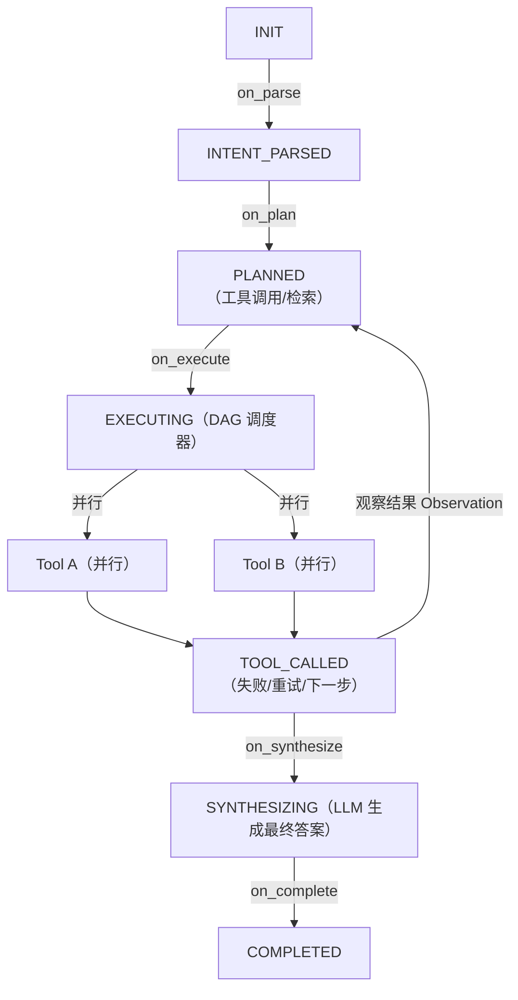
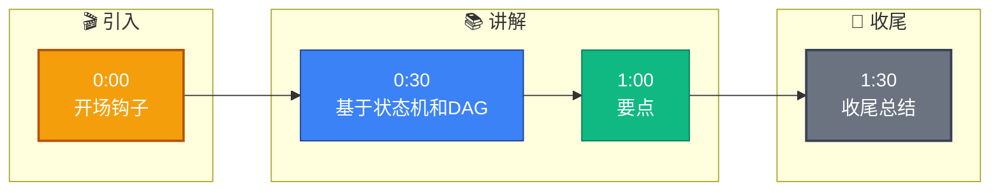

# Agent 编排器是怎么设计的?为什么这样设计

**Situation：** 系统需要协调多个组件(意图识别、检索、生成、工具调用等)的执行流程,需要一个灵活且可扩展的编排机制.

**Task：** 设计一个能支持多种执行模式(顺序、并行、条件分支)且易于扩展的 Agent 编排器.

**Action：** 
1. 核心架构 -- 状态机 + 事件驱动:
定义了 7 个核心状态:INIT → INTENT_PARSED → PLANNED → EXECUTING → TOOL_CALLED → SYNTHESIZING → COMPLETED
每个状态转换由事件触发,通过状态转换表控制流程.

2. 编排器核心组件:
AgentOrchestrator(总编排器): 管理整体流程,维护执行上下文.
TaskPlanner(任务规划器): 将复杂任务分解为子任务 DAG(有向无环图).
ToolDispatcher(工具分发器): 根据 Function Calling 结果调用对应工具.
ContextManager(上下文管理器): 维护对话历史、工具调用结果等上下文信息.

**架构流程图：**


3. 设计决策的考量:
为什么用状态机? 可枚举所有合法状态转换,便于 debug 和异常处理,比纯 LLM 链式调用更可控.
为什么用事件驱动? 解耦各组件,支持异步执行和并行工具调用,提升系统吞吐量.

**实战案例：**
在电商营销助手场景中，我们曾遇到 API 超时导致 Agent "卡死"在 EXECUTING 状态。引入状态机后，通过监听状态停留超时事件（如在 EXECUTING 停留 >10s），自动触发 Fallback 逻辑转人工，系统可用性从 95% 提升至 99.9%。

**代码示例（Python - 状态转换核心）：**
```python
class AgentStateMachine:
    def __init__(self):
        self.state = "INIT"
        self.transitions = {
            "INIT": ["INTENT_PARSED"],
            "INTENT_PARSED": ["PLANNED", "COMPLETED"], # 防御性编程
            "PLANNED": ["EXECUTING"],
            "EXECUTING": ["TOOL_CALLED", "SYNTHESIZING"]
        }

    def transition(self, event):
        next_state = self.event_map.get((self.state, event))
        if next_state and next_state in self.transitions.get(self.state, []):
            self.state = next_state
            print(f"Transition to {self.state}")
            return True
        raise ValueError(f"Invalid transition from {self.state} on {event}")
```


## 记忆要点

- 编排器核心是状态机+事件驱动，定义INIT到COMPLETED的7种状态。
- 状态机枚举合法转换便于Debug，事件驱动解耦组件支持异步并行。
- 组件包括总控、规划器、工具分发器、上下文管理器，支持DAG调度。
- 设计目的：解决多组件协调，支持顺序并行分支，提升系统可控性。


## 结构化回答

**30 秒电梯演讲：** 基于状态机和DAG的异步事件驱动编排框架——打个比方，像交通指挥中心，红绿灯（状态）指挥车辆（事件）走不同路线（DAG）

**展开框架：**
1. **编排器核心是状态** — 编排器核心是状态机+事件驱动，定义INIT到COMPLETED的7种状态。
2. **状态机枚举合法转** — 状态机枚举合法转换便于Debug，事件驱动解耦组件支持异步并行。
3. **组件包括总控、规** — 组件包括总控、规划器、工具分发器、上下文管理器，支持DAG调度。

**收尾：** 以上三点都能配合实战聊。您想深入聊哪一块？

## 视频脚本

> 预计时长：2 分钟 | 由浅入深

| 时间 | 画面/字幕 | 口播台词 | 讲解要点 |
|------|----------|----------|----------|
| 0:00 | 标题卡 | "Agent 编排器是怎么设计的，30 秒讲清楚。" | 开场钩子 |
| 0:30 | 概念定义动画 | "一句话：基于状态机和DAG的异步事件驱动编排框架" | 核心定义 |
| 1:00 | 要点图解 | "编排器核心是状态机+事件驱动，定义INIT到COMPLETED的7种状态。" | 要点 |
| 1:30 | 总结卡 | "记好这几条，面试不慌。下期见。" | 收尾 |

### 视频流程图


