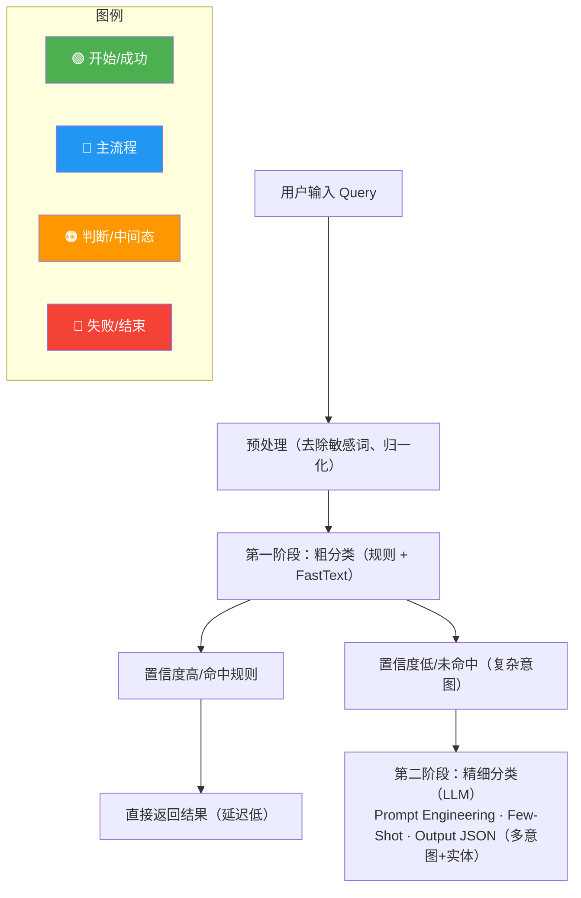
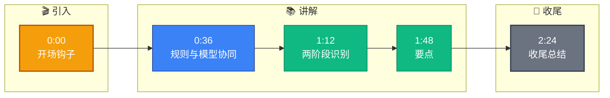

# 意图识别模块是怎么实现的

**Situation：** 企业客服场景中,用户意图多样(咨询、投诉、查询订单、操作请求等),且存在大量隐含意图和多意图混合的情况(如"我的订单怎么还没到,我要退款"同时包含查询和操作意图).

**Task：** 设计一个准确率高、可扩展的意图识别模块,能处理多意图和隐含意图.

**Action：** 
1. 两阶段意图识别架构:
第一阶段 -- 粗分类(基于规则 + 小模型):
正则匹配高频模式(如订单号格式 [A-Z]{2}-\d{8}-\d{3} ).
FastText 轻量分类器做初步意图分类(延迟 < 5ms).
覆盖 80% 的常见查询,快速响应.

第二阶段 -- 精细分类(基于 LLM):
对第一阶段无法确定的复杂查询,调用 LLM 进行意图分析.
使用结构化 Prompt,输出标准 JSON:{"intents": [{"type": "...", "confidence": 0.9, "entities": {...}}]}
支持多意图识别和实体提取.

2. 意图体系设计(三级分类):
**L1：** 咨询/操作/投诉/闲聊
**L2：** 产品咨询/技术咨询/订单查询/退款申请/...
**L3：** 具体产品线/具体操作类型/...

3. 置信度阈值策略:
confidence ≥ 0.85 → 直接执行.
0.6 ≤ confidence < 0.85 → 向用户确认意图.
confidence < 0.6 → 追问澄清.

**Result：** 
意图识别准确率达到 94%(测试集 5000 条标注数据).
多意图识别 F1-score 达到 0.89.
第一阶段处理了 80% 查询,LLM 调用量减少 80%,节省了大量 token 成本.



**实战案例：**
在处理用户反馈 "这玩意儿太烂了，退钱" 时，简单模型只能识别为 "投诉"。引入 LLM 二阶段后，成功提取出隐含意图 "退货申请" (OPERATION_RETURN_GOODS) 和情绪特征 "愤怒"，不仅自动触发了退款流程，还智能标记为高优工单转人工安抚，投诉转化率提升了 15%。

**代码示例（Python - 结构化 Prompt 模板）：**
```python
intent_prompt_template = """
You are an intent classifier. Analyze the user query and output JSON.
Query: "{query}"

Supported Intents: 
- ORDER_QUERY: Asking about order status.
- REFUND_REQUEST: Asking to return money or goods.
- COMPLAINT: Expressing dissatisfaction without specific action.

Output Format (JSON only):
{{
  "primary_intent": "...",
  "sub_intent": "...",
  "confidence": 0.0-1.0,
  "entities": {{"order_id": "..."}}
}}
"""
```


## 记忆要点

- 两阶段识别：一阶段规则+FastText粗分类（快），二阶段LLM精细分类（准）。
- 意图体系分三级（咨询/操作/投诉），支持多意图和隐含意图提取。
- 置信度策略：≥0.85直接执行，0.6-0.85确认，<0.6追问，平衡体验与风险。
- 核心优势：80%流量走低成本规则，复杂意图靠LLM，降本增效。


## 结构化回答

**30 秒电梯演讲：** 规则与模型协同的两级漏斗式意图识别——打个比方，像前台分诊台，护士（规则）先看简单的，疑难杂症转给专家（LLM）

**展开框架：**
1. **两阶段识别** — 一阶段规则+FastText粗分类（快），二阶段LLM精细分类（准）。
2. **意图体系分三级（** — 意图体系分三级（咨询/操作/投诉），支持多意图和隐含意图提取。
3. **置信度策略** — ≥0.85直接执行，0.6-0.85确认，<0.6追问，平衡体验与风险。

**收尾：** 以上三点都能配合实战聊。您想深入聊哪一块？

## 视频脚本

> 预计时长：3 分钟 | 由浅入深

| 时间 | 画面/字幕 | 口播台词 | 讲解要点 |
|------|----------|----------|----------|
| 0:00 | 标题卡 | "意图识别模块是怎么实现的，30 秒讲清楚。" | 开场钩子 |
| 0:36 | 概念定义动画 | "一句话：规则与模型协同的两级漏斗式意图识别" | 核心定义 |
| 1:12 | 两阶段识别图解 | "一阶段规则+FastText粗分类（快），二阶段LLM精细分类（准）。" | 两阶段识别 |
| 1:48 | 要点图解 | "意图体系分三级（咨询/操作/投诉），支持多意图和隐含意图提取。" | 要点 |
| 2:24 | 总结卡 | "记好这几条，面试不慌。下期见。" | 收尾 |

### 视频流程图


