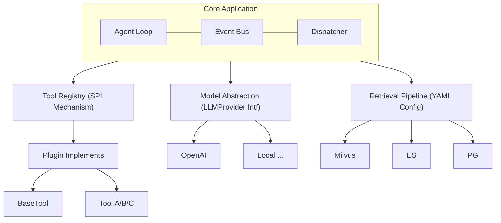
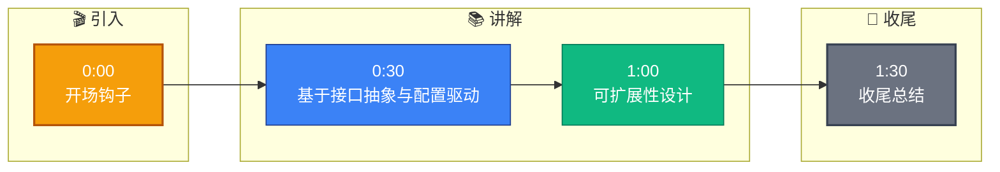

# 系统的可扩展性是怎么设计的

**Situation：** 系统需要支持业务快速迭代,包括新增工具、新增知识源、新增 Agent 类型、新增模型等,不能每次都改核心代码.

**Task：** 设计一套可扩展架构,让新功能接入的边际成本趋近于零.

**Action：** 
1. **插件化工具系统**:
所有工具继承 `BaseTool`,通过 `ToolRegistry` 自动注册.
工具描述自动生成 Function Calling 的 JSON Schema.

2. **可配置的检索管道**:
检索管道通过 YAML 配置文件定义.
新增检索通道只需添加配置项和实现对应引擎接口.

3. **模型抽象层**:
统一的 `LLMProvider` 接口,支持 OpenAI、Anthropic、本地模型等.
通过配置切换模型,不修改业务代码.

4. **事件总线**:
核心流程通过事件总线解耦.
新增功能可以通过监听事件来扩展,不侵入主流程.

**系统架构图 (ASCII):**


**实战案例：** 曾因第三方天气插件 API 超时未设置重试机制，导致整个 Agent 服务阻塞 30 秒。后续引入了 `Resilience4j` 为每个工具插件包装独立的线程池和熔断器，确保单一工具故障不影响主流程。

**代码示例（Python SPI 注册机制）：**
```python
# 基础接口
class BaseTool(ABC):
    @abstractmethod
    def execute(self, params: dict) -> str:
        pass

# 自动注册装饰器
def register_tool(name: str):
    def decorator(cls):
        ToolRegistry.register(name, cls) # 运行时加载到注册中心
        return cls
    return decorator

# 具体工具实现，零侵入注册
@register_tool("weather_search")
class WeatherTool(BaseTool):
    def execute(self, params):
        return requests.get(f"...?q={params['city']}").text
```

**方案对比：**

| 维度 | 插件化架构 (本方案) | 硬编码架构 | 微服务拆分架构 |
| :--- | :--- | :--- | :--- |
| **扩展性** | ⭐⭐⭐⭐⭐ (动态加载) | ⭐ (需改代码重启) | ⭐⭐⭐⭐ (独立部署) |
| **通信开销** | ⭐⭐⭐⭐⭐ (进程内调用) | ⭐⭐⭐⭐⭐ (本地调用) | ⭐⭐ (网络序列化) |
| **故障隔离** | ⭐⭐⭐ (需配合线程池) | ⭐ (级联故障风险高) | ⭐⭐⭐⭐⭐ (进程级隔离) |
| **运维复杂度** | ⭐⭐⭐⭐ (单进程管理) | ⭐⭐⭐⭐⭐ (最简单) | ⭐⭐ (需容器编排) |
| **适用场景** | 工具链多变、性能敏感 | 业务极其固定 | 大规模独立团队协作 |

**Result：** 
**新工具接入：** 平均 2 小时(实现接口 + 写配置).
**新检索通道接入：** 半天.
**切换底层模型：** 改一行配置,零代码改动.
系统在 6 个月内新增了 8 个工具、3 个检索通道,核心代码零修改.

## 常见考点
- **热加载与隔离**：工具插件如果挂了会影响主进程吗？（回答：利用独立类加载器或沙箱机制，或者采用微服务隔离）
- **配置校验**：YAML 配置如何保证合法性？（回答：使用 Schema 定义并在启动时进行校验，防止运行时配置错误）
- **版本兼容性**：当 `BaseTool` 接口升级时，旧插件如何处理？（回答：遵循接口适配器模式，或者维护多版本接口）


## 记忆要点

- 可扩展性设计：插件化工具、可配置检索管道、模型抽象层、事件总线。
- 工具继承BaseTool自动注册，检索管道YAML配置，模型统一LLMProvider接口。
- 事件总线解耦核心流程，新功能监听事件接入，不侵入主代码。
- 目标：新增功能边际成本趋近零，支持热插拔和故障隔离。


## 结构化回答

**30 秒电梯演讲：** 基于接口抽象与配置驱动的插件化扩展架构——打个比方，像乐高积木，新功能只需按标准接口（凸点凹槽）插上，不用重塑底座

**展开框架：**
1. **可扩展性设计** — 插件化工具、可配置检索管道、模型抽象层、事件总线。
2. **工具继承Base** — 工具继承BaseTool自动注册，检索管道YAML配置，模型统一LLMProvider接口。
3. **事件总线解耦核心** — 事件总线解耦核心流程，新功能监听事件接入，不侵入主代码。

**收尾：** 以上三点都能配合实战聊。您想深入聊哪一块？

## 视频脚本

> 预计时长：2 分钟 | 由浅入深

| 时间 | 画面/字幕 | 口播台词 | 讲解要点 |
|------|----------|----------|----------|
| 0:00 | 标题卡 | "系统的可扩展性是怎么设计的，30 秒讲清楚。" | 开场钩子 |
| 0:30 | 概念定义动画 | "一句话：基于接口抽象与配置驱动的插件化扩展架构" | 核心定义 |
| 1:00 | 可扩展性设计图解 | "插件化工具、可配置检索管道、模型抽象层、事件总线。" | 可扩展性设计 |
| 1:30 | 总结卡 | "记好这几条，面试不慌。下期见。" | 收尾 |

### 视频流程图


