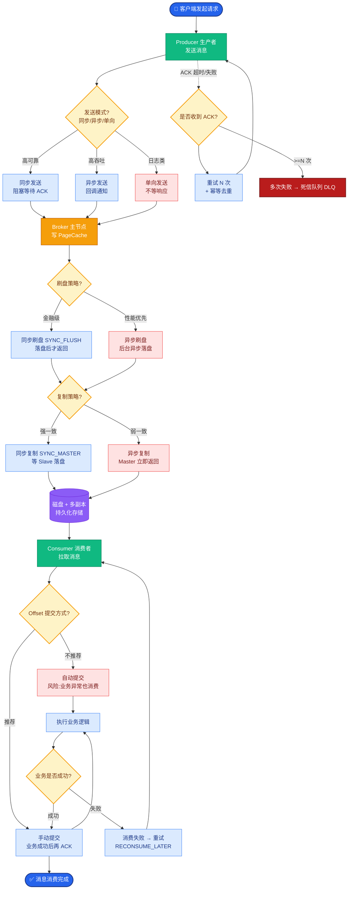

# 如果让你重新设计这个系统,你会怎么改进

**Situation：** 系统已经稳定运行一段时间,积累了很多实践经验和教训,有一些当初的设计决策在回头看是可以优化的.

**Task：** 基于实际运行经验,总结需要改进的点,给出具体的优化方案.

**Action：** 
1. **评估驱动开发**:
当初测试主要靠手动验证,应该从项目开始就建立自动化评估体系.
**改进：** 引入 RAGAS、DeepEval 等框架,建立 CI 流水线中的自动评估.
每次提交自动跑评估集(500+ case),防止回归.

**实战案例**：曾因上线新 Prompt 导致 RAG 检索逻辑失效，回滚耗时 4 小时；引入自动化评估后，类似逻辑错误在 CI 阶段即被拦截（Faithfulness 指标跌至 0.6）。

2. **可观测性增强**:
当初的日志系统是后补的,trace 不够完整.
**改进：** 从第一行代码就接入 LangSmith / LangFuse,实现全链路 trace.
每个 Agent 步骤都有 span,可以在 dashboard 上看到完整的推理链路.

3. **Streaming 优先架构**:
当初是先实现同步接口,后来改成流式,改造成本很高.
**改进：** 从设计阶段就以 SSE/WebSocket 流式为默认通信方式.

4. **更细粒度的模型路由**:
当初只有简单/复杂两档路由.
**改进：** 根据任务类型(分类/生成/推理/摘要)、输入长度、质量要求,做更细粒度的模型选择.

5. **Agent 记忆系统重构**:
当初的记忆系统比较粗糙,只是简单的窗口截断.
**改进：** 实现分层记忆(工作记忆 + 情景记忆 + 语义记忆),引入记忆索引和检索机制.

**关键代码：**
```python
# LangSmith 自动化评估集成示例
from langsmith import Client
from ragas import evaluate

client = Client()

def run_ci_evaluation(dataset_name="production_golden_set"):
    # 获取当前 CI 构建的结果
    run_results = client.list_runs(project_name="pr-123")
    # 运行 RAGAS 评估
    result = evaluate(
        run_results,
        metrics=[faithfulness, answer_relevance],
    )
    # 如果分数低于阈值，阻断流水线
    if result["faithfulness"] < 0.9:
        raise Exception("Regression detected: Faithfulness dropped")
```

**CI/CD 评估流程图 (ASCII):**
```text
Git Push Event
     │
     ▼
[CI Pipeline Trigger]
     │
     ├─► [Unit Tests]
     │     │
     │     └──> PASS/FAIL
     │
     ├─► [Build Docker Image]
     │
     ▼
[Auto Evaluation Stage (RAGAS/DeepEval)]
     │
     ├─► Load Golden Dataset (500+ Cases)
     │
     ├─► Run Inference (New Version)
     │     │
     │     └─► Capture Traces (LangSmith)
     │
     └─► Compare vs Baseline Metrics
           │
           ├─► Faithfulness (≥ 0.9 ?)
           ├─► Answer Relevance (≥ 0.85 ?)
           └─► Context Precision
                 │
                 ▼
            [Decision Gate]
           /              \
        PASS               FAIL
         │                 │
         ▼                 └─► Block Merge & Alert
[Deploy to Staging]
```

**Result：** 这些改进方案已经在新版本中逐步实施,形成了团队的最佳实践文档.这个反思过程本身也体现了持续优化的工程思维.

## 常见考点
- **评估指标的选择**：RAGAS 中的 Faithfulness 和 Answer Relevance 具体怎么计算？（回答：利用 LLM 作为 Judge 进行打分或生成式评估）
- **LangSmith 实现原理**：它是如何捕获 LLM 调用上下文的？（回答：基于 Python 的上下文管理器或回调机制，Hook OpenAI/Anthropic 的日志接口）
- **流式与非流式的权衡**：全流式架构对后端中间件（如 Kafka、Redis）有什么特殊要求？（回答：需要支持背压机制和流式处理，防止内存积压）
- **回归阈值设定**：如果新版本性能提升了但 RAGAS 分数下降了 1%，该不该上线？（回答：视业务场景而定，通常设定硬性阈值，低于阈值必须人工审查）


## 核心流程图



## 记忆要点

- 评估驱动：引入RAGAS/DeepEval建立CI自动评估，防止回归，核心指标Faithfulness≥0.9。
- 可观测性：首选LangSmith全链路Trace，从第一行代码接入，可视化推理过程。
- 架构优先：默认采用SSE/WebSocket流式通信，避免后期改造成本。
- 模型路由：根据任务类型、长度、质量做细粒度选择，而非简单两档。
- 记忆重构：实现分层记忆（工作/情景/语义），替代简单窗口截断。


## 结构化回答

**30 秒电梯演讲：** 从手动验证转向自动化评估与全链路可观测——打个比方，像装修后复盘，应该先装监控（可观测）再定标准（自动化），而不是最后修补

**展开框架：**
1. **评估驱动** — 引入RAGAS/DeepEval建立CI自动评估，防止回归，核心指标Faithfulness≥0.9。
2. **可观测性** — 首选LangSmith全链路Trace，从第一行代码接入，可视化推理过程。
3. **架构优先** — 默认采用SSE/WebSocket流式通信，避免后期改造成本。

**收尾：** 以上三点都能配合实战聊。您想深入聊哪一块？

## 视频脚本

> 预计时长：2 分钟 | 由浅入深

| 时间 | 画面/字幕 | 口播台词 | 讲解要点 |
|------|----------|----------|----------|
| 0:00 | 标题卡 | "如果让你重新设计这个系统,你会怎么改进，30 秒讲清楚。" | 开场钩子 |
| 0:30 | 概念定义动画 | "一句话：从手动验证转向自动化评估与全链路可观测" | 核心定义 |
| 1:00 | 评估驱动图解 | "引入RAGAS/DeepEval建立CI自动评估，防止回归，核心指标Faithfulness≥0.9。" | 评估驱动 |
| 1:30 | 总结卡 | "记好这几条，面试不慌。下期见。" | 收尾 |
