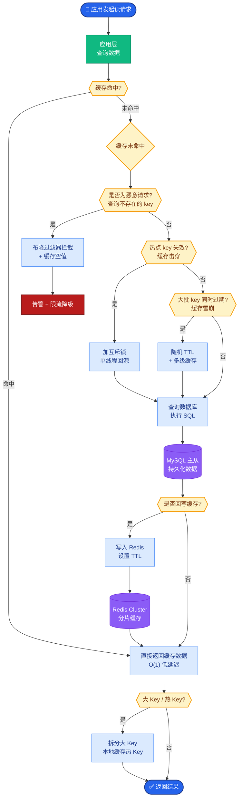

# 你的系统能支持多少并发?怎么评估的

**Situation：** 系统上线前需要进行压力测试,评估系统的并发处理能力,确保能满足业务高峰期的需求.
**Task：** 设计压测方案,找到系统的性能瓶颈和容量上限.
**Action：** 
1. **压测工具和方法**:
   使用 Locust 进行分布式压测,模拟真实用户行为.
   **压测场景：** 简单问答(单轮)、多轮对话、RAG 检索问答、工具调用.
   **按比例混合：** 简单问答 40%、RAG 30%、多轮对话 20%、工具调用 10%.

2. **系统配置(压测环境)**:
   **API 服务**: 4 个 Pod,每个 4C8G.
   **Milvus：** 3 节点集群,每节点 8C32G.
   **Redis：** 3 节点 Sentinel 集群.
   **LLM：** 使用云端 API(GPT-4 级别),QPS 限制 200.

3. **压测结果**:
   - 50 并发: P99 延迟 2.8s, QPS 48, 错误率 0%.
   - 100 并发: P99 延迟 4.2s, QPS 85, 错误率 0.1%.
   - 200 并发: P99 延迟 8.5s, QPS 120, 错误率 2.3%.
   - 300 并发: P99 延迟 15s+, QPS 110(开始下降), 错误率 8.7%.

4. **瓶颈分析**:
   - 主要瓶颈在 LLM API 的 QPS 限制和延迟.
   - Milvus 检索在 200 并发下仍然很轻松(延迟 < 80ms).
   - 通过模型路由(简单查询走小模型)可以有效缓解 LLM 瓶颈.

**实战案例**：曾在线上出现 LLM Provider 侧故障导致响应超时，由于未在网关层配置熔断，导致后端服务线程池全部阻塞，最终引发雪崩。压测后增加了 Timeout 和 Circuit Breaker 策略。

**关键代码：**
```python
# Locust 压测脚本模拟混合流量
from locust import HttpUser, task, between

cnvs = ["simple"] * 4 + ["rag"] * 3 + ["multi"] * 2 + ["tool"]

cnvs_iter = iter(cycle(cnvs))

class AIUser(HttpUser):
    wait_time = between(1, 3)
    
    @task
    def chat_request(self):
        task_type = next(cnvs_iter)
        payload = get_mock_payload(task_type)
        
        with self.client.post("/v1/chat", json=payload, catch_response=True) as resp:
            if resp.status_code == 200:
                resp.success()
            else:
                resp.failure(f"Got status {resp.status_code}")
```

**调用链路与瓶颈分析图 (ASCII):**
```text
用户请求
   │
   ▼
[API Gateway / Load Balancer]
   │
   ├─► [API Service Pod 1] ──┐
   ├─► [API Service Pod 2]  │  4C8G x 4 (未达瓶颈)
   ├─► [API Service Pod 3]  │
   └─► [API Service Pod 4] ──┘
             │
             ├──────────────┼──────────────┐
             ▼              ▼              ▼
       [Redis Cache]   [Milvus Cluster] [LLM Provider API]
       (Hit Rate >    (P99 < 80ms)     (主要瓶颈 !!!)
        90%)             │               (QPS Limit)
                        │               (Token Limit)
                        └───────────────┴──> 响应慢/超时
```

**Result：** 
- 系统安全容量上限定为 150 并发(P99 < 5s, 错误率 < 0.5%).
- 日常业务高峰约 80 并发, 有充足余量.
- **制定了弹性扩缩容策略：** 并发超过 120 时自动扩容 API Pod.

## 常见考点
- **Warm-up（预热）**：为什么压测开始的数据通常不准确？（回答：JIT 编译、连接池建立、缓存未热）
- **限流策略**：当 LLM 触发 Rate Limit 时，系统如何处理？（回答：采用降级策略、重试机制或排队）
- **水位线计算**：P99 和平均延迟哪个更重要？如何定安全水位？（回答：P99 决定了用户的最差体验，安全水位通常定在吞吐量开始下降或延迟急剧上升之前的拐点）
- **数据隔离**：压测数据是否污染线上数据？（回答：使用影子库或独立的压测环境）
- **连接池 exhaustion**：在高并发下，如果下游 LLM 响应慢，如何防止服务端的连接池被占满导致雪崩？（回答：配置合理的超时时间，使用熔断器如 Hystrix/Resilience4j，或采用异步非阻塞 IO 模型）


## 核心流程图



## 记忆要点

- 压测工具：使用Locust模拟混合流量（问答40%、RAG30%等），找到瓶颈。
- 瓶颈定位：主要瓶颈通常是LLM API的QPS限制，向量库通常余量充足。
- 安全水位：定在吞吐量下降或延迟激增拐点前，如150并发(P99<5s)。
- 防护策略：配置Timeout和熔断器，防止下游慢导致线程池满引发雪崩。
- 扩容策略：设定阈值（如并发120）自动扩容Pod，应对流量高峰。


## 结构化回答

**30 秒电梯演讲：** 通过压测模拟真实流量，定位系统性能极限与瓶颈。——打个比方，就像试驾时猛踩油门，看车最高时速和哪里会先出问题。

**展开框架：**
1. **压测工具** — 使用Locust模拟混合流量（问答40%、RAG30%等），找到瓶颈。
2. **瓶颈定位** — 主要瓶颈通常是LLM API的QPS限制，向量库通常余量充足。
3. **安全水位** — 定在吞吐量下降或延迟激增拐点前，如150并发(P99<5s)。

**收尾：** 以上三点都能配合实战聊。您想深入聊哪一块？

## 视频脚本

> 预计时长：2 分钟 | 由浅入深

| 时间 | 画面/字幕 | 口播台词 | 讲解要点 |
|------|----------|----------|----------|
| 0:00 | 标题卡 | "你的系统能支持多少并发，30 秒讲清楚。" | 开场钩子 |
| 0:30 | 概念定义动画 | "一句话：通过压测模拟真实流量，定位系统性能极限与瓶颈。" | 核心定义 |
| 1:00 | 压测工具图解 | "使用Locust模拟混合流量（问答40%、RAG30%等），找到瓶颈。" | 压测工具 |
| 1:30 | 总结卡 | "记好这几条，面试不慌。下期见。" | 收尾 |
