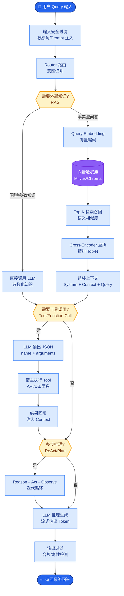

# 为什么要做模型路由?直接用一个模型不行吗

**Situation：** 系统每月的 LLM API 费用高达数万元,且不同类型的查询对模型能力的需求差异很大.简单查询用 GPT-4 是浪费,复杂推理用小模型又不够.
**Task：** 设计一个智能模型路由机制,在保证回答质量的前提下,显著降低 token 成本.
**Action：** 
1. **分析查询分布**:
   统计发现 60% 的查询是简单问答(事实检索、FAQ),小模型即可胜任.
   25% 是中等复杂度(需要多步推理或知识综合).
   15% 是高复杂度(需要强推理、复杂指令遵循).

2. **路由策略设计**:
   **路由判断维度：** 
   ├── 任务复杂度: 简单检索 / 多步推理 / 复杂生成
   ├── 上下文长度: 短文本 / 长文本
   ├── 质量要求: 普通回答 / 高精度回答
   └── 用户等级: 普通用户 / VIP 用户

3. **模型矩阵**:
   - **轻量模型**(GPT-4o-mini / Claude 3 Haiku): 简单问答、意图分类、实体提取.
   - **标准模型**(GPT-4o / Claude 3.5 Sonnet): 中等复杂度推理、RAG 答案生成.
   - **强力模型**(GPT-4 / Claude 3 Opus): 复杂推理、长文本分析、关键业务决策.

4. **路由器实现**:
   轻量级分类器(基于规则 + FastText)判断查询复杂度,延迟 < 3ms.
   **动态降级机制：** 强力模型超时或报错时,自动降级到标准模型.

**实战案例**：上线初期将所有“你好”类问候都路由到了 GPT-4，单日浪费约 $50。优化路由规则后，这类闲聊直接由极低成本模型（甚至规则匹配）处理，成本归零。

**关键代码：**
```python
# 简易路由逻辑示例
model_map = {
    "simple": "gpt-4o-mini",
    "medium": "gpt-4o",
    "complex": "gpt-4-turbo"
}

def route_query(query: str) -> str:
    # 规则 1: 关键词匹配
    if any(k in query.lower() for k in ["hello", "hi", "价格"]):
        return model_map["simple"]
    
    # 规则 2: 分类器预测 (模拟)
    complexity = classifier.predict(query) # returns 'low', 'mid', 'high'
    
    if complexity == 'low': return model_map["simple"]
    if complexity == 'mid': return model_map["medium"]
    return model_map["complex"]
```

**模型路由流程图 (ASCII):**
```text
User Query
    │
    ▼
┌───────────────────────┐
│  Router Classifier    │
│  (Cost: < 5ms / < $0) │
└───────────┬───────────┘
            │
    ┌───────┼───────┬───────────┐
    │       │       │           │
    ▼       ▼       ▼           ▼
[Simple] [Medium] [Complex]  [Fallback]
    │       │       │           │
    ▼       ▼       ▼           ▼
 Lightweight  Standard   Heavy    Heavy (Retry)
 (Low Cost)  (Mid Cost) (High $$)   │
    │       │       │           │
    └───────┴───────┴───────────┘
            │
            ▼
       Response
```

**Result：** 
- 月均 token 成本降低 62%(从 5 万降到 1.9 万).
- 回答质量几乎无损(用户满意度仅下降 1.2%).
- 系统整体延迟降低 35%(小模型响应更快).

## 常见考点
- **冷启动问题**：路由分类器本身也需要训练或定义规则，如何保证分类准确率？（回答：利用历史已标注数据训练，或者使用少量强模型进行离线打标）
- **边缘情况处理**：如果 Lightweight 模型回答错误，用户是否有反馈机制？（回答：监控“重试率”或“人工介入率”，反馈给路由器优化策略）
- **路由开销**：为了路由是否引入了额外的延迟？（回答：使用极轻量模型或规则引擎，远小于节省的 LLM 生成时间）
- **兜底策略**：如果路由器判断失误，将复杂请求发给了小模型导致幻觉，如何实时感知并纠正？（回答：输出端设置质量检测器，或者监听用户负反馈如“重新生成”按钮，触发升级路由）


## 核心流程图



## 记忆要点

- 核心价值：平衡成本与质量，简单任务用小模型，复杂任务用大模型，降本60%+。
- 路由维度：基于任务复杂度、上下文长度、质量要求、用户等级进行判断。
- 模型矩阵：轻量(分类/提取)、标准(推理/RAG)、强力(复杂决策)分层配置。
- 路由开销：使用规则或轻量分类器，延迟<5ms，远小于生成时间。
- 兜底机制：强力模型超时自动降级，监听用户“重试”反馈优化路由策略。


## 结构化回答

**30 秒电梯演讲：** 根据任务难度动态分发请求至不同成本的模型。——打个比方，打车时短途叫快车省钱，长途或商务接待才选专车。

**展开框架：**
1. **核心价值** — 平衡成本与质量，简单任务用小模型，复杂任务用大模型，降本60%+。
2. **路由维度** — 基于任务复杂度、上下文长度、质量要求、用户等级进行判断。
3. **模型矩阵** — 轻量(分类/提取)、标准(推理/RAG)、强力(复杂决策)分层配置。

**收尾：** 以上三点都能配合实战聊。您想深入聊哪一块？

## 视频脚本

> 预计时长：2 分钟 | 由浅入深

| 时间 | 画面/字幕 | 口播台词 | 讲解要点 |
|------|----------|----------|----------|
| 0:00 | 标题卡 | "要做模型路由，30 秒讲清楚。" | 开场钩子 |
| 0:30 | 概念定义动画 | "一句话：根据任务难度动态分发请求至不同成本的模型。" | 核心定义 |
| 1:00 | 核心价值图解 | "平衡成本与质量，简单任务用小模型，复杂任务用大模型，降本60%+。" | 核心价值 |
| 1:30 | 总结卡 | "记好这几条，面试不慌。下期见。" | 收尾 |
