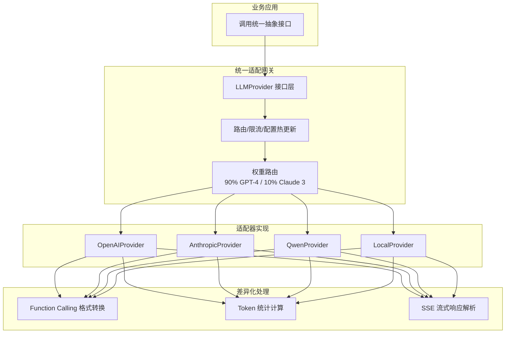
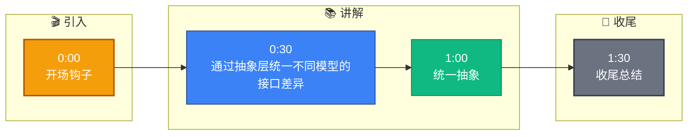

# 你的系统支持哪些模型?怎么做模型适配的

**Situation：** 企业客户有不同的模型偏好:有的要用 OpenAI,有的要用国产模型(如通义千问、文心一言),有的有本地部署需求.
**Task：** 设计统一的模型抽象层,让系统可以无缝切换不同的 LLM 提供商.
**Action：** 
1. **统一接口抽象**:
   ```python
   class LLMProvider(ABC):
       async def chat(self, messages, **kwargs) -> LLMResponse: ...
       async def stream_chat(self, messages, **kwargs) -> AsyncIterator[str]: ...
       def count_tokens(self, text) -> int: ...
       def get_model_info(self) -> ModelInfo: ...
   ```
2. **适配器模式实现**:
   - **OpenAIProvider**: 适配 OpenAI / Azure OpenAI API.
   - **AnthropicProvider**: 适配 Claude 系列.
   - **QwenProvider**: 适配通义千问(兼容 OpenAI 格式).
   - **LocalProvider**: 适配 vLLM / Ollama 部署的本地模型.
3. **差异化处理**:
   - **Function Calling 格式**: OpenAI 用 `tools` 字段, Claude 用 `tool_use`,统一抽象后业务无感知.
   - **Token 计算**: 不同模型的 tokenizer 不同,每个 Provider 实现自己的 `count_tokens`.
   - **流式响应：** 不同 API 的 SSE 格式略有差异,在 Provider 层统一处理.
4. **配置热更新与路由**:
   - 使用配置中心管理模型参数,支持运行时动态切换 Provider 和超时设置.
   - 实现权重路由,支持 A/B 测试或灰度发布(如 90% 流量走 GPT-4, 10% 走 Claude 3).
   - 针对模型限流,在 Provider 层实现了令牌桶算法进行请求整形.

**实战案例**：某客户临时要求从 OpenAI 切换至私有化部署的 Qwen-72B，因已预留适配接口，仅修改配置文件中的 `provider_name` 和 `endpoint`，耗时 10 分钟完成切换，未改动业务代码。

**关键代码：**
```python
# 统一调用入口
class LLMService:
    def __init__(self, provider: LLMProvider):
        self.provider = provider

    async def ask(self, query: str):
        messages = [{"role": "user", "content": query}]
        # 业务层无需关心底层是 OpenAI 还是 Local
        response = await self.provider.chat(messages)
        return response.content

# 具体适配器示例
class QwenProvider(LLMProvider):
    async def chat(self, messages, **kwargs):
        # 转换 Qwen 特有的参数格式
        payload = self._transform_payload(messages)
        async with aiohttp.post(self.endpoint, json=payload) as resp:
            return self._parse_response(await resp.json())
```

**模型适配对比表：**

| 特性 | OpenAI | Anthropic (Claude) | 通义千问 | 本地模型
| :--- | :--- | :--- | :--- | :---
| **认证方式** | API Key | x-api-key Header | API Key / AK/SK | 无鉴权或自定义 Header
| **Function Calling** | `tools` + `tool_calls` | `tools` + `tool_use` | `tools` (兼容 OpenAI) | 通常不支持或需手动 Prompt
| **流式格式** | SSE `data: {}` | SSE `event: message_start` | SSE `data: {}` | HTTP Chunk 或 SSE
| **Token 计算** | `tiktoken` (cl100k_base) | Claude 自有 Tokenizer | Qwen Tokenizer | HuggingFace Tokenizer
| **最大上下文** | 128k (GPT-4-turbo) | 200k (Claude 3) | 32k / 128k | 取决于显存 (VRAM)

**Result：** 
- 支持 6 种模型提供商,切换只需改配置.
- **新模型适配：** 平均 1 天完成(实现 Provider + 测试).
- 多个客户使用不同模型,同一套业务代码.

## 流程图




## 记忆要点

- 统一抽象：定义LLMProvider接口，屏蔽OpenAI/Claude/本地模型差异。
- 适配器模式：各厂商实现Chat、Stream、CountTokens，处理Function Calling格式差异。
- 配置热更：通过配置中心动态切换Provider，支持灰度发布和A/B测试。
- 差异处理：统一流式SSE格式和Token计算逻辑，业务层无感。
- 实战效果：新模型适配仅需1天，切换只需改配置，代码零改动。


## 结构化回答

**30 秒电梯演讲：** 通过抽象层统一不同模型的接口差异，实现灵活切换。——打个比方，万能充电头，不管是苹果还是安卓，插上就能充。

**展开框架：**
1. **统一抽象** — 定义LLMProvider接口，屏蔽OpenAI/Claude/本地模型差异。
2. **适配器模式** — 各厂商实现Chat、Stream、CountTokens，处理Function Calling格式差异。
3. **配置热更** — 通过配置中心动态切换Provider，支持灰度发布和A/B测试。

**收尾：** 以上三点都能配合实战聊。您想深入聊哪一块？

## 视频脚本

> 预计时长：2 分钟 | 由浅入深

| 时间 | 画面/字幕 | 口播台词 | 讲解要点 |
|------|----------|----------|----------|
| 0:00 | 标题卡 | "你的系统支持哪些模型，30 秒讲清楚。" | 开场钩子 |
| 0:30 | 概念定义动画 | "一句话：通过抽象层统一不同模型的接口差异，实现灵活切换。" | 核心定义 |
| 1:00 | 统一抽象图解 | "定义LLMProvider接口，屏蔽OpenAI/Claude/本地模型差异。" | 统一抽象 |
| 1:30 | 总结卡 | "记好这几条，面试不慌。下期见。" | 收尾 |

### 视频流程图


