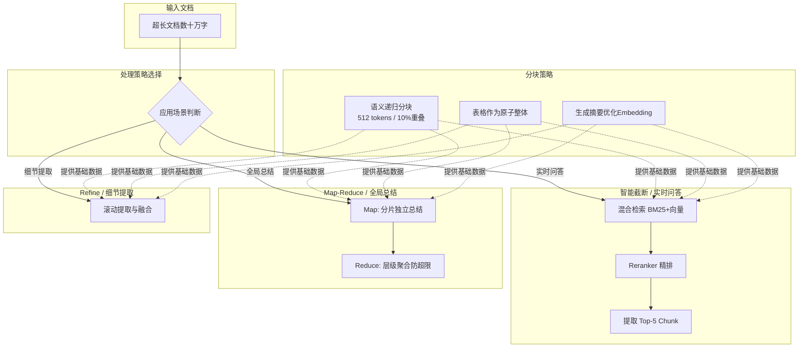

# 如何处理长文档输入?上下文窗口不够怎么办

**Situation：** 企业文档动辄数万字甚至数十万字,远超模型的 context window 限制(如 GPT-4 的 8K/32K/128K).
**Task：** 设计一套长文档处理方案,在不丢失关键信息的前提下,让系统能处理任意长度的文档.
**Action：** 
1. **分块策略**:
   基于语义的分块(不是简单按固定长度切分):
   - 先按章节/段落自然分割.
   - 每个 chunk 大小目标 512 tokens,允许 ±20% 浮动.
   - 相邻 chunk 有 10% 的重叠,避免语义断裂.
   - **递归分块：** 先按 `\n\n` 分,不够再按 `\n` 分,再按句号分.
   - **索引优化**：为每个 chunk 生成摘要并一起 Embedding，提高检索的语义匹配度（Parent Document Retriever 思想）.
2. **Map-Reduce 策略(超长文档总结)**:
   - **Map 阶段**: 对每个 chunk 独立做摘要.
   - **Reduce 阶段**: 对所有 chunk 摘要再做综合总结.
   - 适用于"总结这份 100 页的报告"类需求.
   - **边界控制**：若 Map 阶段 chunk 数量 N 过大(如 N>20)，需采用层级 Reduce（树状聚合）以防最终 Prompt 超限.
3. **Refine 策略(需要细节的场景)**:
   逐 chunk 处理,每次将上一步结果和当前 chunk 一起输入.
   适用于"找到文档中所有提到的风险点"类需求.
   - **缺点**：上下文长度线性增长，Token 消耗大，且存在"迷失中间"现象，中间部分的信息容易被遗忘.
4. **智能截断(实时问答场景)**:
   RAG 检索后,只取最相关的 top-5 chunk 放入 context.
   通过 reranker (如 BGE-Reranker 或 Cohere Rerank) 精排,确保最相关的内容在前面.
   - **混合检索**：结合关键词检索（BM25）和向量检索，召回率提升约 15%.

**实战案例：** 
在处理一份包含大量技术参数表格的 PDF 时，简单的递归分块导致表格被从中间切断，使得检索到的内容缺少表头，模型无法理解数据含义。解决方案是引入基于布局解析（如 PDFPlumber 的表格提取）的分块逻辑，将表格视为一个原子整体，并生成“表头+列名”的伪摘要附在 Embedding 前，解决了表格数据的检索断层问题。

**代码示例（Python - LlamaIndex 语义分块）：**
```python
from llama_index.core.node_parser import SemanticSplitterNodeParser
from llama_index.embeddings.openai import OpenAIEmbedding

# 实战：利用 Embedding 相似度进行语义分块，避免句子中间断开
embed_model = OpenAIEmbedding()
splitter = SemanticSplitterNodeParser(
    buffer_size=1, paragraph_separator="\n\n"
)

nodes = splitter.get_nodes_from_documents(documents)
# 输出节点包含其窗口内的上下文，保证语义连贯性
```

**策略对比：**
| 特性 | Map-Reduce | Refine (滚动摘要) | RAG (向量检索) |
| :--- | :--- | :--- | :--- |
| **适用场景** | 全局摘要、归纳整理 | 提取细节、连贯性生成 | 实时问答、事实核查 |
| **延迟** | 高 (需等待所有分片处理) | 中 (线性串行处理) | 低 (仅检索相关片段) |
| **Token 消耗** | 高 (Map + Reduce 消耗) | 极高 (每次携带历史上下文) | 低 (Top-K 固定窗口) |
| **信息保留** | 易丢失细节，适合宏观视角 | 细节保留好，但易遗忘早期信息 | 高度聚焦，依赖检索质量 |
| **实现复杂度** | 中 (需处理聚合逻辑) | 低 (简单的循环拼接) | 中 (需依赖向量数据库) |

**Result：** 
- 支持处理最长 50 万字的文档.
- Map-Reduce 总结准确率达到 88%(与人工总结对比).
- 实时问答场景的检索-生成延迟控制在 3s 以内.

## 流程图




## 记忆要点

- 分块策略：语义分块+递归分割，Chunk大小512 tokens，保留10%重叠。
- Map-Reduce：适合全局摘要，先分片总结再聚合，防止超限。
- Refine策略：适合细节提取，滚动摘要但Token消耗大，易遗忘中间信息。
- RAG优化：混合检索(BM25+向量)+Reranker精排，只取Top-5上下文。
- 表格处理：基于布局解析将表格视为原子整体，避免切断导致检索失效。


## 结构化回答

**30 秒电梯演讲：** 通过分块与分层策略，将大文档转化为模型可处理的单元。——打个比方，吃大披萨，先切块，慢慢吃，或者嚼碎了一起咽。

**展开框架：**
1. **分块策略** — 语义分块+递归分割，Chunk大小512 tokens，保留10%重叠。
2. **Map-Redu** — Map-Reduce：适合全局摘要，先分片总结再聚合，防止超限。
3. **Refine策略** — 适合细节提取，滚动摘要但Token消耗大，易遗忘中间信息。

**收尾：** 以上三点都能配合实战聊。您想深入聊哪一块？

## 视频脚本

> 预计时长：2 分钟 | 由浅入深

| 时间 | 画面/字幕 | 口播台词 | 讲解要点 |
|------|----------|----------|----------|
| 0:00 | 标题卡 | "处理长文档输入，30 秒讲清楚。" | 开场钩子 |
| 0:30 | 概念定义动画 | "一句话：通过分块与分层策略，将大文档转化为模型可处理的单元。" | 核心定义 |
| 1:00 | 分块策略图解 | "语义分块+递归分割，Chunk大小512 tokens，保留10%重叠。" | 分块策略 |
| 1:30 | 总结卡 | "记好这几条，面试不慌。下期见。" | 收尾 |

### 视频流程图


