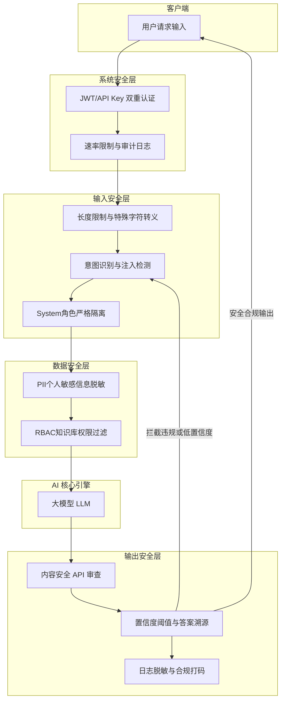

# 系统的安全架构是怎么设计的

**Situation：** 企业级 AI 系统面临多种安全威胁:Prompt 注入、数据泄露、恶意输入、越权访问等.
**Task：** 建立多层安全防护体系,确保系统的安全性和数据合规性.
**Action：** 
1. **输入安全层**:
   - **输入预处理：** 特殊字符转义、长度限制(单次输入 ≤ 2000 字符).
   - **注入检测模型**：训练了一个轻量级分类器,识别常见注入模式(如"忽略之前的指令"、"你现在是..."等).
   - **角色隔离**：用户输入和系统指令严格分离(不拼接在同一个 message 中)，利用 Chat API 的 `system` 字段强制设定。
2. **数据安全层**:
   - **敏感信息脱敏**：PII(个人身份信息)在输入 LLM 前自动脱敏（如用正则替换为 <PERSON>），输出后还原；或采用微差隐私技术。
   - **知识库权限控制**：不同角色可访问不同的知识分区(基于 RBAC)，在检索阶段通过 Metadata Filter 过滤文档。
   - **日志脱敏**：对话日志中的敏感信息自动打码，且符合 GDPR/数据安全法要求。
3. **输出安全层**:
   - **输出内容审核**：调用内容安全 API 检查输出是否包含违规内容（政治敏感、暴力等）。
   - **置信度阈值**：低置信度回答添加免责声明，或触发人工介入。
   - **答案溯源**：每个回答标注引用的知识来源，便于验证和防止幻觉。
4. **系统安全层**:
   - **API 鉴权**: JWT + API Key 双重认证。
   - **速率限制**：每用户每分钟最多 20 次请求，防止 DDoS 和成本刷爆。
   - **审计日志**：所有操作可追溯，包含调用模型、时间、用户、输入输出 Hash。
   - **私有化部署支持**：对于极度敏感数据，支持完全隔离的私有化模型部署，数据不出域。

**实战案例：**
曾遭遇黑客利用“越狱翻译”攻击，用户要求“把以下恶意指令翻译成中文”，试图绕过直接注入检测。我们在系统层增加了一个“意图识别”模块，若检测到请求本质是生成代码或非正常翻译逻辑，即使输入内容看似合法也会拦截；同时引入 LlamaGuard 等开源模型进行输入输出的双重审查。

**代码示例（Python - 输入清洗与检测）：**
```python
import re

def sanitize_input(user_input: str) -> str:
    # 1. 基础清洗：移除控制字符
    clean_input = re.sub(r'[\x00-\x1f\x7f]', '', user_input)
    # 2. 长度截断
    if len(clean_input) > 2000:
        clean_input = clean_input[:2000]
    return clean_input

def is_injection_attack(user_input: str) -> bool:
    # 实战：利用正则快速匹配常见 Prompt Injection 模式
    patterns = [
        r"ignore (previous|all) (instructions?|commands?)",
        r"you are now (a|an) .*",
        r"override (the )?system"
    ]
    return any(re.search(p, user_input, re.IGNORECASE) for p in patterns)
```

**安全层对比：**
| 安全层级 | 主要防护对象 | 技术手段 | 响应速度 | 误伤率 |
| :--- | :--- | :--- | :--- | :--- |
| **输入层** | Prompt 注入、恶意指令 | 正则规则、分类器 | 毫秒级 | 中 (规则严格) |
| **数据层** | PII 泄露、越权访问 | 脱敏算法、RBAC 过滤 | 毫秒级 | 低 (无损还原) |
| **输出层** | 有害内容生成、幻觉 | Moderation API、事实核查 | 秒级 (依赖 API) | 中 (需人工校验) |
| **系统层** | 滥用、未授权访问 | JWT、WAF、限流 | 微秒级 | 低 (标准鉴权) |

**Result：** 
- Prompt 注入防护拦截率 97%(基于 1000 个攻击样本测试).
- 零数据泄露事故.
- 通过了公司内部安全团队的渗透测试.

## 流程图



## 核心知识点图


## 记忆要点

- 输入层：预处理+注入检测+角色隔离，防止Prompt Injection。
- 数据层：PII脱敏、RBAC权限过滤、日志脱敏，确保数据合规。
- 输出层：内容审核API+置信度阈值+答案溯源，防止幻觉和违规。
- 系统层：JWT鉴权+速率限制+审计日志，防止滥用和未授权访问。
- 实战防御：增加意图识别模块拦截“越狱翻译”等绕过攻击。


## 结构化回答

**30 秒电梯演讲：** 构建多层防御体系，从输入到输出全链路保障安全。——打个比方，机场安检，层层关卡：入口检查、行李扫描、身份核验。

**展开框架：**
1. **输入层** — 预处理+注入检测+角色隔离，防止Prompt Injection。
2. **数据层** — PII脱敏、RBAC权限过滤、日志脱敏，确保数据合规。
3. **输出层** — 内容审核API+置信度阈值+答案溯源，防止幻觉和违规。

**收尾：** 以上三点都能配合实战聊。您想深入聊哪一块？

## 视频脚本

> 预计时长：2 分钟 | 由浅入深

| 时间 | 画面/字幕 | 口播台词 | 讲解要点 |
|------|----------|----------|----------|
| 0:00 | 标题卡 | "系统的安全架构是怎么设计的，30 秒讲清楚。" | 开场钩子 |
| 0:30 | 概念定义动画 | "一句话：构建多层防御体系，从输入到输出全链路保障安全。" | 核心定义 |
| 1:00 | 输入层图解 | "预处理+注入检测+角色隔离，防止Prompt Injection。" | 输入层 |
| 1:30 | 总结卡 | "记好这几条，面试不慌。下期见。" | 收尾 |
