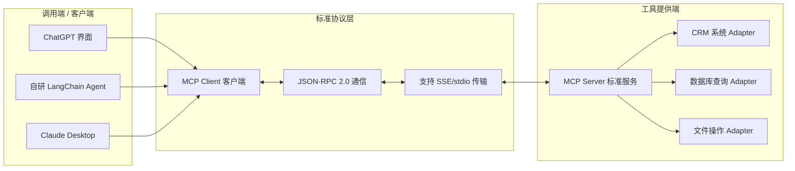
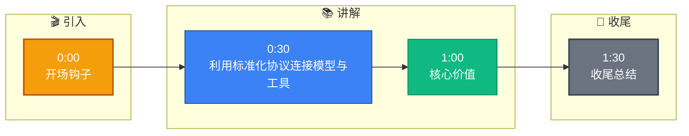

# 你怎么看待 MCP(Model Context Protocol)?在你的系统中是怎么使

**Situation：** Anthropic 发布了 MCP 协议,提供了一种标准化的方式让 AI 模型与外部工具和数据源交互.需要评估是否在系统中采用 MCP.
**Task：** 评估 MCP 的价值,决定是否以及如何在现有系统中集成 MCP.
**Action：** 
1. **MCP 核心价值分析**:
   - **标准化接口：** 定义了 tools、resources、prompts 三大原语,统一了不同工具的接入方式.
   - **双向通信：** 基于 JSON-RPC 2.0,支持服务端主动推送通知.
   - **传输灵活：** 支持 stdio(本地进程)和 SSE(远程服务)两种传输方式.
2. **与 Function Calling 的对比**:
   - Function Calling 是模型厂商的私有协议,每个厂商格式不同.
   - MCP 是开放协议,理论上可以跨模型、跨客户端复用工具.
   - MCP 更适合构建工具生态,Function Calling 更适合简单集成.
3. **在系统中的应用**:
   - 将现有工具封装为 MCP Server,对外提供标准化接口.
   - 数据库查询、API 调用、文件操作等工具都通过 MCP Server 暴露.
   - 内部 Agent 调用工具时,通过 MCP Client 发起请求.
4. **落地挑战和解决**:
   - MCP 生态还在早期,部分工具的 MCP 封装需要自己开发.
   - **安全审核：** 每个 MCP Server 的权限需要严格控制 (如 Capability Manifest).
   - **性能开销：** MCP 协议的序列化/反序列化有额外开销(约 5ms),可接受.
   - **连接管理：** stdio 模式下进程的生命周期管理需要小心处理僵尸进程.

**实战案例：**
在集成企业内部 CRM 工具时，原先每个模型（GPT-4, Claude 3）都要写一套 API Adapter 接口定义。改用 MCP 后，我们只需开发一个 MCP Server，无论是 ChatGPT 的配置界面还是我们自己基于 LangChain 的 Agent，都能直接通过统一的 MCP Client 调用该工具，新增模型支持成本降为 0。

**代码示例（TypeScript - MCP Client 调用工具）：**
```typescript
import { Client } from "@modelcontextprotocol/sdk/client/index.js";
import { StdioClientTransport } from "@modelcontextprotocol/sdk/client/stdio.js";

const transport = new StdioClientTransport({
  command: "node", // 启动本地 MCP Server 进程
  args: ["./my-crm-server.js"]
});

const client = new Client({
  name: "my-agent",
  version: "1.0.0"
}, {
  capabilities: {}
});

await client.connect(transport);
// 统一调用工具，无需关心底层实现
const result = await client.callTool({
  name: "get_customer_info",
  arguments: { id: "12345" }
});
```

**MCP vs 传统 Function Calling 对比：**
| 维度 | MCP (Model Context Protocol) | Function Calling (厂商私有) |
| :--- | :--- | :--- |
| **协议性质** | 开源标准协议 | 私有 API 规范 |
| **互操作性** | 高，一次开发到处运行 | 低，需为每个厂商适配 |
| **连接方式** | Stdio (本地), SSE (HTTP) | 通常是 HTTP REST 或 WebSocket |
| **资源发现** | 内置 List Tools/Prompts/Resources | 依赖外部文档或静态配置 |
| **适用场景** | 复杂工具生态、本地系统集成 | 快速接入单一云端工具 |

**Result：** 
- 工具接入标准化后,新工具的平均接入时间从 2 天缩短到 4 小时.
- 工具可以在不同项目之间复用,减少重复开发.
- 为后续接入社区 MCP 工具生态奠定基础.

## 流程图




## 记忆要点

- 核心价值：标准化工具接口，一次开发跨模型复用，降低接入成本。
- 协议对比：MCP是开放标准，Function Calling是厂商私有，MCP互操作性更强。
- 原语支持：统一Tools、Resources、Prompts三大原语，基于JSON-RPC通信。
- 落地挑战：生态早期需自研Server，需严格控制权限和进程生命周期。
- 实战效果：工具接入时间从2天缩短到4小时，支持跨项目复用。


## 结构化回答

**30 秒电梯演讲：** 利用标准化协议连接模型与工具，实现跨平台复用。——打个比方，像 USB 接口，任何厂家的鼠标键盘插上电脑都能用。

**展开框架：**
1. **核心价值** — 标准化工具接口，一次开发跨模型复用，降低接入成本。
2. **协议对比** — MCP是开放标准，Function Calling是厂商私有，MCP互操作性更强。
3. **原语支持** — 统一Tools、Resources、Prompts三大原语，基于JSON-RPC通信。

**收尾：** 以上三点都能配合实战聊。您想深入聊哪一块？

## 视频脚本

> 预计时长：2 分钟 | 由浅入深

| 时间 | 画面/字幕 | 口播台词 | 讲解要点 |
|------|----------|----------|----------|
| 0:00 | 标题卡 | "你怎么看待 MCP(Model Context Protocol)，30 秒讲清楚。" | 开场钩子 |
| 0:30 | 概念定义动画 | "一句话：利用标准化协议连接模型与工具，实现跨平台复用。" | 核心定义 |
| 1:00 | 核心价值图解 | "标准化工具接口，一次开发跨模型复用，降低接入成本。" | 核心价值 |
| 1:30 | 总结卡 | "记好这几条，面试不慌。下期见。" | 收尾 |

### 视频流程图


