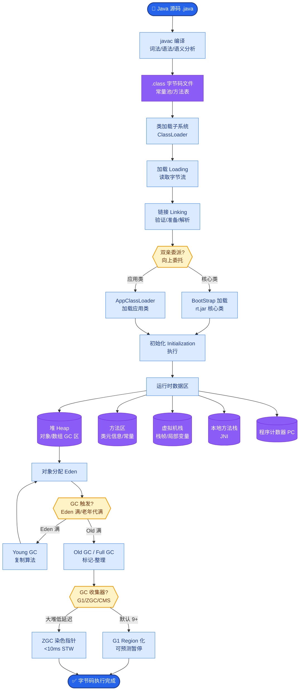

# 你怎么看 Agent 架构的未来发展

**Situation：** AI Agent 技术发展迅速,架构范式在不断演进,需要对未来趋势有前瞻性判断.
**Task：** 分析 Agent 架构的发展趋势,给出有见地的观点.
**Action：** 
1. **当前阶段的特点(2024-2025)**:
   - 以 ReAct、Plan-and-Execute 为主的单 Agent 架构成熟，主要解决工具调用问题。
   - 多 Agent 协作开始落地但尚不成熟，通信协议和冲突解决是难点。
   - 工具生态(MCP、Function Calling)快速发展，连接器成为核心资产。
2. **近期趋势(2025-2026)**:
   - **Agent 工作流 + 自主决策的混合**: 关键路径用确定性工作流（如 LangChain Graph），非关键路径或模糊场景让 Agent 自主决策。确定性保障 SLA，灵活性处理边缘 Case。
   - **长期记忆的突破：** 从简单的向量存储到结构化的长期记忆系统（如 GraphRAG、记忆数据库），实现知识的归纳和去重。
   - **多模态 Agent**: 不仅处理文本，还能理解和生成图像、代码、数据分析。
3. **中期展望(2026-2028)**:
   - **Agent-to-Agent 协议标准化**: 类似 MCP 但面向 Agent 间通信，实现跨平台协作。
   - **自我进化的 Agent**: Agent 能从历史执行经验中学习和优化（反思机制、策略梯度更新）。
   - **端到端的 Agent 开发平台**: 从开发、测试、部署到监控的全生命周期平台。
4. **我的核心观点**:
   - Agent 的核心价值不是替代人，而是做信息和工具之间的桥梁。
   - **确定性和灵活性的平衡**是 Agent 架构的核心挑战。
   - 可观测性和可控性是企业级 Agent 落地的关键。

**架构演进趋势图：**
```text
Stage 1: Tool Caller (Current)    Stage 2: Orchestrator (Near)    Stage 3: Ecosystem (Future)
┌────────────┐                    ┌───────────────┐               ┌──────────────────┐
│   User     │                    │     User      │               │  User / Agent   │
└──────┬─────┘                    └───────┬───────┘               └────────┬─────────┘
       │                                  │                                │
       ▼                                  ▼                                ▼
┌────────────┐                    ┌───────────────┐               ┌──────────────────┐
│   LLM +    │                    │  Workflow +   │               │  Agentic Mesh    │
│  Tools     │                    │  Sub-Agents   │               │  (Standard Prot)│
└────────────┘                    └───────────────┘               └──────────────────┘
```

**实战案例：**
在构建内部代码审查 Agent 时，我们最初尝试让 Agent 完全自主分析整个仓库，结果经常在无关文件中“迷失”且 Token 消耗巨大。后来改为“工作流”架构：先用确定性脚本提取 Git Diff，再交给 Agent 只针对变更行进行 Review，不仅将审查耗时从 45s 降到 8s，还大幅提高了建议的准确率。

**代码示例：**
```python
# LangGraph 实现 Workflow + Agent 混合架构示例
from langgraph.graph import StateGraph

def check_sensitive_data(state): # 确定性节点：处理敏感数据
    if "salary" in state["query"]:
        return {"next": "human_approval", "reason": "sensitive"}
    return {"next": "agent"}

def agent_handler(state): # Agent 节点：处理通用查询
    return llm.invoke(state["query"])

workflow = StateGraph()
workflow.add_node("check", check_sensitive_data)
workflow.add_node("agent", agent_handler)
workflow.add_conditional_edges("check", lambda x: x["next"])
```

**多 Agent 协作模式对比：**

| 模式 | 机制 | 适用场景 | 复杂度 | 通信开销 |
| :--- | :--- | :--- | :--- | :--- |
| **Sequential (顺序)** | 链式传递，上一个输出是下一个输入 | 简单流水线（如：写代码->测试->部署） | 低 | 低
| **Supervisor (主管)** | 中心化调度，所有 Agent 向管理者汇报 | 任务复杂、需要强协调的场景（如：复杂报表生成） | 中 | 中
| **Hierarchical (分层)** | 树状结构，子 Agent 处理细节，向上汇总 | 大型系统，顶层规划、底层执行（如：全栈开发） | 高 | 高

**Result：** 这些观点不仅是对技术趋势的判断,也指导了我们的技术选型和架构演进方向.


## 核心流程图



## 记忆要点

- 架构演进：从单Agent工具调用，到工作流与自主决策混合，最终走向标准化Agent生态。
- 核心挑战：平衡确定性与灵活性，关键路径用工作流保SLA，边缘场景用Agent保灵活。
- 技术趋势：长期记忆结构化（GraphRAG）、多模态处理、Agent间通信协议标准化。
- 落地关键：可观测性和可控性是企业级应用的核心，Agent是信息与工具的桥梁而非替代人。


## 结构化回答

**30 秒电梯演讲：** Agent将向多模态、协作化、自我进化及平台化方向发展。——打个比方，像从单兵作战发展到特种部队小组协作，再到联合指挥部。

**展开框架：**
1. **架构演进** — 从单Agent工具调用，到工作流与自主决策混合，最终走向标准化Agent生态。
2. **核心挑战** — 平衡确定性与灵活性，关键路径用工作流保SLA，边缘场景用Agent保灵活。
3. **技术趋势** — 长期记忆结构化（GraphRAG）、多模态处理、Agent间通信协议标准化。

**收尾：** 以上三点都能配合实战聊。您想深入聊哪一块？

## 视频脚本

> 预计时长：2 分钟 | 由浅入深

| 时间 | 画面/字幕 | 口播台词 | 讲解要点 |
|------|----------|----------|----------|
| 0:00 | 标题卡 | "你怎么看 Agent 架构的未来发展，30 秒讲清楚。" | 开场钩子 |
| 0:30 | 概念定义动画 | "一句话：Agent将向多模态、协作化、自我进化及平台化方向发展。" | 核心定义 |
| 1:00 | 架构演进图解 | "从单Agent工具调用，到工作流与自主决策混合，最终走向标准化Agent生态。" | 架构演进 |
| 1:30 | 总结卡 | "记好这几条，面试不慌。下期见。" | 收尾 |
