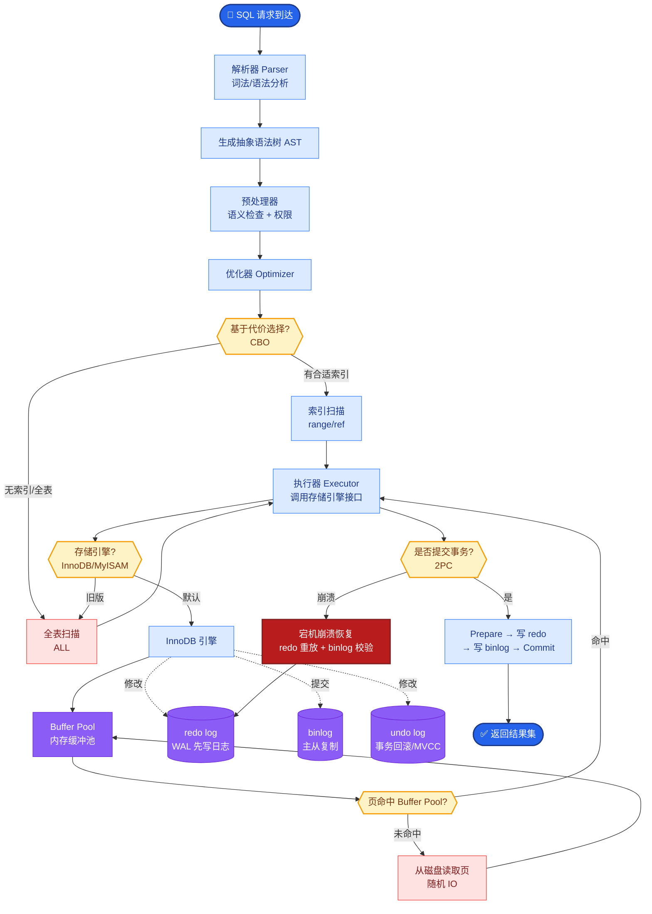

# 向量数据库是怎么选型的?分块策略是什么

**Situation：** 企业知识库包含多种格式的文档(PDF、Word、HTML、Markdown),需要建立高效的向量检索系统.文档分块质量直接影响检索效果.
**Task：** 选择合适的向量数据库并设计科学的文档分块策略.
**Action：** 
1. 向量数据库选型(详见架构类 Q6): 最终选择 Milvus。核心考量点：支持 GPU 加速索引（HNSW/IVF）、分布式扩展性好、支持 Filter 过滤（元数据检索）、同时支持标量和向量字段混合查询。

2. 分块策略设计:
   **递归字符分块(默认策略):**
   - **分隔符优先级：** \n\n  → \n  → . → , → 空格
   - chunk_size = 512 tokens, chunk_overlap = 50 tokens(约 10%)
   - **原理：** 保证语义单元尽量完整（如段落不被切断），Overlap 确保边界信息不丢失，提升召回率。

   **语义分块(高质量场景):**
   - 先计算每个句子的 embedding。
   - 相邻句子的余弦相似度低于阈值 0.7 时,视为语义断点（语义差距大）。
   - 在语义断点处切分,保证每个 chunk 语义完整。
   - **优势：** 避免了固定长度将无关内容强行拼凑。

   **结构化分块(特殊文档):**
   - **Markdown：** 按标题层级分块(# 、## 、### )。
   - **代码文档：** 按 AST（抽象语法树）结构分块，确保函数/类完整。
   - **表格：** 整表作为一个 chunk,将 HTML 表格转为 Markdown 格式或 JSON 描述,附加上下文描述（表头、表名），避免检索到无意义的碎片单元格。

3. 分块元数据管理:
   - 每个 chunk 存储元数据:文档ID、标题、章节路径、页码、分块位置。
   - **关键应用：** 检索时可利用元数据做过滤（如“只查某个文档的内容”），大幅缩小搜索范围（Vector Search + Scalar Filter = Hybrid Search）。

4. 分块质量评估:
   - 自建评估集,对比不同分块策略的检索命中率。
   - 定期抽样检查分块质量,调整参数。

**分块策略选择流程图：**
```text
┌─────────────────┐
│   Input Doc     │
└────────┬────────┘
         │
         ▼
┌─────────────────┐    Is Structured?    ┌───────────────────┐
│  Doc Type Check│ ──────────────────▶  │ Structural Chunks │
└────────┬────────┘   (Table/Code/MD)    │ (AST/Headers)     │
         │ No                            └─────────┬─────────┘
         ▼                                        │
┌─────────────────┐    Need Precision?             │
│ Semantic Chunk?│ ──────────────────▶            │
└────────┬────────┘   (High Cost)                  │
         │ No                                      │
         ▼                                         ▼
┌───────────────────────────────────────────────────────┐
│          Recursive Character Chunks (Default)          │
│  (Size: 512, Overlap: 50, Splitter: \n\n > \n > .)   │
└───────────────────────────────────────────────────────┘
```

**实战案例：**
在处理一份 50 页的财务 PDF 报表时，简单的字符分块将“资产负债表”的表头和具体数值切分到了两个不同的 Chunk，导致检索时只能找到表头而查不到数据。后来改用“表格检测+LLM 意图描述”的混合分块，将整张表格提取并由 LLM 生成一段摘要作为索引内容，召回率提升至 90%。

**代码示例：**
```python
from langchain_text_splitters import RecursiveCharacterTextSplitter

# 针对代码/结构化数据的分块配置
code_splitter = RecursiveCharacterTextSplitter(
    chunk_size=1000,
    chunk_overlap=200,
    separators=["\nclass ", "\ndef ", "\n\t", "\n", " "] # 优先按函数/类切分
)

docs = code_splitter.create_documents([python_code])
# 自动保留父级上下文，避免代码片段缺失依赖
```

**向量数据库选型对比：**

| 特性 | Milvus | Pinecone | Qdrant | Chroma |
| :--- | :--- | :--- | :--- | :--- |
| **部署模式** | 开源 / 云服务 | 仅云服务 | 开源 / 云服务 | 仅开源（易用）
| **性能** | 极高 (C++内核, GPU支持) | 高 | 高 | 中
| **混合查询** | 支持 (Scalar+Vector) | 支持 (Filter) | 支持 (Payload) | 支持 (Where)
| **扩展性** | 云原生，存算分离 | 托管扩展好 | 良好 | 单机为主
| **适用场景** | 亿级向量、大规模生产 | 快速集成、中小规模 | 高性能嵌入式、边缘 | 本地开发、原型验证 |

**Result：** 
- 语义分块比固定长度分块的检索准确率提升 12%.
- 结构化分块在技术文档场景下准确率提升 18%.
- 分块参数经过 3 轮调优后趋于稳定.


## 核心流程图



## 记忆要点

- 选型核心：优先支持GPU加速、混合查询（向量+标量过滤）及分布式扩展，如Milvus。
- 默认策略：递归字符分块，Size=512，Overlap=50，按段落/句子优先级切分。
- 进阶策略：语义分块保完整，结构化分块按AST/标题，表格整表存并附摘要。
- 元数据价值：利用文档ID、章节路径做过滤，实现Vector Search + Scalar Filter混合检索。


## 结构化回答

**30 秒电梯演讲：** 按语义或结构拆分文档，确保向量检索的最小单元信息完整。——打个比方，把厚书切成有完整意思的小章节，方便按图索骥。

**展开框架：**
1. **选型核心** — 优先支持GPU加速、混合查询（向量+标量过滤）及分布式扩展，如Milvus。
2. **默认策略** — 递归字符分块，Size=512，Overlap=50，按段落/句子优先级切分。
3. **进阶策略** — 语义分块保完整，结构化分块按AST/标题，表格整表存并附摘要。

**收尾：** 以上三点都能配合实战聊。您想深入聊哪一块？

## 视频脚本

> 预计时长：2 分钟 | 由浅入深

| 时间 | 画面/字幕 | 口播台词 | 讲解要点 |
|------|----------|----------|----------|
| 0:00 | 标题卡 | "向量数据库是怎么选型的，30 秒讲清楚。" | 开场钩子 |
| 0:30 | 概念定义动画 | "一句话：按语义或结构拆分文档，确保向量检索的最小单元信息完整。" | 核心定义 |
| 1:00 | 选型核心图解 | "优先支持GPU加速、混合查询（向量+标量过滤）及分布式扩展，如Milvus。" | 选型核心 |
| 1:30 | 总结卡 | "记好这几条，面试不慌。下期见。" | 收尾 |

### 视频流程图


