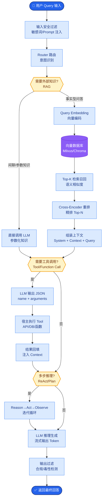

# ReAct 的 Prompt 是怎么设计的

**Situation：** ReAct 模式的效果严重依赖 Prompt 设计质量.需要让 LLM 严格遵循 Thought → Action → Observation 的循环模式,同时保持灵活性.
**Task：** 设计一套高效且鲁棒的 ReAct Prompt 模板.
**Action：** 
1. Prompt 结构设计:
   **[System Prompt]**
   你是一个企业级AI助手.请严格按照以下格式回答问题:

   **Thought：** 分析用户问题,决定下一步行动
   **Action：** 选择要调用的工具
   Action Input: 工具的输入参数(JSON格式)
   **Observation：** 工具返回的结果
   ... (可以重复多次 Thought/Action/Observation)
   **Thought：** 综合所有信息,给出最终答案
   Final Answer: 最终回答

   **可用工具：** 
   1. search_knowledge: 搜索知识库 - 参数: {"query": "搜索内容"}
   2. query_database: 查询数据库 - 参数: {"sql": "SQL语句"}
   ...

   **重要规则：** 
   - 每次只调用一个工具
   - 如果不需要工具,直接给出 Final Answer
   - 最多进行5轮工具调用

2. 关键设计原则:
   - **格式约束严格：** 使用明确的关键词(Thought/Action/Observation/Final Answer)做解析锚点。不仅定义格式，还要定义**Stop Token**，防止模型无休止地生成。
   - **工具描述精确：** 每个工具的描述包含“什么时候用”和“参数格式”,减少错用。对于 JSON 参数，要求 Model 必须输出合法的 JSON 字符串，并在 Parser 端做校验。
   - **安全兜底：** 设置最大迭代次数，防止无限循环。
   - **Few-shot 示例:** 在 System Prompt 中提供 2-3 个高质量示例，覆盖单步和多步场景，特别是“遇到错误如何重试”的示例。

3. Prompt 版本管理:
   - 所有 Prompt 模板版本化管理,每次修改有 changelog.
   - A/B 测试不同版本的 Prompt,基于评估指标选择最优版本.

4. 常见问题处理:
   - LLM 有时会跳过 Thought 直接给 Action → 在解析时检查并补充默认 Thought (或强制模型补全)。
   - LLM 有时输出格式不标准 → 正则解析 + LLM 重新格式化兜底。
   - JSON 参数格式错误 → 使用 JSON Repair 工具或反馈给 LLM “格式错误，请重新生成”。

**ReAct 执行循环图：**
```text
┌──────────────────────────────────────────────────────┐
│                     User Query                        │
└───────────────────────┬──────────────────────────────┘
                        ▼
┌──────────────────────────────────────────────────────┐
│                    LLM Generation                     │
│  (Input: Query + Prompt + History)                   │
└───────────┬──────────────────────┬───────────────────┘
            │                      │
            ▼                      ▼
     [Action Input]          [Final Answer]
            │                      │
            ▼                      ▼
┌─────────────────┐    ┌──────────────────────┐
│   Tool Parser   │    │      Return to User   │
└────────┬────────┘    └──────────────────────┘
         │
         ▼
┌─────────────────┐
│   Tool Exec     │
└────────┬────────┘
         │
         ▼ (Observation)
└───────────────────────┘ (Loop back to LLM)
```

**实战案例：**
在开发售后客服 Agent 时，我们发现单纯靠 Zero-shot Prompt，模型在遇到 API 报错时经常陷入“不断重复同一个错误调用”的死循环。通过在 Few-shot 示例中显式加入“当返回 401 时，Thought 应该是'Token 过期，需重新登录'，而不是'重试请求'”的负面样本，将自我恢复率从 20% 提升到了 85%。

**代码示例：**
```python
# 使用 ReAct 模式的核心 Loop 逻辑 (Python)
import re

def react_loop(query, llm, tools, max_iterations=5):
    prompt_template = "..." # 包含 Thought/Action 结构的 Prompt
    history = []
    
    for _ in range(max_iterations):
        response = llm.generate(prompt_template, history, query)
        
        # 解析 Action Input
        action_match = re.search(r'Action: (\w+)\nAction Input: (.*)', response)
        if not action_match: return response # 无 Action 则视为 Final Answer
        
        tool_name, action_input = action_match.groups()
        
        # 执行工具并捕获 Observation
        try:
            observation = tools[tool_name].run(action_input)
        except Exception as e:
            observation = f"Error: {str(e)}"
            
        history.append((response, f"Observation: {observation}"))
        
    return "Max iterations reached"
```

**Prompt 设计技巧对比：**

| 技巧 | 作用 | 常见误区 |
| :--- | :--- | :--- |
| **Few-shot (少样本提示)** | 提供标准范式，显著降低幻觉和格式错误 | 样本不够典型，导致模型过拟合样本格式而忽略逻辑 |
| **Stop Token (停止符)** | 节省 Token，精确控制生成截断点 | 忘记设置，导致模型生成 Observation 而非由系统填充 |
| **思维链 (CoT) 强制** | 强迫模型展示推理过程，提高复杂任务准确率 | 任务太简单时使用，增加延迟且可能引入噪声 |

**Result：** 这些 Prompt 设计策略使 Agent 的工具调用成功率提升了 40%，并具备了基本的错误自愈能力。


## 核心流程图



## 记忆要点

- 核心循环：严格遵循 Thought → Action → Observation → Final Answer 的推理链。
- 设计原则：定义Stop Token防无限生成，工具描述需精确含参数格式，设置最大迭代次数。
- 鲁棒性：Few-shot示例覆盖多步及错误重试场景，解析层需做JSON校验与兜底修复。
- 常见坑：模型可能跳过Thought或输出格式错误，需通过正则解析和反馈机制纠正。


## 结构化回答

**30 秒电梯演讲：** 通过思维链和工具定义的提示词模板，规范模型调用工具的推理流程。——打个比方，给智能助手一本标准操作手册，强制其按步骤思考办事。

**展开框架：**
1. **核心循环** — 严格遵循 Thought → Action → Observation → Final Answer 的推理链。
2. **设计原则** — 定义Stop Token防无限生成，工具描述需精确含参数格式，设置最大迭代次数。
3. **鲁棒性** — Few-shot示例覆盖多步及错误重试场景，解析层需做JSON校验与兜底修复。

**收尾：** 以上三点都能配合实战聊。您想深入聊哪一块？

## 视频脚本

> 预计时长：2 分钟 | 由浅入深

| 时间 | 画面/字幕 | 口播台词 | 讲解要点 |
|------|----------|----------|----------|
| 0:00 | 标题卡 | "ReAct 的 Prompt 是怎么设计的，30 秒讲清楚。" | 开场钩子 |
| 0:30 | 概念定义动画 | "一句话：通过思维链和工具定义的提示词模板，规范模型调用工具的推理流程。" | 核心定义 |
| 1:00 | 核心循环图解 | "严格遵循 Thought → Action → Observation → Final Answer 的推理链。" | 核心循环 |
| 1:30 | 总结卡 | "记好这几条，面试不慌。下期见。" | 收尾 |
