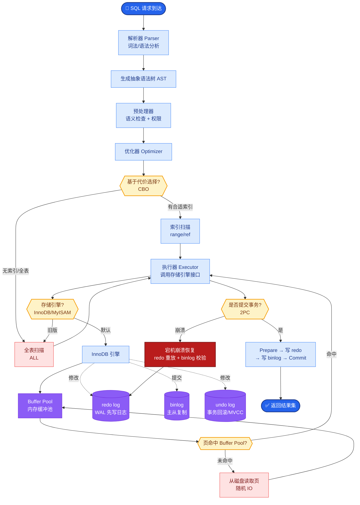

# 文档解析支持哪些格式?怎么处理表格和图片

**Situation：** 企业知识库中的文档格式多样,包括 PDF、Word、Excel、PPT、HTML、Markdown 等,且包含大量表格和图片.

**Task：** 建立一套全格式文档解析管道,确保各类内容都能被有效提取和索引.

**Action：**
1. 支持的文档格式和解析工具:
   | 格式 | 解析工具 | 特殊处理 |
   | :--- | :--- | :--- |
   | **PDF** | PyMuPDF + pdfplumber | 版面分析区分正文/表格/图片 |
   | **Word** | python-docx | 保留标题层级结构 |
   | **Excel** | openpyxl | 每个 sheet 独立处理 |
   | **PPT** | python-pptx | 幻灯片逐页提取文本 |
   | **HTML** | BeautifulSoup | 清洗标签,保留结构 |
   | **Markdown** | markdown-it | 保留标题层级 |

2. 表格处理策略:
   - 简单表格(< 10行10列): 转为 Markdown 表格格式,整表作为一个 chunk.
   - 复杂表格(大型数据表): 转为结构化描述文本("表格共 X 行 Y 列,列名分别是..."),并生成自然语言摘要.
   - **合并单元格：** 通过 pdfplumber 的表格检测算法处理单元格合并情况.
   - **表格上下文：** 每个表格 chunk 附加所在章节的标题和前后段落,增强语义理解.

3. 图片处理策略:
   - OCR 提取: 使用 PaddleOCR 提取图片中的文字.
   - **图片描述：** 对非文字图片(流程图、架构图等),使用多模态模型(GPT-4V)生成图片描述.
   - **图片索引：** 图片描述文本作为 chunk 索引到向量库,同时保存图片 URL 用于溯源展示.

4. 解析质量保证:
   - 建立解析质量评估集(100 份文档的标准解析结果).
   - 每次更新解析逻辑后,自动跑评估集对比.
   - **人工抽检：** 每周随机抽查 20 份文档的解析结果.

**实战案例：** 
在处理一份财务PDF报表时，传统的流式解析导致表头（如“2023年度营收”）被错误归入上一行段落的结尾。引入版面分析后，通过识别表格区域边界，强制将表格作为一个独立语义单元提取，解决了检索时“营收数值”找不到对应表头的严重幻觉问题。

**代码示例 (Python - 表格HTML化增强)：** 
```python
import pdfplumber
def extract_table_as_html(pdf_path):
    with pdfplumber.open(pdf_path) as pdf:
        page = pdf.pages[0]
        table = page.extract_table()
        # 转换为 HTML 以便 LLM 更好理解表格结构
        html_table = "<table>"
        for row in table:
            html_table += "<tr>" + "".join([f"<td>{cell}</td>" for cell in row]) + "</tr>"
        return html_table + "</table>"
```

**处理流水线：**
```text
┌──────────────┐
│ Input File   │ (PDF/Word/PPT...)
└──────┬───────┘
       │
┌──────▼────────────────────────────────────┐
│     Format Detection & Routing            │
└──────┬──────────────┬──────────────┬───────┘
       │              │              │
┌──────▼──────┐ ┌─────▼──────┐ ┌──▼──────────┐
│   PDF       │ │   Excel    │ │   Images    │
│  (Layout)   │ │ (Sheets)   │ │  (OCR/VLM)  │
└──────┬──────┘ └─────┬──────┘ └──┬──────────┘
       │              │              │
┌──────▼──────────────▼──────────────▼───────┐
│         Text & Metadata Normalization      │
│  (Merge Cells, Clean HTML, Header Tags)    │
└──────┬──────────────────────────────────────┘
       │
┌──────▼──────────────────────────────────────┐
│            Chunking Strategy               │
│  (Recursive Char / Table Summary / Image   │
│   Caption)                                 │
└──────┬──────────────────────────────────────┘
       │
┌──────▼──────────────────────────────────────┐
│          Embedding & Indexing              │
└──────────────────────────────────────────────┘


## 核心流程图



## 记忆要点

- 全格式支持：PDF用版面分析，Word/PPT/Excel保留结构，HTML清洗标签。
- 表格处理：简单表转Markdown，复杂表转结构化描述+摘要，必须附加表头和上下文。
- 图片处理：OCR提取文字，流程图用多模态模型生成描述，描述文本用于向量索引。
- 质量保证：建立标准解析集评估，人工定期抽检，重点解决表头错位和语义单元切断。


## 结构化回答

**30 秒电梯演讲：** 针对不同格式文档使用工具解析，通过OCR和多模态模型处理非文本信息。——打个比方，把纸质书、PPT、图片里的内容全部抄写成统一的电子稿。

**展开框架：**
1. **全格式支持** — PDF用版面分析，Word/PPT/Excel保留结构，HTML清洗标签。
2. **表格处理** — 简单表转Markdown，复杂表转结构化描述+摘要，必须附加表头和上下文。
3. **图片处理** — OCR提取文字，流程图用多模态模型生成描述，描述文本用于向量索引。

**收尾：** 以上三点都能配合实战聊。您想深入聊哪一块？

## 视频脚本

> 预计时长：2 分钟 | 由浅入深

| 时间 | 画面/字幕 | 口播台词 | 讲解要点 |
|------|----------|----------|----------|
| 0:00 | 标题卡 | "文档解析支持哪些格式，30 秒讲清楚。" | 开场钩子 |
| 0:30 | 概念定义动画 | "一句话：针对不同格式文档使用工具解析，通过OCR和多模态模型处理非文本信息。" | 核心定义 |
| 1:00 | 全格式支持图解 | "PDF用版面分析，Word/PPT/Excel保留结构，HTML清洗标签。" | 全格式支持 |
| 1:30 | 总结卡 | "记好这几条，面试不慌。下期见。" | 收尾 |
