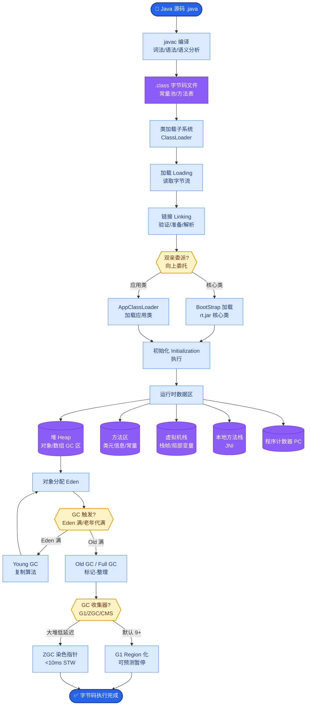

# 重排序是怎么做的?用的什么模型

**Situation：** 多路检索后得到大量候选 chunk(通常 30-60 个),需要精排后选出最相关的 top-5 给 LLM 生成答案.粗排的向量相似度和 BM25 分数不够精确.

**Task：** 实现高质量的重排序模块,提升最终检索精度.

**Action：** 
1. Reranker 模型选择:
   对比了三个主流 reranker:
   - **BGE-Reranker-v2-M3(最终选择):** 支持中英文,精度高,模型大小适中(568MB).
   - Cohere Rerank: 效果好但需要调 API,增加延迟和成本.
   - Cross-encoder/ms-marco-MiniLM-L-12-v2: 英文效果好,中文不行.

2. 重排序流程:
   - Reranker 输入: (query, chunk) pair,输出相关性分数 [0, 1].
   - **去重策略：** 基于 chunk 内容的 MinHash 去重(相似度 > 0.9 视为重复).

3. 性能优化:
   - Reranker 模型部署在 GPU 服务器上(T4 显卡),batch 推理.
   - 40 条候选的 rerank 耗时约 120ms(batch_size=40, GPU).
   - 对于实时性要求极高的场景,可跳过 rerank 直接取 top-5.

4. 分数阈值策略:
   - rerank_score ≥ 0.7 → 高相关,直接使用.
   - 0.4 ≤ rerank_score < 0.7 → 中等相关,作为补充信息.
   - rerank_score < 0.4 → 低相关,丢弃.
   - 如果所有 chunk 分数 < 0.4 → 触发"知识库中没有找到相关信息"的回复.

**实战案例：** 
用户查询“系统报错Error 503如何处理”，向量检索召回了几篇包含“503 Service Unavailable”字段的通用文档，但未召回最新的内部修复手册。BGE-Reranker识别出内部手册中包含“修复补丁ID”等更具体的语义特征，将其从第15名提升至第1名，解决了空答问题。

**代码示例 (Python - BGE Rerank)：** 
```python
from FlagEmbedding import FlagReranker
reranker = FlagReranker('BAAI/bge-reranker-v2-m3', use_fp16=True)

def compute_scores(query, passages):
    pairs = [[query, passage] for passage in passages]
    scores = reranker.compute_score(pairs, normalize=True)
    # 按分数降序排序并返回Top-K
    ranked = sorted(zip(passages, scores), key=lambda x: x[1], reverse=True)
    return ranked[:5]
```

**Rerank 流程图：**
```text
Query: "如何配置Nginx反向代理?"
       │
       ▼
┌──────────────────────┐
│  Retrieval (Stage 1) │  (Vector + BM25)
│  Candidates: 30-60   │
└──────────┬───────────┘
           │
           ▼
┌──────────────────────┐
│  Candidate Filter    │  (Remove duplicates)
└──────────┬───────────┘
           │
           ▼
┌──────────────────────┐
│  Rerank Model (GPU)  │  (Cross-Encoder)
│  Query vs Chunk A    │───► Score: 0.92
│  Query vs Chunk B    │───► Score: 0.85
│  Query vs Chunk C    │───► Score: 0.45
└──────────┬───────────┘
           │
           ▼
┌──────────────────────┐
│  Thresholding & Sort │  (Score >= 0.4)
└──────────┬───────────┘
           │
           ▼
┌──────────────────────┐
│  Final Context (Top5)│  ┌─── Chunk A ───┐
└──────────────────────┘  └─── Chunk B ───┘
```

**Result：** 
- 重排序后 Precision@5 从 78% 提升到 92%.
- NDCG@5 从 0.72 提升到 0.89.
- Rerank 延迟 120ms,在整体 3s 响应时间中占比可接受.

## 常见考点
1. **召回数量（N）**：粗排召回多少条比较合适？（答案：Rerank 成本较高，通常召回 30-50 条，在精度和延迟间取平衡）。
2. **Cross-encoder 局限**：Cross-encoder 计算复杂度是 O(N^2)，为什么还用它而不是继续用 Bi-encoder？（答案：Cross-encoder 在 Query 和 Document 之间做了全量 Attention，交互更深，精度更高，虽然慢但只用于少量精排）。
3. **截断策略**：Rerank 模型通常有 max_length 限制（如 512），输入的 chunk 超长怎么办？（答案：采用“头+尾”拼接策略，保留chunk的开头和结尾各200字符，中间截断，保留核心语义）。


## 核心流程图



## 记忆要点

- 模型选择：BGE-Reranker精度高且支持中英文，优于Cohere API和MiniLM。
- 流程：粗排召回30-60条 → MinHash去重 → Rerank打分 → 阈值过滤取Top5。
- 阈值策略：≥0.7高优直接用，<0.4低相关丢弃，全低则触发无相关信息回复。
- 性能优化：GPU Batch推理，耗时约120ms，平衡精度与延迟。


## 结构化回答

**30 秒电梯演讲：** 在粗排基础上使用精细模型进行二轮打分，筛选最相关的Top结果。——打个比方，先粗筛一堆简历，再人工仔细挑出最匹配的几个候选人。

**展开框架：**
1. **模型选择** — BGE-Reranker精度高且支持中英文，优于Cohere API和MiniLM。
2. **流程** — 粗排召回30-60条 → MinHash去重 → Rerank打分 → 阈值过滤取Top5。
3. **阈值策略** — ≥0.7高优直接用，<0.4低相关丢弃，全低则触发无相关信息回复。

**收尾：** 以上三点都能配合实战聊。您想深入聊哪一块？

## 视频脚本

> 预计时长：2 分钟 | 由浅入深

| 时间 | 画面/字幕 | 口播台词 | 讲解要点 |
|------|----------|----------|----------|
| 0:00 | 标题卡 | "重排序是怎么做的，30 秒讲清楚。" | 开场钩子 |
| 0:30 | 概念定义动画 | "一句话：在粗排基础上使用精细模型进行二轮打分，筛选最相关的Top结果。" | 核心定义 |
| 1:00 | 模型选择图解 | "BGE-Reranker精度高且支持中英文，优于Cohere API和MiniLM。" | 模型选择 |
| 1:30 | 总结卡 | "记好这几条，面试不慌。下期见。" | 收尾 |
