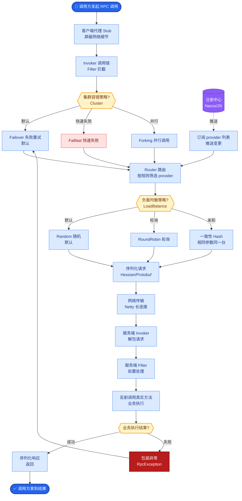
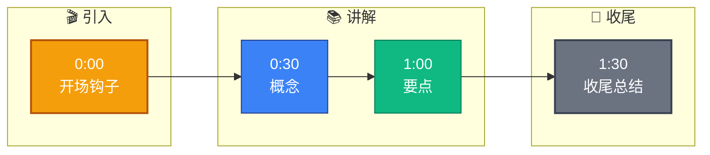

# Function Calling 和 MCP 有什么区别?你怎么选的

**Situation：** 系统需要让 Agent 调用外部工具.Function Calling(OpenAI 原生支持)和 MCP (Anthropic 提出的开放协议)是两种主流方案.

**Task：** 理解两者的差异,选择适合项目的方案或混合使用.

**Action：**
1. Function Calling 特点:
   - **定义在模型侧：** 工具定义作为 API 请求的一部分发送给模型.
   - **模型原生支持：** GPT-4、Claude 等都内置支持,工具选择由模型完成.
   - **简单直接：** 适合快速接入少量工具.
   - **耦合模型：** 不同模型的 Function Calling 格式有差异.

2. MCP 特点:
   - **独立于模型：** 工具通过 MCP Server 独立运行,通过标准协议通信.
   - **生态复用：** 一个 MCP Server 可以被任何 MCP Client 使用.
   - **双向通信：** 支持服务端推送通知和进度更新.
   - **资源抽象：** 除了工具,还有资源和提示原语.
   - **权限控制：** 协议层面支持能力协商和权限控制.

3. 对比表:
   | 维度 | Function Calling | MCP |
   | :--- | :--- | :--- |
   | **标准化** | 各模型厂商私有 | 开放协议 (JSON-RPC) |
   | **复用性** | 需要适配不同模型 | 跨模型/平台复用 |
   | **部署模式** | 集成在应用内 | 独立服务 |
   | **通信方向** | 单向 | 双向 (支持 SSE 推送) |
   | **适用场景** | 简单集成 | 复杂工具生态 |
   | **生态成熟度** | 成熟 | 快速发展中 |

4. 项目选择 -- 混合方案:
   - 内部简单工具(如数据库查询、文本处理): 使用 Function Calling,因为实现简单,无需额外部署.
   - 外部复杂服务(如第三方 API、需要独立运行的工具): 封装为 MCP Server.
   - **底层统一：** 在编排器层面做了统一抽象,业务代码不感知具体是 FC 还是 MCP.

**实战案例：** 
我们在接入Gitlab工具时，使用Function Calling在单次查询中表现良好。但开发“MR代码审查”功能时，需要监听Gitlab的Webhook事件并主动推送给Agent，FC无法支持服务端推送。切换到MCP协议后，利用SSE双向通道，当有新MR提交时，MCP Server能实时触发Agent工作流。

**代码示例 (Typescript - 统一适配器)：** 
```typescript
interface ToolExecutor {
  execute(name: string, args: any): Promise<any>;
}

// FC 实现
class FCTool implements ToolExecutor {
  async execute(name, args) {
    return await openai.beta.chat.completions.run({
      model: 'gpt-4',
      tools: [{name, ...args}]
    });
  }
}

// MCP 实现 (简化)
class MCPTool implements ToolExecutor {
  async execute(name, args) {
    return await mcpClient.request({ method: 'tools/call', params: { name, args } });
  }
}
```

**架构对比图：**
```text
┌───────────────── Function Calling (原生) ─────────────────┐
│                                                           │
│   App ──[1. Send Tools Def + Query]──► LLM Provider       │
│         │                                              │
│         │◄──[2. Return Tool_Call]──────────────────────│
│   App ──[3. Execute Tool Locally]                        │
│         │                                              │
│   App ──[4. Send Result + Query]──► LLM Provider       │
│                                                           │
└───────────────────────────────────────────────────────────┘

┌───────────────── MCP (开放协议) ────────────────────────┐
│                                                           │
│   ┌───────────┐          JSON-RPC 2.0          ┌──────┐  │
│   │   Client  │◄──────────────────────────────►│Server│  │
│   │ (in App)  │     (stdio / SSE / TCP)       │ Tool │  │
│   └─────┬─────┘                                └──────┘  │
│         │                                                │
│         │


## 核心流程图



## 记忆要点

- Function Calling：模型原生支持，定义随请求发，适合简单集成，耦合特定模型。
- MCP协议：独立于模型，标准JSON-RPC，支持双向通信和权限控制，适合复杂生态。
- 核心差异：FC是单向调用工具，MCP是双向服务交互且跨平台复用。
- 选型策略：内部简单工具用FC降本，外部复杂服务或需推送事件用MCP，底层统一适配。


## 结构化回答

**30 秒电梯演讲：** Function Calling 适合单点简单集成，MCP 适合构建独立复用的工具生态。——打个比方，前者是像自带的充电器，后者是通用的标准接口插排。

**展开框架：**
1. **Function** — Function Calling：模型原生支持，定义随请求发，适合简单集成，耦合特定模型。
2. **MCP协议** — 独立于模型，标准JSON-RPC，支持双向通信和权限控制，适合复杂生态。
3. **核心差异** — FC是单向调用工具，MCP是双向服务交互且跨平台复用。

**收尾：** 以上三点都能配合实战聊。您想深入聊哪一块？

## 视频脚本

> 预计时长：2 分钟 | 由浅入深

| 时间 | 画面/字幕 | 口播台词 | 讲解要点 |
|------|----------|----------|----------|
| 0:00 | 标题卡 | "Function Calling 和 MCP 有什么区别，30 秒讲清楚。" | 开场钩子 |
| 0:30 | 概念定义动画 | "一句话：Function Calling 适合单点简单集成，MCP 适合构建独立复用的工具生态。" | 核心定义 |
| 1:00 | 要点图解 | "Function Calling：模型原生支持，定义随请求发，适合简单集成，耦合特定模型。" | 要点 |
| 1:30 | 总结卡 | "记好这几条，面试不慌。下期见。" | 收尾 |

### 视频流程图


