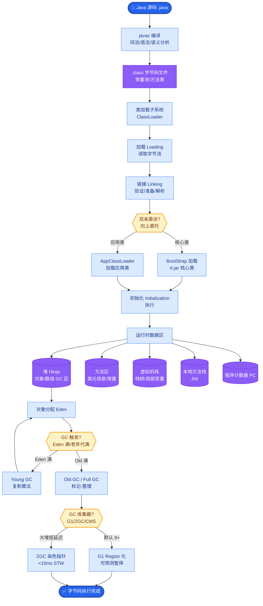
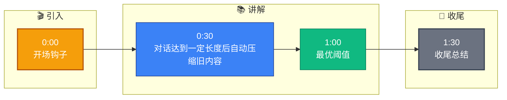

# 会话摘要压缩的阈值是多少?怎么确定的

**Situation：** 长对话会导致 context window 超限,需要对历史对话做摘要压缩.但压缩太早会丢失信息,压缩太晚会超出 token 限制.

**Task：** 确定最优的摘要压缩阈值和策略.

**Action：** 
1. 阈值设定:
   - **触发阈值：** 当对话历史占用超过 context window 的 40% 时触发压缩.
   - 以 8K context 为例: 对话历史超过 3200 tokens 时开始压缩.
   - **保留窗口：** 最近 3 轮对话始终保留原文,不压缩.

2. 阈值确定过程:
   - **实验了三个阈值：** 30%、40%、50%.
   - **30%：** 压缩太频繁,信息损失明显,回答质量下降 8%.
   - **40%：** 平衡点,信息保留度和 token 效率最优.
   - **50%：** 在长对话(>15 轮)时 context 容易超限.

3. 摘要策略:
   - 摘要后通常可以将 3000 tokens 的对话压缩到 500-800 tokens.
   - 压缩比约 4:1 到 6:1.
   - **Prompt：** 请将以下对话历史压缩为简洁的摘要,保留以下关键信息:
     1. 用户的核心诉求
     2. 已确认的关键信息(如订单号、用户名等)
     3. 已完成的操作和结果
     4. 待解决的问题
     **对话历史：** {history}

4. 增量摘要(渐进式压缩):
   - 不是一次性压缩所有历史,而是每次只压缩最旧的 3-5 轮.
   - 新的摘要与旧的摘要合并,形成递进式摘要.
   - 避免单次压缩大量内容导致的信息损失.

**实战案例：** 
在一个代码调试Agent中，用户和Agent通过10轮对话确定了Bug位于`getUserInfo`函数。当对话继续进行到第15轮涉及其他函数时，由于设置了阈值压缩，早期的10轮对话被摘要为“已确定Bug在getUserInfo，尝试了方案A和方案B均失败”。这种结构化摘要确保了Agent在后续生成修复代码时，不会重复调用已证伪的方案A，同时释放了Context空间。

**代码示例 (Python - Token计算与压缩触发)：** 
```python
import tiktoken

def check_and_summarize(history: list, max_tokens: int = 8000):
    enc = tiktoken.encoding_for_model("gpt-4")
    current_tokens = len(enc.encode(str(history)))
    
    if current_tokens > max_tokens * 0.4:
        # 保留最近3轮，其余压缩
        keep_window = history[-3:]
        to_summarize = history[:-3]
        summary = llm.summarize(to_summarize)
        return [{"role": "system", "content": f"History Summary: {summary}"}] + keep_window
    return history
```

**状态转换图：**
```text
┌──────────────────────────────────────────────────────┐
│                  Dialogue History                     │
│  [Msg1] [Msg2] [Msg3] ... [MsgN-1] [MsgN]            │
└──────────────────────┬───────────────────────────────┘
                       │ Token Usage Check
                       ▼
           ┌───────────────────────┐
           │ Is Usage > 40%?       │
           └───────────┬───────────┘
               Yes    │    No
           ┌───────────▼───────────┐
           │  Incremental Summarize│
           │  (Compress Oldest)    │
           └───────────┬───────────┘
                       │
                       ▼
┌──────────────────────────────────────────────────────┐
│  New State                                          │
│  [Summary of 1..N-3] [MsgN-2] [MsgN-1] [MsgN]       │
│  (Compressed)     (Sliding Window - Keep 3)        │
└──────────────────────────────────────────────────────┘
```

**Result：** 
- 40% 阈值下,支持最长 50 轮对话不丢失关键上下文.
- 摘要后的对话理解准确率为 91%(对比完整历史的 96%).
- Token 节省约 60%(长对话场景).

## 常见考点
1. **结构化摘要**：Prompt 只要求保留文本摘要吗？如果对话中包含代码或特定参数（如 SQL 语句），如何处理？（答案：在 Prompt 中显式指示保留 Code Blocks 和 Key-Value pairs，不进行文本概括，或使用 XML 标签包裹特殊内容）。
2. **幻觉问题**：LLM 做摘要时如果产生幻觉（编造不存在的偏好），后续模型会当真，怎么解决？（答案：摘要 Prompt 增加“Strict Mode”，只提取原文提及的事实，禁止推理想象；或者将摘要仅作为参考，保留原始文档检索路径以便溯源）。


## 核心流程图



## 记忆要点

- 最优阈值：历史对话超Context Window的40%时触发压缩，保留最近3轮原文。
- 压缩策略：增量摘要最旧3-5轮，压缩比约4:1到6:1，保留诉求、实体和待解决问题。
- 确定依据：对比30%/40%/50%，40%在信息保留度与Token效率间平衡最佳。
- 效果：支持长对话不超限，摘要后理解准确率保持在90%以上。


## 结构化回答

**30 秒电梯演讲：** 对话达到一定长度后自动压缩旧内容为摘要，保留最近原文，平衡上下文与Token限制。——打个比方，像记笔记一样，旧笔记提炼成要点，新内容详细记录。

**展开框架：**
1. **最优阈值** — 历史对话超Context Window的40%时触发压缩，保留最近3轮原文。
2. **压缩策略** — 增量摘要最旧3-5轮，压缩比约4:1到6:1，保留诉求、实体和待解决问题。
3. **确定依据** — 对比30%/40%/50%，40%在信息保留度与Token效率间平衡最佳。

**收尾：** 以上三点都能配合实战聊。您想深入聊哪一块？

## 视频脚本

> 预计时长：2 分钟 | 由浅入深

| 时间 | 画面/字幕 | 口播台词 | 讲解要点 |
|------|----------|----------|----------|
| 0:00 | 标题卡 | "会话摘要压缩的阈值是多少，30 秒讲清楚。" | 开场钩子 |
| 0:30 | 概念定义动画 | "一句话：对话达到一定长度后自动压缩旧内容为摘要，保留最近原文，平衡上下文与Token限制。" | 核心定义 |
| 1:00 | 最优阈值图解 | "历史对话超Context Window的40%时触发压缩，保留最近3轮原文。" | 最优阈值 |
| 1:30 | 总结卡 | "记好这几条，面试不慌。下期见。" | 收尾 |

### 视频流程图


