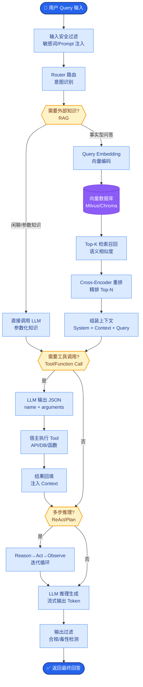

# RRF 融合排序的公式是什么?权重怎么调

**Situation：** 多路检索(向量 + 关键词 + 知识图谱)各自返回排序结果,需要融合成统一的排序.

**Task：** 实现一个公平、有效的多路结果融合算法.

**Action：** 
1. RRF(Reciprocal Rank Fusion)公式:
   $$ RRF_{score}(d) = \sum_{i=1}^{n} \frac{1}{k + rank_i(d)} $$
   - d: 文档
   - n: 检索通道数量
   - rank_i(d): 文档 d 在第 i 个通道中的排名(从 1 开始)
   - k: 平滑常数(默认 60)

2. 为什么用 RRF 而不是加权分数融合?
   - 不同检索通道的分数量纲不同(向量用余弦相似度 0-1, BM25 分数范围不固定).
   - RRF 只看排名,不看绝对分数,天然解决了量纲不一致的问题.
   - 理论和实践都证明 RRF 效果优于简单的分数加权.

3. 加权 RRF(Weighted RRF):
   - 不同通道可以设置权重 w_i, 反映不同通道的置信度.
   - $$ WRRF_{score}(d) = \sum_{i=1}^{n} \frac{w_i}{k + rank_i(d)} $$
   - **默认权重：** 向量 0.6、关键词 0.3、知识图谱 0.1.

4. 权重调优方法:
   - 建立标注评估集(500 条 query + 标准答案).
   - **使用网格搜索遍历权重组合：** 
     - 向量：[0.4, 0.5, 0.6, 0.7]
     - 关键词：[0.2, 0.3, 0.4]
     - 知识图谱：[0.05, 0.1, 0.15]
   - 以 NDCG@5 为优化目标,找最优权重组合.

5. k 值调优:
   - k 越大,排名差异的影响越小(倾向于平均化).
   - k 越小,高排名文档的优势越明显.
   - 实验发现 k=60 是较优选择(经典值,Microsoft 论文推荐).

**Result：** 
- 加权 RRF 比等权 RRF 的 NDCG@5 提升 3.2%.
- **最优权重组合：** 向量 0.6、关键词 0.3、知识图谱 0.1.
- 比纯向量检索的 Precision@5 提升 17%.

---

### 实战案例
在电商搜索中，关键词检索（BM25）倾向于匹配商品标题，导致过拟合；而向量检索更擅长理解语义（如“手机”匹配“iPhone”）。我曾遇到场景：直接相加分数导致向量相似度较高的长尾商品（分数 0.9+）压倒了热门关键词匹配商品（BM25 分数 15），排序崩坏。切换 RRF 后，仅关注排名，有效平衡了头部结果的相关性与多样性。

### 代码示例

```python
def reciprocal_rank_fusion(results_dict, k=60, weights=None):
    """
    results_dict: {"retriever_name": [doc_ids_sorted_list]}
    weights: {"retriever_name": float_weight}
    """
    scores = {}
    if weights is None: weights = {k: 1.0 for k in results_dict}
    
    for system, doc_list in results_dict.items():
        w = weights.get(system, 1.0)
        for rank, doc_id in enumerate(doc_list, start=1):
            # 如果文档不存在则初始化为0
            scores.setdefault(doc_id, 0.0)
            # RRF核心公式累加
            scores[doc_id] += w / (k + rank)
            
    # 按融合分数降序排序
    return sorted(scores.items(), key=lambda x: x[1], reverse=True)
```

### RRF vs 分数加权对比

| 特性 | RRF (倒数排名融合) | Weighted Score (分数加权) |
| :--- | :--- | :--- |
| **输入依赖** | 仅依赖排名 | 依赖原始分数值 (归一化敏感) |
| **量纲问题** | 天然免疫，无需归一化 | 需要人工进行 Min-Max 或 Z-score 归一化 |
| **极端值敏感度** | 低 (Top 1 和 Top 2 分数差距有限) | 高 (分数分布差异可能导致某路主导) |
| **调优难度** | 低 (主要调 k 和权重) | 高 (需精细调整归一化参数和权重) |
| **适用场景** | 异构检索源融合 (向量+全文+图谱) | 同构检索源或分数分布高度可控时 |

### RRF 数据流与计算架构图

```text
                    Query Input
                         │
        ┌────────────────┼────────────────┐
        ▼                ▼                ▼
┌───────────────┐ ┌───────────────┐ ┌───────────────┐
│  Keyword (BM25)│ │   Vector      │ │  Knowledge    │
│  Retriever    │ │  Retriever    │ │  Graph Retri. │
└───────┬───────┘ └───────┬───────┘ └───────┬───────┘
        │                │                │
        │ List: [d1, d3, d5]│ List: [d2, d1, d4]│ List: [d1, d5]│
        │ (Rank 1, 2, 3) │ (Rank 1, 2, 3) │ (Rank 1, 2) │
        ▼                ▼                ▼
┌─────────────────────────────────────────────────────┐
│              RRF Fusion Engine                      │
│  -------------------------------------------------  │
│  For each doc d in Top-K Union:                     │
│    Score_d = w1/(k+r1) + w2/(k+r2) + w3/(k+r3)       │
│                                                     │
│  Example (d1):                                      │
│    Keyword(1st): 0.5/(60+1) + Vector(2nd): 0.3/(60+2) + KG(1st): 0.1/(60+1)
```


## 核心流程图



## 记忆要点

- RRF公式：Score = Σ 1 / (k + rank)，k默认60，只看排名不看分数解决量纲问题。
- 加权扩展：WRRF = Σ w / (k + rank)，不同通道设权重(如向量0.6/关键词0.3)。
- 调优方法：基于评估集网格搜索权重组合，以NDCG@5为目标，k值通常取60。
- 优势：相比分数加权，RRF对极端值不敏感，无需归一化，适合异构检索源融合。


## 结构化回答

**30 秒电梯演讲：** 通过倒排排名融合算法，将多路检索结果统一排序，消除分数量纲差异。——打个比方，多个裁判打分排名，综合计算谁排在最前面。

**展开框架：**
1. **RRF公式** — Score = Σ 1 / (k + rank)，k默认60，只看排名不看分数解决量纲问题。
2. **加权扩展** — WRRF = Σ w / (k + rank)，不同通道设权重(如向量0.6/关键词0.3)。
3. **调优方法** — 基于评估集网格搜索权重组合，以NDCG@5为目标，k值通常取60。

**收尾：** 以上三点都能配合实战聊。您想深入聊哪一块？

## 视频脚本

> 预计时长：2 分钟 | 由浅入深

| 时间 | 画面/字幕 | 口播台词 | 讲解要点 |
|------|----------|----------|----------|
| 0:00 | 标题卡 | "RRF 融合排序的公式是什么，30 秒讲清楚。" | 开场钩子 |
| 0:30 | 概念定义动画 | "一句话：通过倒排排名融合算法，将多路检索结果统一排序，消除分数量纲差异。" | 核心定义 |
| 1:00 | RRF公式图解 | "Score = Σ 1 / (k + rank)，k默认60，只看排名不看分数解决量纲问题。" | RRF公式 |
| 1:30 | 总结卡 | "记好这几条，面试不慌。下期见。" | 收尾 |
