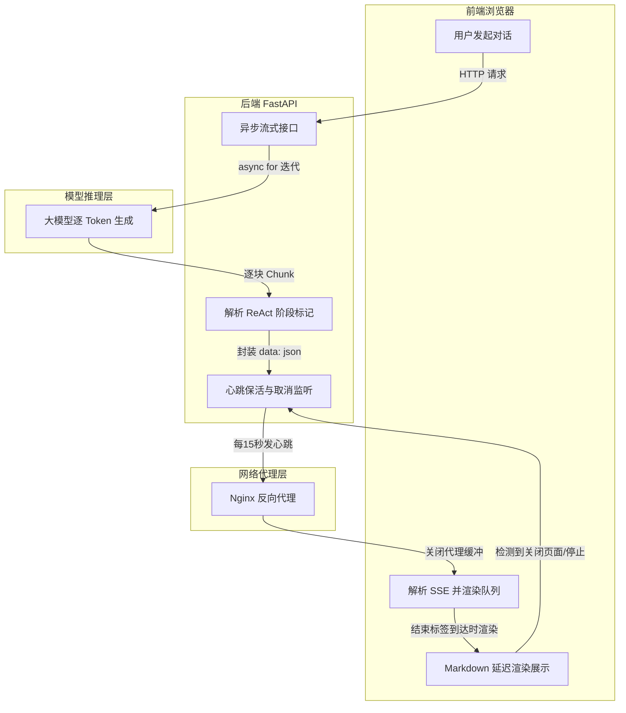
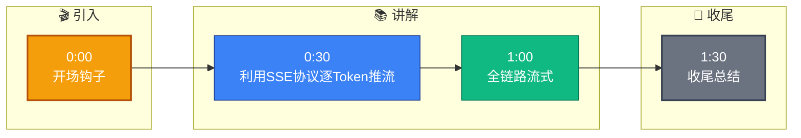

# 怎么实现的 Streaming 流式输出

**Situation：** LLM 生成完整回答通常需要 3-10 秒，如果等完全生成后才返回，用户体验很差。需要实现逐 token 的流式输出。

**Task：** 实现端到端的流式输出管道，从 LLM 到前端的全链路流式传输。

**Action：** 
1. **整体架构：**
   ```text
   LLM Provider (OpenAI/Anthropic)
          │ SSE Stream
          ▼
   Backend (Python/FastAPI Generator)
          │ SSE Protocol
          ▼
   API Gateway / Nginx (Proxy Buffer Off)
          │ SSE / WebSocket
          ▼
   Frontend (EventSource / ReadableStream)
   ```

2. **后端实现 (Python FastAPI)：**
   - **异步生成器：** 使用 `async for` 迭代 LLM 返回的 chunk。
   - **SSE 格式：** 按 `data: {json}\n\n` 格式封装数据。
   - **代码示例：**
     ```python
     @app.post("/chat/stream")
     async def chat_stream(request: ChatRequest):
         async def generate():
             async for chunk in agent.stream_chat(request.messages):
                 data = json.dumps({"content": chunk, "type": "token"})
                 yield f"data: {data}\n\n"
             yield f"data: {json.dumps({'type': 'done'})}\n\n"
         return StreamingResponse(
             generate(), 
             media_type="text/event-stream",
             headers={"Cache-Control": "no-cache", "X-Accel-Buffering": "no"}
         )
     ```

3. **关键技术点：**
   - **禁用缓冲：** Nginx 设置 `X-Accel-Buffering: no`，防止代理层缓冲 SSE。
   - **心跳保活：** 每 15 秒发送一个心跳事件，防止连接超时。
   - **错误处理：** 流式过程中出错时发送 `error` 事件，前端展示错误信息。
   - **取消机制：** 用户关闭页面时，后端检测到连接断开，取消 LLM API 调用。

4. **ReAct 模式下的流式处理：**
   - **Thought 阶段：** 不输出给用户（内部推理过程）。
   - **Action 阶段：** 输出 "正在查询..." 等状态提示。
   - **Final Answer 阶段：** 逐 token 流式输出给用户。
   - 通过解析 token 流，区分不同阶段。

**Result：** 
- 首 token 延迟 (TTFT) 从非流式的 3s 降低到 500ms。
- 用户感知的响应速度提升 5x。
- 流式连接稳定性 99.9%（心跳保活 + 自动重连）。

## 常见考点
1. **并发下的连接管理**：流式响应占用连接时间较长，如何防止高并发下耗尽服务器连接数？（答：调整服务端超时配置，使用连接池，针对长连接进行独立扩容或限流）
2. **Token 生成与渲染节奏**：LLM 生成速度快于前端渲染速度（如 Markdown 渲染）如何处理？（答：前端增加渲染队列或使用虚拟滚动，避免 DOM 操作阻塞主线程）
3. **中断处理**：用户点击“停止生成”后，后端如何停止 LLM 推理？（答：客户端关闭 SSE 连接，后端生成器检测到 Disconnect 异常，调用 LLM 提供的 `/cancel` 接口或直接中止底层 HTTP 请求）

---

### 深化内容

**实战案例**：
在支持 Markdown 表格的流式渲染中，曾出现前端在表格未闭合时布局反复抖动的问题。解决方案是后端在流中附加“思考状态”的标记位，前端检测到正在生成复杂结构（如表格、代码块）时，暂时隐藏该区域，待结束标签（如 `</table>`）到达后再统一渲染，极大提升了视觉稳定性。

**代码示例 (前端处理 ReadableStream)**：
```javascript
async function streamResponse(response) {
    const reader = response.body.getReader();
    const decoder = new TextDecoder();
    let buffer = '';

    while (true) {
        const { done, value } = await reader.read();
        if (done) break;
        
        buffer += decoder.decode(value, { stream: true });
        const lines = buffer.split('\n\n');
        buffer = lines.pop(); // 保留未完成的片段

        for (const line of lines) {
            if (line.startsWith('data: ')) {
                const data = JSON.parse(line.slice(6));
                if (data.type === 'token') {
                    updateUI(data.content); // 实时更新 DOM
                }
            }
        }
    }
}
```

**流式传输方案对比 (SSE vs WebSocket)**：

| 特性 | Server-Sent Events (SSE) | WebSocket |
| :--- | :--- | :--- |
| **通信方向** | 单向 (Server -> Client) | 双向 (Full-duplex) |
| **协议** | 基于 HTTP，自动断线重连 | 独立 TCP 升级协议，需手动处理心跳/重连 |
| **数据格式** | 纯文本 (UTF-8)，自带 `data:` 格式 | 二进制/文本，需自定义应用层协议 |
| **浏览器支持** | 广泛支持 (除 IE) | 广泛支持 |
| **适用场景** | LLM 文本生成、日志推送、消息通知 | 实时协作、即时通讯 (IM)、游戏 |
| **穿透性** | 更容易穿越防火墙和代理 | 部分严格代理可能阻断升级握手 |

## 流程图




## 记忆要点

- 全链路流式：LLM -> FastAPI(生成器) -> Nginx(禁缓冲) -> 前端。
- 后端关键：使用 async for 迭代，按 SSE 格式封装数据。
- 配置要点：Nginx 关闭代理缓冲，设置心跳保活防止超时。
- ReAct 流式：Thought 隐藏，Action 返回状态，Final Answer 逐字输出。


## 结构化回答

**30 秒电梯演讲：** 利用SSE协议逐Token推流，降低首字延迟提升体验。——打个比方，像看视频边下边播，不用等整部电影下载完才能看。

**展开框架：**
1. **全链路流式** — LLM -> FastAPI(生成器) -> Nginx(禁缓冲) -> 前端。
2. **后端关键** — 使用 async for 迭代，按 SSE 格式封装数据。
3. **配置要点** — Nginx 关闭代理缓冲，设置心跳保活防止超时。

**收尾：** 以上三点都能配合实战聊。您想深入聊哪一块？

## 视频脚本

> 预计时长：2 分钟 | 由浅入深

| 时间 | 画面/字幕 | 口播台词 | 讲解要点 |
|------|----------|----------|----------|
| 0:00 | 标题卡 | "怎么实现的 Streaming 流式输出，30 秒讲清楚。" | 开场钩子 |
| 0:30 | 概念定义动画 | "一句话：利用SSE协议逐Token推流，降低首字延迟提升体验。" | 核心定义 |
| 1:00 | 全链路流式图解 | "LLM -> FastAPI(生成器) -> Nginx(禁缓冲) -> 前端。" | 全链路流式 |
| 1:30 | 总结卡 | "记好这几条，面试不慌。下期见。" | 收尾 |

### 视频流程图


