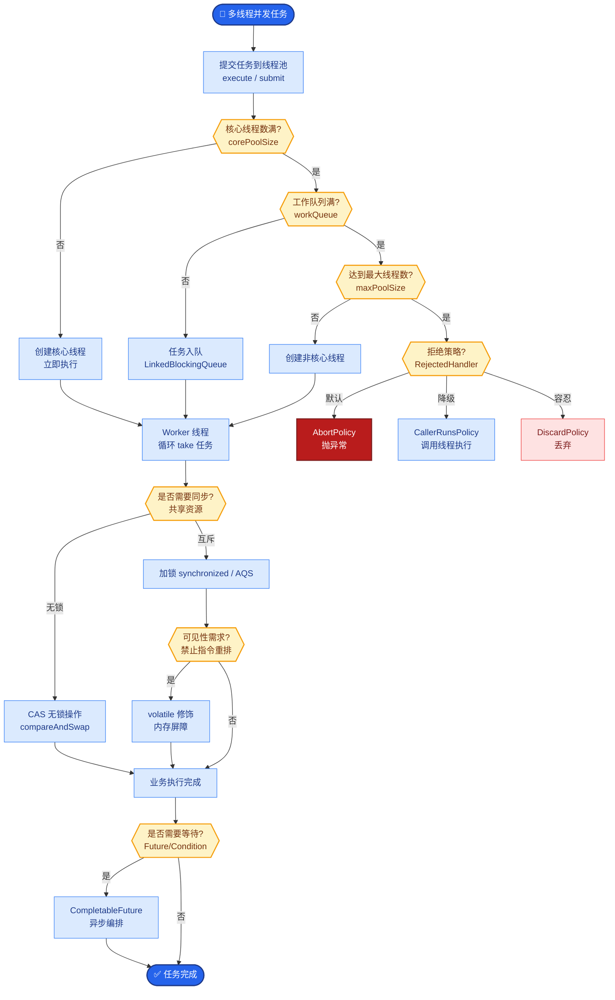

# 怎么做的日志和链路追踪

**Situation：** Agent 系统的执行链路复杂（用户输入 → 意图识别 → 检索 → 工具调用 → 生成），需要完整的可观测性来排查问题。

**Task：** 建立全链路的日志和追踪系统。

**Action：**
1. **日志分级体系：**
   - **INFO：** 请求/响应概要、Agent 状态转换。
   - **DEBUG：** 详细的中间过程（Prompt 内容、检索结果、工具调用参数）。
   - **WARN：** 降级事件、重试事件、低置信度回答。
   - **ERROR：** 异常、超时、工具调用失败。

2. **结构化日志格式：**
   ```json
   {
     "trace_id": "abc-123",
     "span_id": "span-456",
     "timestamp": "2024-03-15T10:30:00Z",
     "service": "agent-orchestrator",
     "event": "tool_call",
     "tool_name": "search_knowledge",
     "latency_ms": 245,
     "status": "success",
     "metadata": {"query": "...", "result_count": 5}
   }
   ```

3. **链路追踪（基于 OpenTelemetry）：**
   每个请求分配唯一 `trace_id`。Agent 执行的每个阶段创建独立的 `span`。
   ```text
   trace_id: abc-123
   ├── span: intent_recognition (50ms)
   ├── span: retrieval (250ms)
   │   ├── span: vector_search (120ms)
   │   └── span: keyword_search (100ms)
   ├── span: reranking (130ms)
   ├── span: llm_generation (2500ms)
   └── span: response_formatting (20ms)
   ```

4. **可视化和告警：**
   - **日志收集：** Fluentd → Elasticsearch → Kibana。
   - **链路追踪可视化：** Jaeger。
   - **告警规则：** P99 延迟 > 10s、错误率 > 1%、LLM 幻觉率 > 5% 时触发告警。

**Result：**
- 问题定位时间从平均 2 小时缩短到 15 分钟。
- 全链路 trace 覆盖率 100%。
- 通过日志分析发现并优化了 3 个性能瓶颈。

## 常见考点
1. **Context 传递开销**：在微服务间传递 Trace ID 会增加性能开销吗？（答：主要开销在于日志序列化和网络传输，通常采用异步写入 Log Agent，对业务延迟影响可忽略）
2. **大日志处理**：Prompt 和 Context 内容非常大（>10k tokens），是否全量记入日志？（答：通常截断或仅记录摘要，全文仅在被标记为 ERROR 或抽样时记录，避免存储爆炸）
3. **采样率策略**：高并发下如何平衡追踪精度与存储成本？（答：错误请求 100% 采集，正常请求设置 1%-10% 采样率，或在特定用户 ID 上进行全量采集）

---

### 深化内容

**实战案例**：
曾遇到线上偶发的回答错误，原因难以复现。通过引入 `Trace ID` 并透传到用户端反馈按钮，当用户点“踩”时，直接关联该次请求的完整 Prompt 和检索上下文。通过分析发现是 Rerank 模型对特定长尾词降权过重，导致正确文档被排序过低，快速修复了业务逻辑。

**代码示例**：
```python
from opentelemetry import trace
from opentelemetry.instrumentation.fastapi import FastAPIInstrumentor

# 获取当前的 tracer
tracer = trace.get_tracer(__name__)

def execute_tool(tool_name: str, params: dict):
    # 创建一个子 span 用于追踪工具调用耗时
    with tracer.start_as_current_span(f"tool.{tool_name}") as span:
        span.set_attribute("tool.params", str(params))
        try:
            result = call_external_api(params)
            span.set_attribute("tool.result_count", len(result))
            return result
        except Exception as e:
            span.record_exception(e)
            span.set_status(trace.Status(trace.StatusCode.ERROR, str(e)))
            raise
```

**日志方案对比 (ELK vs Loki)**：

| 维度 | ELK Stack (Elasticsearch) | Grafana Loki |
| :--- | :--- | :--- |
| **存储索引** | 倒排索引 (全文检索能力强) | 标签索引 (类似 Prometheus，仅索引元数据) |
| **写入性能** | 较高资源消耗 (CPU/内存) | 极高 (追加写，适合高吞吐日志) |
| **查询能力** | 支持复杂的全文模糊查询 | 主要基于 Label 过滤，全文查询稍弱 (LogQL) |
| **存储成本** | 高 (索引膨胀大) | 低 (压缩比高，纯文本存储) |
| **适用场景** | 需要对日志内容做复杂分析、Debug | 云原生环境、关注链路追踪与成本控制 |


## 核心流程图



## 记忆要点

- 分级日志：INFO 记录概要，DEBUG 记录 Prompt/检索详情，ERROR 记录异常。
- 链路追踪：基于 OpenTelemetry，TraceID 贯穿全链路，Span 记录各阶段耗时。
- 存储方案：Fluentd 收集，ES 存储日志，Jaeger 可视化追踪。
- 成本控制：大文本截断记录，ERROR 全量记录，正常请求采样。


## 结构化回答

**30 秒电梯演讲：** 通过Trace ID串联全链路日志，实现系统运行的可观测性。——打个比方，物流快递的单号追踪，包裹到哪了、卡在哪了一目了然。

**展开框架：**
1. **分级日志** — INFO 记录概要，DEBUG 记录 Prompt/检索详情，ERROR 记录异常。
2. **链路追踪** — 基于 OpenTelemetry，TraceID 贯穿全链路，Span 记录各阶段耗时。
3. **存储方案** — Fluentd 收集，ES 存储日志，Jaeger 可视化追踪。

**收尾：** 以上三点都能配合实战聊。您想深入聊哪一块？

## 视频脚本

> 预计时长：3 分钟 | 由浅入深

| 时间 | 画面/字幕 | 口播台词 | 讲解要点 |
|------|----------|----------|----------|
| 0:00 | 标题卡 | "怎么做的日志和链路追踪，30 秒讲清楚。" | 开场钩子 |
| 0:36 | 概念定义动画 | "一句话：通过Trace ID串联全链路日志，实现系统运行的可观测性。" | 核心定义 |
| 1:12 | 分级日志图解 | "INFO 记录概要，DEBUG 记录 Prompt/检索详情，ERROR 记录异常。" | 分级日志 |
| 1:48 | 链路追踪图解 | "基于 OpenTelemetry，TraceID 贯穿全链路，Span 记录各阶段耗时。" | 链路追踪 |
| 2:24 | 总结卡 | "记好这几条，面试不慌。下期见。" | 收尾 |
