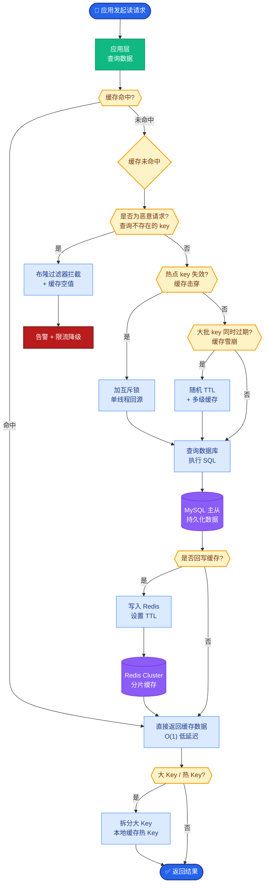
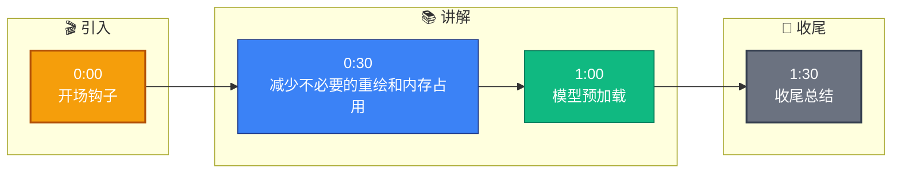

# 前端渲染性能怎么优化

**Situation：** 系统重启或新实例扩容时存在冷启动问题:模型加载慢、缓存为空、连接池未预热.
**Task：** 减少冷启动对用户的影响.
**Action：** 
1. 模型预加载:
  *   **K8s 探针**：使用 `readinessProbe`，模型加载完成(返回 200)后才接收流量.
  *   **存储优化**：模型文件使用共享存储(NFS/OSS)或 Image 预置，避免每次从网络下载. **预加载时间**：约 30s(embedding 模型 + reranker 模型).

2. 缓存预热:
  *   **主动加载**：服务启动时自动加载高频 FAQ 缓存.
  *   **Peer 同步**：新实例启动后，从已有的健康实例通过 RPC 获取当前热点 Key 列表.
  *   **降级策略**：预热完成前，设置 `allow_stale=true` 或跳过缓存直接查库.

3. 连接池预建:
  *   服务启动时立即创建最小数量的数据库连接 (`min_idle`),并执行简单查询验证连通性.

4. 流量预热:
  *   **负载均衡**：新实例启动后，LB 先分配 5% 权重，观察指标正常后逐步增加到 100%. 避免大量冷请求同时打死新实例.

**冷启动处理流程图：**
```text
K8s Pod Start
    │
    ├─> [Load Models from Shared Storage] (Async)
    │
    ├─> [Init Connection Pools] (PG/Redis)
    │
    ├─> [Cache Warm-up]
    │       ├─> Load Static Configs
    │       └─> Sync Hot Keys from Peers
    │
    ▼
[ReadinessProbe Check] (Is GPU Ready? Is DB Connected?)
    │ Success
    ▼
[LB Traffic On] (Weight: 5% -> 50% -> 100%)
```

**实战案例：** 曾遇到新实例在缓存未预热时接入全量流量，导致 Redis 命令率飙升触发了限流熔断，整个服务集群瘫痪。后续引入了“灰度预热窗口期”，只有当本地缓存数量达到阈值的 80% 时，才标记 Ready，彻底解决了此问题。

**代码示例（Go Preheat）：**
```go
func (s *Service) warmUpCache(ctx context.Context) error {
    // 1. 从 Peer 获取热点 Key
    hotKeys, _ := s.discovery.GetHotKeysFromPeers(ctx)
    // 2. 异步并发加载，不阻塞启动主流程
    semaphore := make(chan struct{}, 50) // 限制并发数，打爆缓存
    var wg sync.WaitGroup
    for _, key := range hotKeys {
        wg.Add(1)
        go func(k string) {
            defer wg.Done()
            semaphore <- struct{}{}
            s.cache.Get(ctx, k) // 触发回源
            <-semaphore
        }(key)
    }
    wg.Wait()
    return nil
}
```

**对比表格（预热策略对比）：**
| 策略 | 优点 | 缺点 | 适用场景 |
| :--- | :--- | :--- | :--- |
| **被动触发** | 实现简单，无浪费 | 首次请求慢，可能击穿数据库 | 低频业务，非核心链路 |
| **定时全量** | 避免冷启动，覆盖全 | 浪费资源，加载慢 | 离线计算，配置加载 |
| **Peer 同步** | 精准预热热点，效率高 | 增加集群内部通信开销 | 高并发读，缓存集群 |
| **Bloom Filter** | 节省网络带宽，极快 | 有误判率，需容忍极少量未命中 | 超大规模 Key 集群 |

**Result：** 
*   冷启动时间从 120s 降低到 45s.
*   冷启动期间的请求成功率从 70% 提升到 98%.
*   缓存预热后命中率快速回升到正常水平.

## 常见考点
1.  **Jetty 预热**：对于 Java 应用，除了加载类，还需要做什么？（如 JIT 编译预热，运行多次模拟请求触发 C2 编译）。
2.  **Bloom Filter 替代**：如果 Peer 预热流量太大，如何优化？（使用布隆过滤器同步 Key 集合，只同步可能存在的 Key）。
3.  **数据库连接池**：连接池的 `validationQuery` 参数作用是什么？（防止获取到已失效的连接）。


## 核心流程图



## 记忆要点

- 模型预加载：ReadinessProbe检查GPU就绪才接流量，模型文件存共享存储。
- 缓存预热：启动时从Peer同步热点Key，异步并发加载，达阈值才Ready。
- 连接池预建：启动时创建min_idle连接并执行验证查询。
- 流量预热：LB权重从5%逐步增至100%，避免冷请求打死新实例。


## 结构化回答

**30 秒电梯演讲：** 减少不必要的重绘和内存占用，提升渲染帧率。——打个比方，像只砌视线内的墙（虚拟滚动），省去看不到的砖头。

**展开框架：**
1. **模型预加载** — ReadinessProbe检查GPU就绪才接流量，模型文件存共享存储。
2. **缓存预热** — 启动时从Peer同步热点Key，异步并发加载，达阈值才Ready。
3. **连接池预建** — 启动时创建min_idle连接并执行验证查询。

**收尾：** 以上三点都能配合实战聊。您想深入聊哪一块？

## 视频脚本

> 预计时长：2 分钟 | 由浅入深

| 时间 | 画面/字幕 | 口播台词 | 讲解要点 |
|------|----------|----------|----------|
| 0:00 | 标题卡 | "前端渲染性能怎么优化，30 秒讲清楚。" | 开场钩子 |
| 0:30 | 概念定义动画 | "一句话：减少不必要的重绘和内存占用，提升渲染帧率。" | 核心定义 |
| 1:00 | 模型预加载图解 | "ReadinessProbe检查GPU就绪才接流量，模型文件存共享存储。" | 模型预加载 |
| 1:30 | 总结卡 | "记好这几条，面试不慌。下期见。" | 收尾 |

### 视频流程图


