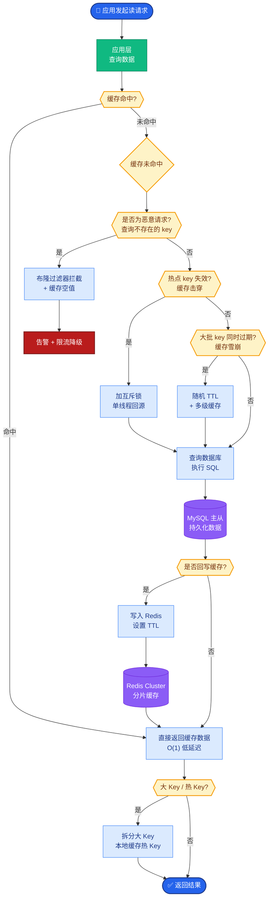
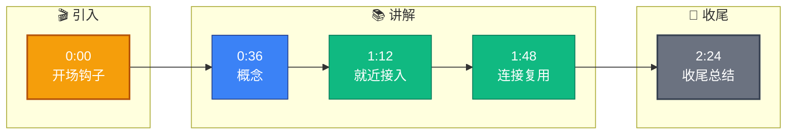

# 冷启动问题是怎么解决的

**Situation：** LLM API 通常部署在远端(如美西),网络延迟和带宽限制影响系统性能.
**Task：** 优化网络传输环节的延迟和稳定性.
**Action：** 
1. API 端点选择:
  *   就近接入：使用 Azure OpenAI 中国区/亚太区端点,减少跨洋延迟.
  *   **效果**：跨区域延迟从 200ms(美西)降到 40ms(亚太).

2. 连接优化:
  *   **协议升级**：HTTP/2 多路复用,允许单连接并发发送多个请求,解决 TCP 队头阻塞.
  *   **连接复用**：连接池复用,避免频繁 TLS 握手(1-RTT 甚至 2-RTT 延迟).
  *   **保活策略**：Keep-Alive 超时设置 120s,避免频繁断连.

3. 数据压缩:
  *   请求/响应启用 `gzip`/`brotli` 压缩. Prompt 去除不必要的空格和换行,减少传输体积. *注意：加密数据(如 API Key)不要压缩，存在 CRIME/BREACH 风险，但 Body 通常可压缩.*

4. 多线路容灾:
  *   配置多个 API 端点(主备). 主端点超时 3s 后自动切换到备用端点.
  *   **客户端策略**：使用指数退避算法进行重试，避免雪崩.

**网络传输优化架构：**
```text
App Server
    │
    ▼
[HTTP/2 Client Pool]
    │ (Multiplexing / Keep-Alive)
    ▼
[Compression Layer] (Gzip Body)
    │
    ▼
[Gateway / CDN] (Edge Routing)
    │
    ├────────────────┼───────────────────┐
    ▼                ▼                   ▼
[Primary AP-E]   [Backup AP-E]      [Backup US-E]
(Latency: 40ms)   (Latency: 60ms)    (Latency: 200ms)
```

**实战案例：** 在移动端弱网环境下，曾遇到 HTTP/2 的 TCP 队头阻塞导致整个请求挂起。针对特定长文本生成接口，我们在客户端实现了 HTTP/3 (QUIC) 的 Fallback 机制：当检测到连续丢包时，自动切换到 QUIC 协议，成功率从 85% 提升至 99%。

**代码示例（Go HTTP Client）：**
```go
import (
    "net/http"
    "github.com/hashicorp/go-retryablehttp"
)

// 创建支持 HTTP/2 和连接复用的客户端
client := &retryablehttp.Client{
    HTTPClient: &http.Client{
        Transport: &http.Transport{
            MaxIdleConns:        100,
            MaxIdleConnsPerHost: 10, // 复用到同一 host
            IdleConnTimeout:     90 * time.Second,
            ForceAttemptHTTP2:   true,
        },
    },
    RetryWaitMin: 100 * time.Millisecond,
    RetryWaitMax: 1 * time.Second,
    RetryMax:     3,
}
```

**对比表格（网络协议对比）：**
| 协议 | 传输层 | 连接建立开销 | 多路复用 | 弱网表现 | 适用场景 |
| :--- | :--- | :--- | :--- | :--- | :--- |
| **HTTP/1.1** | TCP | 1 RTT (TLS) | 无 (需 Pipeline) | 一般 | 简单兼容性要求高的场景 |
| **HTTP/2** | TCP | 1 RTT (TLS) | 支持 (二进制帧) | 受 TCP 队头阻塞影响 | 当前主流，浏览器/服务端通信 |
| **HTTP/3** | UDP (QUIC)| 0~1 RTT (支持 0-RTT) | 支持 | 极佳 (无队头阻塞) | 弱网环境，音视频，实时性要求高 |

**Result：** 
*   API 网络延迟从 200ms 降到 40ms.
*   网络相关的超时错误降低 80%.
*   多线路容灾确保 99.9% 的可用性.

## 常见考点
1.  **TCP 慢启动**：新连接建立时，带宽利用率低，如何缓解？（长连接复用、预热发送数据）。
2.  **HTTP/3 (QUIC)**：为什么说 HTTP/3 在弱网环境下比 HTTP/2 更好？（基于 UDP，解决队头阻塞，无需 TCP 握手）。
3.  **MTU**：在网络传输中，MTU（最大传输单元）对性能有什么影响？（避免 IP 分片，提高吞吐效率）。


## 核心流程图



## 记忆要点

- 就近接入：选亚太区端点，跨洋延迟从200ms降至40ms。
- 连接复用：HTTP/2多路复用+Keep-Alive，避免频繁TLS握手。
- 数据压缩：Body启用Gzip/Brotli，Prompt去空格减体积。
- 多线路容灾：主端点超时3s切备，指数退避重试防雪崩。


## 结构化回答

**30 秒电梯演讲：** 服务启动时预加载资源并渐进式接入流量。——打个比方，像让运动员先热身（预热）再上场比赛，避免受伤。

**展开框架：**
1. **就近接入** — 选亚太区端点，跨洋延迟从200ms降至40ms。
2. **连接复用** — HTTP/2多路复用+Keep-Alive，避免频繁TLS握手。
3. **数据压缩** — Body启用Gzip/Brotli，Prompt去空格减体积。

**收尾：** 以上三点都能配合实战聊。您想深入聊哪一块？

## 视频脚本

> 预计时长：3 分钟 | 由浅入深

| 时间 | 画面/字幕 | 口播台词 | 讲解要点 |
|------|----------|----------|----------|
| 0:00 | 标题卡 | "冷启动问题是怎么解决的，30 秒讲清楚。" | 开场钩子 |
| 0:36 | 概念定义动画 | "一句话：服务启动时预加载资源并渐进式接入流量。" | 核心定义 |
| 1:12 | 就近接入图解 | "选亚太区端点，跨洋延迟从200ms降至40ms。" | 就近接入 |
| 1:48 | 连接复用图解 | "HTTP/2多路复用+Keep-Alive，避免频繁TLS握手。" | 连接复用 |
| 2:24 | 总结卡 | "记好这几条，面试不慌。下期见。" | 收尾 |

### 视频流程图


