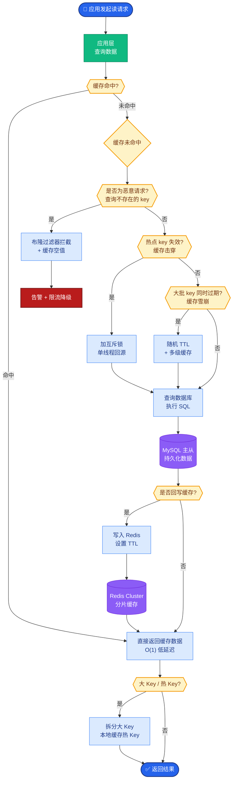

# 模型超时怎么处理

**Situation：** LLM API 调用有时会出现超长延迟(> 30s)或直接超时,影响用户体验.

**Task：** 设计模型超时的处理策略,保证用户体验.

**Action：** 
1. **超时策略分级:**
   - **连接超时：** 5s(TCP 连接建立).
   - **首 token 超时:** 10s(等待第一个 token 返回).
   - **总超时：** 60s(整个请求的最长时间).

2. **超时处理流程:**
   - 首次调用超时 → 自动重试(切换备用端点,最多1次)
   - → 重试超时 → 降级到备用模型
   - → 备用模型也超时 → 返回兜底话术

**超时熔断与降级决策流：**
```text
Client Request
    │
    ▼
[Timeout Check Layer]
    │
    ├── Connect Timeout (5s)
    ├── TTFB Timeout (10s) ──┐
    └── Total Timeout (60s)  │
                            │
                (Fail)       │ (Success)
                ▼           ▼
    [Retry Logic]        Return Stream
    (Exponential Backoff)
    │
    ├── Retry 1: Same Endpoint?
    ├── Retry 2: Switch Region/Endpoint?
    └── (Still Fail) -> [Fallback Chain]
                       │
                       ├── 1. Smaller Model (Faster)
                       ├── 2. Cached Answer
                       └── 3. Static Fallback Script
```

3. **降级矩阵:**
| 主模型 | 备用模型 | 兜底 |
| :--- | :--- | :--- |
| GPT-4o | GPT-4o-mini | 缓存/话术 |
| Claude 3.5 | GPT-4o-mini | 缓存/话术 |
| 本地模型 | GPT-4o-mini | 缓存/话术 |

4. **用户侧处理:**
   - **流式模式下：** 超时前如果已有部分输出,告知用户"回答可能不完整".
   - **非流式模式：** 返回"处理时间较长,正在努力处理中...",并提供重试按钮.
   - 记录超时请求,后台异步完成后主动推送结果.

**补充原理细节：**
- **首 Token 延迟 (TTFT)**：这是大模型最敏感的指标。TTF 超时通常意味着模型负载过高或推理启动慢，是扩容的信号。
- **重试策略**：必须带有随机退避，避免重试风暴导致上游服务雪崩。

**Result：** 
- 用户可见的超时错误从 5% 降低到 0.5%.
- 降级后的回答质量虽然有所下降,但 85% 的用户仍然接受.
- 模型不可用时的系统可用性从 0% 提升到 95%(降级兜底).

---

**实战案例**：在黑五大促期间，LLM 供应商 API 响应时间飙升至 10s+。通过配置网关层面的熔断策略，在 P99 延迟超过 8s 时自动切换到同规格的备用 Region，将用户无感知地平摊了流量，避免了大规模报错。

**代码示例**：
```python
import httpx
from tenacity import retry, stop_after_attempt, wait_exponential

@retry(stop=stop_after_attempt(2), wait=wait_exponential(multiplier=1, min=1, max=5))
def call_llm_with_timeout(prompt: str):
    try:
        with httpx.Client(timeout=httpx.Timeout(5.0, connect=5.0, read=60.0)) as client:
            response = client.post("https://api.openai.com/v1/chat/completions", json={...})
            response.raise_for_status()
            return response.json()
    except httpx.TimeoutException:
        raise  # 触发 tenacity 重试
```

**常见考点**
1. **流式传输中的超时判定**：已经吐出一半内容断了，算成功还是失败？（答案：视为部分成功，用户体验优于完全报错，但需标记不完整）
2. **重试风暴**：客户端重试是否可能导致服务端更崩溃？（答案：是，需引入指数退避和 Jitter，且限制最大重试次数）
3. **降级触发条件**：什么时候降级？是单次超时就降级还是连续失败？（答案：通常结合熔断器，如连续 5 次失败才开启降级）
4. **异步推送**：后台异步处理完毕后，前端如何展示？（答案：WebSocket 推送或前端轮询，提示用户“已生成最新答案”）


## 核心流程图



## 记忆要点

- 三级超时设置：连接(5s)、首Token(10s)、总超时(60s)，精细控制等待时间。
- 重试与降级：超时自动重试(切换端点)，失败后降级备用模型或返回兜底话术。
- 用户侧体验：流式超时提示不完整，非流式提示处理中，支持异步推送结果。
- 避坑指南：重试需指数退避防雪崩，TTFT过长是扩容信号。


## 结构化回答

**30 秒电梯演讲：** 通过分级超时控制、自动重试和模型降级，确保服务始终有响应。——打个比方，打不通主电话就自动打备用电话，还打不通就发短信兜底。

**展开框架：**
1. **三级超时设置** — 连接(5s)、首Token(10s)、总超时(60s)，精细控制等待时间。
2. **重试与降级** — 超时自动重试(切换端点)，失败后降级备用模型或返回兜底话术。
3. **用户侧体验** — 流式超时提示不完整，非流式提示处理中，支持异步推送结果。

**收尾：** 以上三点都能配合实战聊。您想深入聊哪一块？

## 视频脚本

> 预计时长：2 分钟 | 由浅入深

| 时间 | 画面/字幕 | 口播台词 | 讲解要点 |
|------|----------|----------|----------|
| 0:00 | 标题卡 | "模型超时怎么处理，30 秒讲清楚。" | 开场钩子 |
| 0:30 | 概念定义动画 | "一句话：通过分级超时控制、自动重试和模型降级，确保服务始终有响应。" | 核心定义 |
| 1:00 | 三级超时设置图解 | "连接(5s)、首Token(10s)、总超时(60s)，精细控制等待时间。" | 三级超时设置 |
| 1:30 | 总结卡 | "记好这几条，面试不慌。下期见。" | 收尾 |
