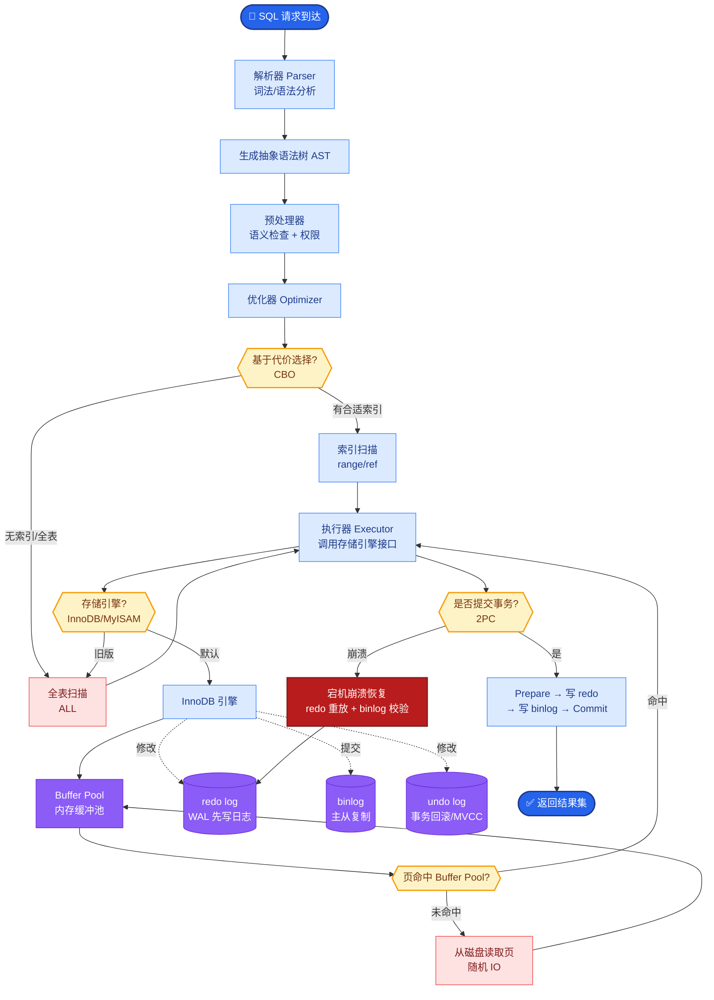

# 工具调用失败怎么处理

**Situation：** Agent 调用外部工具(数据库查询、API 调用等)时可能失败:接口不可用、参数错误、权限不足、数据不存在等.

**Task：** 设计工具调用失败的处理策略,保证 Agent 的鲁棒性.

**Action：**
1. **错误分类和处理:**
| 错误类型 | 示例 | 处理策略 |
| :--- | :--- | :--- |
| 临时错误 | 网络超时、限流 | 重试(最多 2 次) |
| 参数错误 | SQL 语法错误 | 告知 Agent,让其修正参数 |
| 权限错误 | 无访问权限 | 告知用户,建议联系管理员 |
| 数据不存在 | 查无此订单 | 告知用户,建议核实信息 |
| 系统错误 | 服务不可用 | 降级处理 |

2. **Agent 自愈机制:**
   - 工具调用失败后,错误信息返回给 Agent 的 Observation.
   - Agent 基于错误信息决定下一步:
     - 修改参数重新调用(如修正 SQL 语法).
     - 尝试替代工具(如 API 不可用,改为查数据库).
     - 直接告知用户(如数据确实不存在).

3. **错误信息标准化:**
   ```python
   class ToolError:
       error_type: str  # TIMEOUT/PARAM_ERROR/AUTH_ERROR/NOT_FOUND/SYSTEM_ERROR
       message: str     # 人可读的错误描述
       retryable: bool  # 是否可重试
       suggestion: str  # 建议的处理方式
   ```

4. **兜底机制:**
   - 工具调用连续失败 3 次 → 跳过该工具,基于已有信息回答.
   - 所有工具都不可用 → 返回知识库检索的纯 RAG 回答.

**Agent 自愈与重试逻辑流：**
```text
Agent Decides to Use Tool (e.g., get_weather)
     │
     ▼
[Tool Execution Layer]
     │
     ├── Try Call
     │     │
     │     ├── Success ──> Return Result ──> Agent Thought
     │     │
     │     └── Failure ──> Parse Error (Standardize ToolError)
     │                │
     │                ▼
     │         [Error Routing]
     │                │
     │     ┌───────────┼─────────────┐
     │     ▼           ▼             ▼
     │ Retryable?  Param Error?  Fatal?
     │ (Net jitter) (Bad SQL)     (Auth)
     │     │           │             │
     │     ▼           ▼             ▼
     │  [Retry]    [Feedback Loop] [Stop/Notify]
     │ (Backoff)  (To Agent LLM)      │
     │     │           │             │
     └─────┴───────────┴─────────────┘
                  │
                  ▼
           Agent Self-Correction
           (Regenerate Thought & Action)
```

**Result：**
- 工具调用的端到端成功率从 92% 提升到 98%.
- Agent 自主修正参数的成功率 78%.
- 工具不可用时的用户体验保持在可接受水平(有降级回答).

---

**实战案例**：在金融 Agent 尝试执行“转账”操作时，数据库因死锁报错。最初的重试逻辑导致重复扣款。后续在工具定义中增加 `idempotency_key`（幂等键）支持，并确保工具层在重试前校验事务状态，彻底解决了资金安全风险。

**代码示例**：
```python
# 幂等性工具调用封装
def safe_tool_call(tool_func, *args, max_retries=3, **kwargs):
    for attempt in range(max_retries):
        try:
            # 检查是否具备幂等键（如转账流水号）
            result = tool_func(*args, **kwargs)
            return {"status": "success", "data": result}
        except DatabaseDeadlock as e:
            if attempt == max_retries - 1:
                return {"status": "error", "error_type": "SYSTEM_ERROR", "message": "系统繁忙，请稍后重试"}
            time.sleep(1 * (attempt + 1)) # 指数退避
        except ValidationError as e:
            # 参数错误不重试，直接反馈给 Agent 修正
            return {"status": "error", "error_type": "PARAM_ERROR", "message": str(e), "retryable": False}
```

**常见考点**
1. **工具调用的循环陷阱**：如果 Agent 不断尝试修正参数但一直失败，如何防止无限循环？（答案：设置最大重试次数或最大步数 Max Iterations，如 5 步后强制停止）
2. **副作用操作的重试**：如果工具是“发送邮件”或“扣款”，失败能重试吗？（答案：不能盲目重试，需要幂等校验，确保操作未被执行过才重试，否则可能造成双倍发货或扣款）


## 核心流程图



## 记忆要点

- 错误分类处理：临时错误重试，参数错误反馈修正，权限错误告知用户。
- Agent自愈机制：错误信息返回Observation，引导LLM修正参数或尝试替代工具。
- 错误标准化：定义包含类型、重试性、建议的结构化错误对象，便于路由。
- 兜底与幂等：连续失败跳过工具降级回答，关键操作需支持幂等防重试风险。


## 结构化回答

**30 秒电梯演讲：** 通过错误分类、自愈重试和兜底策略，增强Agent调用外部工具的鲁棒性。——打个比方，就像修车工具坏了，先试着修，不行换把工具，实在不行凭经验修。

**展开框架：**
1. **错误分类处理** — 临时错误重试，参数错误反馈修正，权限错误告知用户。
2. **Agent自愈机** — Agent自愈机制：错误信息返回Observation，引导LLM修正参数或尝试替代工具。
3. **错误标准化** — 定义包含类型、重试性、建议的结构化错误对象，便于路由。

**收尾：** 以上三点都能配合实战聊。您想深入聊哪一块？

## 视频脚本

> 预计时长：3 分钟 | 由浅入深

| 时间 | 画面/字幕 | 口播台词 | 讲解要点 |
|------|----------|----------|----------|
| 0:00 | 标题卡 | "工具调用失败怎么处理，30 秒讲清楚。" | 开场钩子 |
| 0:36 | 概念定义动画 | "一句话：通过错误分类、自愈重试和兜底策略，增强Agent调用外部工具的鲁棒性。" | 核心定义 |
| 1:12 | 错误分类处理图解 | "临时错误重试，参数错误反馈修正，权限错误告知用户。" | 错误分类处理 |
| 1:48 | Agent自愈机制图解 | "错误信息返回Observation，引导LLM修正参数或尝试替代工具。" | Agent自愈机制 |
| 2:24 | 总结卡 | "记好这几条，面试不慌。下期见。" | 收尾 |
