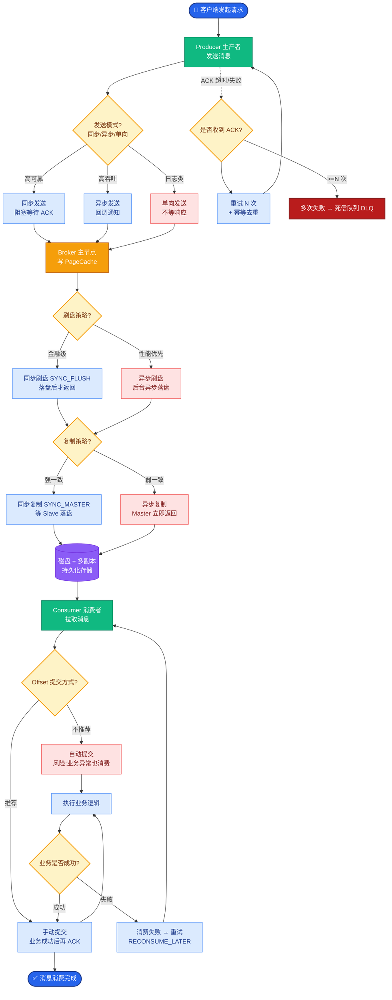

# 多 Agent 之间通信失败怎么处理

**Situation：** 多 Agent 架构中,Agent 之间通过消息传递协作.如果某个 Agent 挂掉或响应超时,会影响整个任务链.

**Task：** 确保多 Agent 系统的容错性和可靠性.

**Action：** 
1. **通信超时控制:**
   - 每个 Agent 调用设置超时:30s(默认),复杂任务 60s.
   - 超时后 Supervisor Agent 决定是否重试或跳过.

2. **Agent 健康检查:**
   - 每 10s 发送一次健康检查请求.
   - 连续 3 次健康检查失败 → 标记 Agent 为不可用.
   - 不可用的 Agent 不再接收新任务.

3. **任务重新分配:**
   - Agent 失败后,任务重新分配给同类型的备份 Agent.
   - 如果没有备份 Agent → 由 Supervisor Agent 尝试直接处理(降级).

4. **消息持久化:**
   - Agent 间的消息通过 Redis Stream 传递(有持久化).
   - 即使消费者 Agent 重启,未处理的消息不会丢失.

5. **错误信息标准化:**
   ```python
   class ToolError:
       error_type: str  # 定义错误类型
       message: str     # 人可读的错误描述
       retryable: bool  # 是否可重试
       suggestion: str  # 建议的处理方式
   ```

6. **实战案例（新增）：**
   - 在某次代码生成任务中，Python 执行 Agent 因死循环导致资源耗尽。由于设置了严格超时（30s）和熔断机制，Supervisor 迅速收到 TimeoutError，并将任务切分后转交给 Backup Agent（使用更强的 GPT-4 模型），最终任务完成仅延迟 15s，未阻塞队列。

7. **关键代码示例（新增）：**
   ```python
   import time
   from functools import wraps

n   def retry_on_failure(max_retries=2, delay=1):
       def decorator(func):
           @wraps(func)
           def wrapper(*args, **kwargs):
               last_exception = None
               for attempt in range(max_retries):
                   try:
                       return func(*args, **kwargs)
                   except Exception as e:
                       last_exception = e
                       if not is_retryable(e): break
                       time.sleep(delay * (attempt + 1)) # Exponential backoff
               raise SupervisorError(f"Agent failed after {max_retries} retries") from last_exception
           return wrapper
       return decorator
   ```

**Result：** 
- 单个 Agent 故障不影响整体系统可用性.
- 任务重新分配延迟 < 5s.
- 系统整体可用性 99.5%.

**架构流程图：**
```text
┌───────────────┐      Publish/Subscribe      ┌───────────────┐
│  Supervisor   │────────────────────────────▶│  Redis Stream │
│   (Orchestr.) │◀─────────────────────────────│  (Message Bus)│
└───────┬───────┘                               └───────┬───────┘
        │                                               │
        │ Assign Task                                   │ Read Message
        ▼                                               ▼
┌───────────────┐                               ┌───────────────┐
│  Agent Group  │                               │  Consumer A   │
│ (Load Balancer)──────────────────────────────▶│  (Worker 1)   │
└───────┬───────┘   1. Pick Idle Worker          └───────┬───────┘
        │           2. Send Task Payload                │
        │                                               │
        │                                   ┌───────────┴───────────┐
        │                                   ▼                       ▼
        │                            ┌───────────────┐       ┌───────────────┐
        │                            │   Success     │       │    Fail       │
        │                            │  (ACK to MQ)  │       │ (NACK/Retry)  │
```


## 核心流程图



## 记忆要点

- 通信超时控制：设置Agent调用超时(30s)，超时由Supervisor决策重试或跳过。
- 健康检查机制：定期Ping Agent，连续失败标记不可用，不再分配新任务。
- 任务重新分配：故障Agent任务转交给同组备份，无备份则Supervisor降级处理。
- 消息持久化：使用Redis Stream等消息队列，确保Agent重启后消息不丢失。


## 结构化回答

**30 秒电梯演讲：** 利用健康检查、任务转移和消息持久化，实现多Agent协作的故障隔离。——打个比方，一个快递员病了，系统自动把件转给另一个快递员，确保件不丢。

**展开框架：**
1. **通信超时控制** — 设置Agent调用超时(30s)，超时由Supervisor决策重试或跳过。
2. **健康检查机制** — 定期Ping Agent，连续失败标记不可用，不再分配新任务。
3. **任务重新分配** — 故障Agent任务转交给同组备份，无备份则Supervisor降级处理。

**收尾：** 以上三点都能配合实战聊。您想深入聊哪一块？

## 视频脚本

> 预计时长：2 分钟 | 由浅入深

| 时间 | 画面/字幕 | 口播台词 | 讲解要点 |
|------|----------|----------|----------|
| 0:00 | 标题卡 | "多 Agent 之间通信失败怎么处理，30 秒讲清楚。" | 开场钩子 |
| 0:30 | 概念定义动画 | "一句话：利用健康检查、任务转移和消息持久化，实现多Agent协作的故障隔离。" | 核心定义 |
| 1:00 | 通信超时控制图解 | "设置Agent调用超时(30s)，超时由Supervisor决策重试或跳过。" | 通信超时控制 |
| 1:30 | 总结卡 | "记好这几条，面试不慌。下期见。" | 收尾 |
