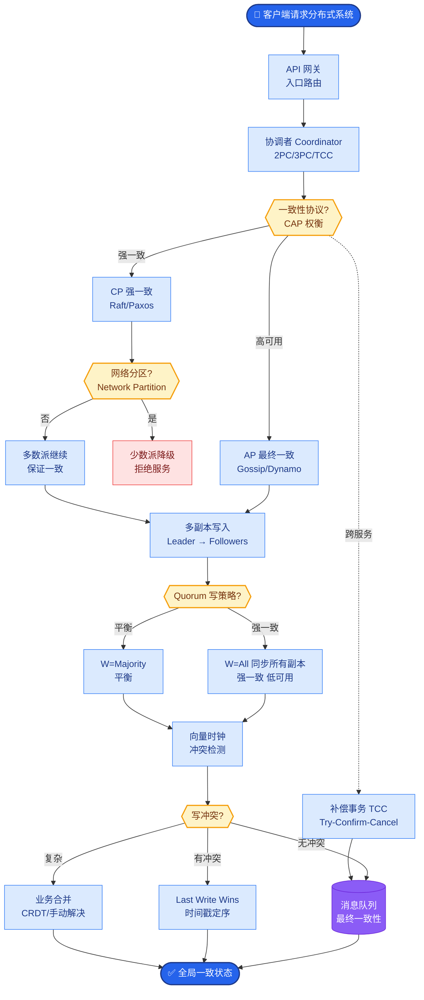
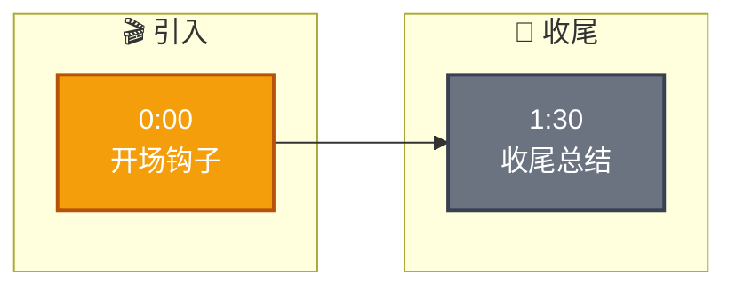

# 知识库数据不一致怎么处理

**Situation：** 知识库中可能存在过时信息、矛盾信息(同一主题不同文档说法不一致)、或错误信息.

**Task：** 检测和处理知识库中的数据不一致问题.

**Action：** 
1. **时效性管理:**
   - 每个文档/chunk 标记创建时间和更新时间.
   - 检索结果中,近期文档的排序权重更高.
   - 超过设定期限(如 1 年)的文档标记为"可能过时".

2. **矛盾检测:**
   - 当检索到多个相关 chunk 时,检查它们是否包含矛盾信息.
   - **检测方法：** 使用 NLI 模型判断两个文本片段是否矛盾.
   - **发现矛盾时：** 优先使用更新的文档,并在回答中说明存在不同说法.

3. **数据质量巡检:**
   - **每周自动巡检：** 检查文档的可用性(链接是否有效、格式是否正常).
   - **每月人工审核：** 随机抽查 50 份文档,验证内容准确性.

4. **用户反馈闭环:**
   - 用户标记"回答错误"时,自动触发人工审核.
   - 审核结果反馈到知识库(修正或标注).

5. **实战案例（新增）：**
   - 某金融问答系统中，政策文档更新导致新旧利率共存。系统检索到两个 Chunk，通过 NLI 模型判定为矛盾（Contradiction Score > 0.9），系统自动过滤掉旧文档，并在 Prompt 中注入“依据最新政策...”的上下文，避免了用户因过时信息产生资金损失风险。

6. **关键代码示例（新增）：**
   ```python
   def resolve_conflicts(retrieved_docs):
       # Sort by date desc
       docs = sorted(retrieved_docs, key=lambda x: x['updated_at'], reverse=True)
       valid_docs = [docs[0]]
       
       for doc in docs[1:]:
           is_contradiction = nli_model.predict(
               premise=docs[0]['content'], 
               hypothesis=doc['content']
           ) == 'contradiction'
           if not is_contradiction:
               valid_docs.append(doc)
       return valid_docs
   ```

**Result：** 
- 过时信息的误导率降低 70%.
- 矛盾信息的检测覆盖率 80%.
- 知识库数据质量评分从 3.6 提升到 4.2(满分 5 分).

**处理流程图：**
```text
┌─────────────┐    1. Search     ┌─────────────┐
│   User      │────────────────▶│ Vector DB   │
│   Query     │                  │ (Candidates)│
└─────────────┘                  └──────┬───────┘
                                         │
                                         ▼
                                ┌─────────────────┐
                                │  Rerank & Check │◀───── Time/Hash
                                └────────┬────────┘
                                         │
                    ┌────────────────────┼────────────────────┐
                    ▼                    ▼                    ▼
             ┌─────────────┐      ┌─────────────┐      ┌─────────────┐
             │   Normal    │      │  Outdated   │      │ Contradict  │
             │   Return    │      │   Demote    │      │  Resolve    │
             └─────────────┘      └─────────────┘      └──────┬──────┘
                                                               │
                                                               ▼
                                                        ┌─────────────┐
                                                        │  Explain &  │
                                                        │ Cite Source │
                                                        └─────────────┘
```

## 常见考点
1. **NLI 模型选择**：用于矛盾检测的 NLI 模型通常有哪些？一般选用轻量级的 BERT 或 DeBERTa 训练的 NLI


## 核心流程图



## 记忆要点

- 时效性管理：标记文档时间，检索时提升近期文档权重，过期文档降权。
- 矛盾检测与解决：使用NLI模型检测冲突，优先保留新文档，并在回答中说明。
- 数据质量巡检：定期自动检查链接可用性，人工随机抽查内容准确性。
- 用户反馈闭环：用户标记错误触发人工审核，修正结果回流更新知识库。


## 结构化回答

**30 秒电梯演讲：** 通过时间权重排序、矛盾检测和人工巡检，保证知识库数据的准确性和一致性。——打个比方，图书馆定期清理旧书，发现两本书说法打架就标注出来提醒读者。

**展开框架：**
1. **时效性管理** — 标记文档时间，检索时提升近期文档权重，过期文档降权。
2. **矛盾检测与解决** — 使用NLI模型检测冲突，优先保留新文档，并在回答中说明。
3. **数据质量巡检** — 定期自动检查链接可用性，人工随机抽查内容准确性。

**收尾：** 以上三点都能配合实战聊。您想深入聊哪一块？

## 视频脚本

> 预计时长：2 分钟 | 由浅入深

| 时间 | 画面/字幕 | 口播台词 | 讲解要点 |
|------|----------|----------|----------|
| 0:00 | 标题卡 | "知识库数据不一致怎么处理，30 秒讲清楚。" | 开场钩子 |
| 0:30 | 概念定义动画 | "一句话：通过时间权重排序、矛盾检测和人工巡检，保证知识库数据的准确性和一致性。" | 核心定义 |
| 1:00 | 时效性管理图解 | "标记文档时间，检索时提升近期文档权重，过期文档降权。" | 时效性管理 |
| 1:30 | 总结卡 | "记好这几条，面试不慌。下期见。" | 收尾 |

### 视频流程图


