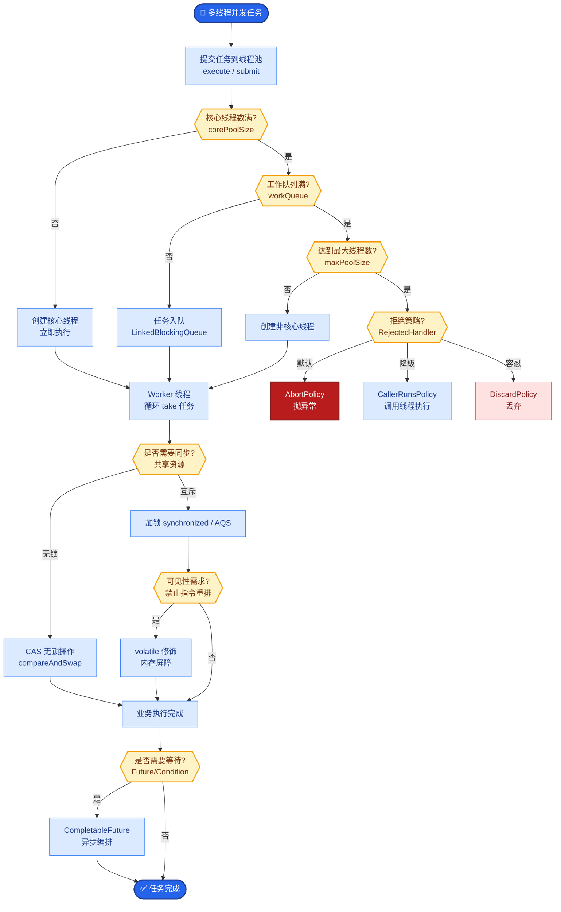
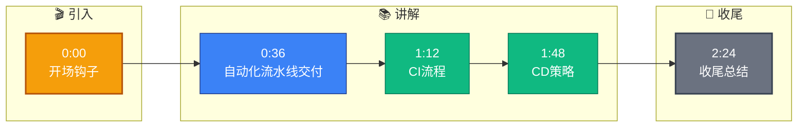

# 怎么部署的?CI/CD 是什么流程

**Situation：** 系统需要频繁迭代(每周 1-2 次发版)，需要可靠的 CI/CD 流程保障发布质量。
**Task：** 建立自动化的 CI/CD 流水线，确保快速、安全的发布。
**Action：** 
1.  **CI 流水线(代码合入前)：**
    全部通过后才允许合入主分支。CI 时间目标：< 15 分钟。
    流程：代码提交 → 代码扫描(lint + type check) → 单元测试(覆盖率 > 80%) → 集成测试 → AI 评估测试 → 安全扫描 → 构建 Docker 镜像 → 推送镜像仓库。
2.  **CD 流水线(发布流程)：**
    主分支合入 → 自动部署到 Staging → 冒烟测试 → 人工验证 → 灰度发布(10% → 50% → 100%) → 全量部署。
    灰度发布使用 Kubernetes 的金丝雀部署策略。每个阶段观察 30 分钟，无异常后进入下一阶段。
3.  **回滚机制：**
    保留最近 5 个版本的 Docker 镜像。
    **一键回滚：** kubectl rollout undo deployment/agent-api。
    灰度期间发现问题自动回滚（基于 Prometheus 的 Error Rate 指标触发）。
4.  **环境管理：**
    Dev → Staging → Production 三个环境。
    使用 Helm Chart 管理 Kubernetes 部署配置，实现 GitOps。
    环境配置通过 ConfigMap 和 Secret 管理，敏感信息使用 KMS 加密。
5.  **CI/CD 流水线架构图：**
```text
[开发人员] -> Git Commit (Main Branch)
      │
      ▼
┌─────────────────────────────────────┐
│  CI Pipeline (Jenkins/GitLab CI)    │
│  1. Lint & Security Scan             │
│  2. Unit Test & Integration Test     │
│  3. Build Docker Image               │
│  4. Push to Harbor (Registry)        │
└─────────────────┬───────────────────┘
                  │
                  ▼
         Update Helm Chart Repo
                  │
                  ▼
┌─────────────────────────────────────┐
│        CD Pipeline (ArgoCD)          │
│                                     │
│  [Staging] -> [Smoke Test] -> [OK]  │
│       │                            │
│       ▼                            │
│  [Prod: Canary 10%] -> [Observe]   │
│       │                            │
│       ▼ (Metrics Normal)           │
│  [Prod: Full Rollout 100%]          │
└─────────────────────────────────────┘
```

**实战案例**：曾遇到一次发布导致 LLM 响应超时，原因是未充分测试的 Prompt 变量在并发下触发了 Rate Limit。依赖金丝雀发布 10% 流量时的 P99 延迟告警，我们在影响全量用户前 2 分钟内完成了自动回滚。

**代码示例**：K8s 批量更新并等待 Rollout 状态（Shell）
```bash
# 更新镜像并自动观察滚动更新状态
kubectl set image deployment/agent-api \
  agent-api=registry.example.com/agent:v1.2.3 --record

# 等待所有 Pod 就绪，超时 5m
kubectl rollout status deployment/agent-api --timeout=5m
```

**对比表格**：发布策略选型对比
| 特性 | 蓝绿发布 | 金丝雀发布 | 滚动发布 |
| :--- | :--- | :--- | :--- |
| **风险控制** | 低（一键切换） | 低（渐进式放量） | 中（部分旧部分新） |
| **资源消耗** | 高（需 2 倍资源） | 低（共用资源） | 低（无需额外资源） |
| **回滚速度** | 极快（切流量） | 快（逐步切回） | 慢（重新镜像） |
| **适用场景** | 稳定性要求极高、后端无状态服务 | 验证新版本兼容性、AI 模型灰度 | 常规微服务更新 |

**Result：** 
发布频率从月到周。
发布成功率 98%(2% 的发布在灰度阶段被回滚)。
回滚时间 < 3 分钟。
零因发布导致的线上事故。


## 核心流程图



## 记忆要点

- CI流程：Lint->单测(>80%)->AI评估->构建镜像，合入主分支前必须全过
- CD策略：Staging冒烟后金丝雀灰度(10%->50%->100%)，观察期无异常再全量
- 回滚机制：保留近5个镜像，基于Error Rate自动回滚，K8s一键Rollback


## 结构化回答

**30 秒电梯演讲：** 自动化流水线交付，配合灰度发布实现快速安全迭代。——打个比方，像工厂流水线生产，先小批量试销(灰度)没问题再上架。

**展开框架：**
1. **CI流程** — Lint->单测(>80%)->AI评估->构建镜像，合入主分支前必须全过
2. **CD策略** — Staging冒烟后金丝雀灰度(10%->50%->100%)，观察期无异常再全量
3. **回滚机制** — 保留近5个镜像，基于Error Rate自动回滚，K8s一键Rollback

**收尾：** 以上三点都能配合实战聊。您想深入聊哪一块？

## 视频脚本

> 预计时长：3 分钟 | 由浅入深

| 时间 | 画面/字幕 | 口播台词 | 讲解要点 |
|------|----------|----------|----------|
| 0:00 | 标题卡 | "怎么部署的，30 秒讲清楚。" | 开场钩子 |
| 0:36 | 概念定义动画 | "一句话：自动化流水线交付，配合灰度发布实现快速安全迭代。" | 核心定义 |
| 1:12 | CI流程图解 | "Lint->单测(>80%)->AI评估->构建镜像，合入主分支前必须全过" | CI流程 |
| 1:48 | CD策略图解 | "Staging冒烟后金丝雀灰度(10%->50%->100%)，观察期无异常再全量" | CD策略 |
| 2:24 | 总结卡 | "记好这几条，面试不慌。下期见。" | 收尾 |

### 视频流程图


