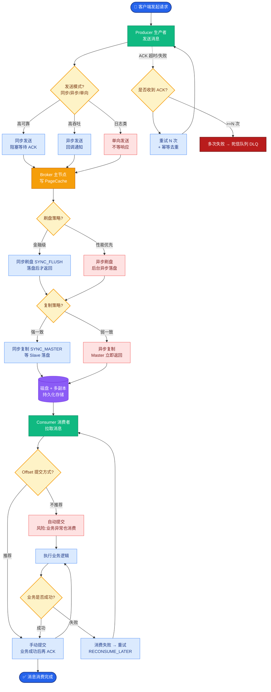

# 日志系统怎么设计的

**Situation：** AI Agent 系统的日志需求特殊：不仅要记录请求/响应，还要记录 Agent 的完整推理过程(Thought → Action → Observation 链路)。
**Task：** 设计满足调试、审计、分析多重需求的日志系统。
**Action：** 
1.  **日志分类：**
    *   **请求日志：** 每个用户请求的概要信息。
    *   **推理日志：** Agent 的完整推理链(包含 Prompt 和 LLM 输出)。
    *   **工具日志：** 工具调用的参数和返回值。
    *   **审计日志：** 安全相关的操作(登录、权限变更等)。
2.  **日志采集与架构：**
    应用层使用结构化日志（JSON 格式），包含 `trace_id`, `user_id`, `session_id`。
    通过 Fluent Bit/Logstash 作为 Sidecar 采集容器日志。
    Kafka 作为缓冲层，削峰填谷，防止日志流量冲击 ES。
3.  **日志存储策略：**
    *   **热数据(7天)：** Elasticsearch，支持全文检索，保留 3 副本。
    *   **温数据(30天)：** 索引生命周期管理 (ILM)，将数据 Rollup 后存储在对象存储 (S3/MinIO) 或降配 ES 节点。
    *   **冷数据(1年)：** 归档到低成本存储，仅保留索引元数据。
4.  **推理日志的特殊处理：**
    推理日志可能包含大量 Prompt 文本，每条可达数 KB。
    生产环境默认只记录摘要版本(去掉 Prompt 全文，仅记录 Hash 或摘要)。
    需要时可以通过动态开关（Feature Flag）对特定 `user_id` 或 `trace_id` 开启详细日志（Debug 模式）。
5.  **日志数据流转图：**
```text
[Agent Pod] ───(stdout/stderr JSON)──> [Fluent Bit DaemonSet]
                                            │
                                            ▼
                                     [Kafka Cluster] (Buffer)
                                            │
                        ┌─────────────────┴─────────────────┐
                        ▼                                   ▼
             [Logstash / Flink]                    [Logstash / Flink]
         (解析/脱敏/路由)                         (解析/脱敏/路由)
                        │                                   │
                        ▼                                   ▼
        [Elasticsearch (Hot Tier)]            [S3/MinIO (Cold Tier)]
                        │
                        ▼
                 [Grafana/Kibana]
```
6.  **隐私保护：**
    所有日志经过脱敏处理后再存储（正则匹配手机号/身份证/邮箱）。
    推理日志中用户的原始输入做 PII 脱敏。

**实战案例**：曾排查一次偶发性的 Tool 调用失败，因为全链路 TraceId 没透传到底层 SDK，导致日志断层。后来我们强制要求所有异步任务必须在 Context 中传递 trace_id，否则拒绝启动。

**代码示例**：Python 结构化日志输出与 TraceId 注入
```python
import logging
import json

class JsonFormatter(logging.Formatter):
    def format(self, record):
        log_obj = {
            "time": self.formatTime(record),
            "level": record.levelname,
        
        "trace_id": getattr(record, "trace_id", "N/A"),
            "msg": record.getMessage()
        }
        return json.dumps(log_obj)
```

**对比表格**：日志采集方案对比
| 方案 | Fluent Bit | Logstash | Filebeat |
| :--- | :--- | :--- | :--- |
| **资源消耗** | 极低 (C + Go) | 高 (Java) | 低 (Go) |
| **处理能力** | 高 (侧重采集转发) | 高 (侧重过滤解析) | 中 (侧重采集) |
| **部署方式** | Sidecar / DaemonSet | 独立集群 / DaemonSet | DaemonSet |
| **适用场景** | K8s 环境首选 | 复杂数据清洗需求 | 简单日志收集 |

**Result：** 
日志系统支撑了 100% 的问题排查需求。
日志存储成本通过分层策略降低 60%。
**日志查询延迟：** 热数据 < 1s，温数据 < 10s。


## 核心流程图



## 记忆要点

- 日志分类：请求、推理(含Prompt)、工具、审计四类，统一JSON格式带TraceId
- 存储策略：热数据7天存ES，温数据30天降配，冷数据1年归档S3，推理日志默认摘要
- 隐私保护：采集层正则脱敏PII，推理日志通过Feature Flag动态开启Debug模式


## 结构化回答

**30 秒电梯演讲：** 分层存储多维度日志，在成本与可追溯性间取得平衡。——打个比方，像档案管理，常用文件放手边，旧文件封存进仓库。

**展开框架：**
1. **日志分类** — 请求、推理(含Prompt)、工具、审计四类，统一JSON格式带TraceId
2. **存储策略** — 热数据7天存ES，温数据30天降配，冷数据1年归档S3，推理日志默认摘要
3. **隐私保护** — 采集层正则脱敏PII，推理日志通过Feature Flag动态开启Debug模式

**收尾：** 以上三点都能配合实战聊。您想深入聊哪一块？

## 视频脚本

> 预计时长：2 分钟 | 由浅入深

| 时间 | 画面/字幕 | 口播台词 | 讲解要点 |
|------|----------|----------|----------|
| 0:00 | 标题卡 | "日志系统怎么设计的，30 秒讲清楚。" | 开场钩子 |
| 0:30 | 概念定义动画 | "一句话：分层存储多维度日志，在成本与可追溯性间取得平衡。" | 核心定义 |
| 1:00 | 日志分类图解 | "请求、推理(含Prompt)、工具、审计四类，统一JSON格式带TraceId" | 日志分类 |
| 1:30 | 总结卡 | "记好这几条，面试不慌。下期见。" | 收尾 |
