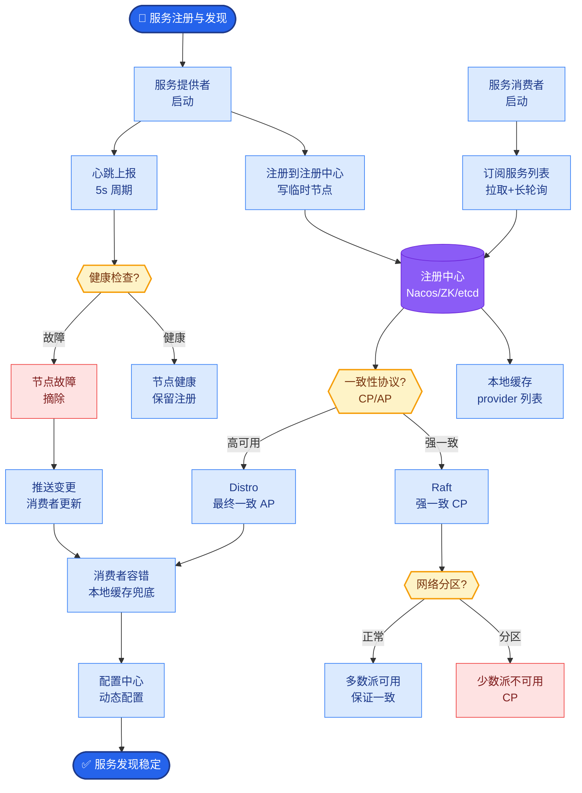
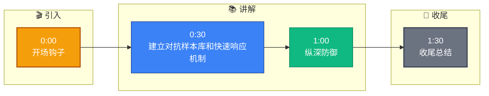

# 安全性怎么保证的?(Prompt 注入等)

**Situation：** AI Agent 系统面临的安全威胁不断演化，需要持续更新防护策略。
**Task：** 建立安全防护的持续迭代机制。
**Action：** 
1.  **安全测试常态化：**
    维护一个 Prompt 注入攻击样本库(500+ 样本)，定期更新。
    每次发版前跑安全测试，确保不引入新的漏洞。
    每季度做一次红蓝对抗(安全团队模拟攻击)。
2.  **安全防护架构（输入至输出）：**
    *   **输入层**：防火墙/WAF 拦截恶意 IP，敏感词过滤。
    *   **模型层**：
        *   **System Prompt 强化**：明确指令边界，禁止越权操作。
        *   **输入审查**：在送入 LLM 前，使用轻量级分类器检测注入攻击特征。
    *   *输出层*：对 LLM 生成的回复进行内容审查，过滤 PII 或违规内容。
3.  **安全更新流程：**
    关注 OWASP LLM Top 10 等安全指南的更新。
    监控社区报告的新型攻击模式。
    新攻击模式发现后 48 小时内更新防护规则。
4.  **安全编码规范：**
    用户输入永远不信任，必须经过清洗和校验。
    System Prompt 和用户输入严格分离(使用 OpenAI Chat 格式的 `system` 和 `user` role，避免混淆)。
    工具调用的参数必须做强类型校验和白名单验证，防止 SQL 注入或命令注入。
5.  **应急响应：**
    制定安全事件应急预案。
    发现 Prompt 注入绕过时，可以在 10 分钟内紧急上线新的拦截规则（通过配置中心如 Apollo/Nacos 热更新，无需重新发版）。
6.  **安全防御流程图：**
```text
[用户输入]
    │
    ├─> [敏感词过滤/正则匹配] ──(拦截)──> [拒绝访问]
    │
    ▼ (通过)
[输入审查模块] (轻量级模型检测 Prompt Injection)
    │
    ├─> (高风险) ──────────────────> [触发告警 & 拦截]
    │
    ▼ (低风险)
[LLM 推理] (System Prompt: "不要执行非白名单内的操作")
    │
    ▼
[输出审查] (PII 脱敏/违规内容过滤)
    │
    ▼
[返回给用户]
```

**实战案例**：曾遭遇利用“Unicode 变体欺骗”的攻击，攻击者用视觉上相似的同形字符绕过了敏感词库。我们在预处理层增加了 Unicode 标准化步骤（NFKC），统一编码后再进行匹配，成功拦截此类攻击。

**代码示例**：Pydantic 模型做参数强校验与清洗
```python
from pydantic import BaseModel, constr, validator

class ToolCallRequest(BaseModel):
    tool_name: constr(strip_whitespace=True, max_length=50)
    arguments: dict

    @validator('tool_name')
    def validate_tool_name(cls, v):
        allowed_tools = ["search_db", "read_file"]
        if v not in allowed_tools:
            raise ValueError(f"Tool '{v}' is not allowed")
        return v
```

**对比表格**：安全防御策略对比
| 防御手段 | 关键词/正则 | 神经网络分类器 | 人类审核(HITL) |
| :--- | :--- | :--- | :--- |
| **响应速度** | 毫秒级 | 毫秒级 (模型推理) | 分钟级 (依赖人工) |
| **维护成本** | 低 (需人工更新规则) | 中 (需标注数据训练) | 高 (需人力) |
| **误杀率** | 高 (死板易误伤) | 低 (语义理解强) | 极低 |
| **适用场景** | 第一道防线，明显攻击 | 复杂 Prompt 注入检测 | 高风险操作确认 |

**Result：** 
无安全事件(0 次成功的注入攻击)。
安全规则更新平均时间 < 4 小时。
通过了外部安全审计。


## 核心流程图



## 记忆要点

- 纵深防御：输入层WAF过滤，模型层分类器检测注入，输出层PII脱敏，System Prompt强约束
- 持续对抗：维护500+攻击样本库，发版前必跑，每季度红蓝对抗，新攻击48小时内更新规则
- 应急响应：配置中心热更新拦截规则，参数用Pydantic强校验，防SQL/命令注入


## 结构化回答

**30 秒电梯演讲：** 建立对抗样本库和快速响应机制，动态防御AI安全威胁。——打个比方，像打流感疫苗，病毒变异了就要及时更新疫苗库。

**展开框架：**
1. **纵深防御** — 输入层WAF过滤，模型层分类器检测注入，输出层PII脱敏，System Prompt强约束
2. **持续对抗** — 维护500+攻击样本库，发版前必跑，每季度红蓝对抗，新攻击48小时内更新规则
3. **应急响应** — 配置中心热更新拦截规则，参数用Pydantic强校验，防SQL/命令注入

**收尾：** 以上三点都能配合实战聊。您想深入聊哪一块？

## 视频脚本

> 预计时长：2 分钟 | 由浅入深

| 时间 | 画面/字幕 | 口播台词 | 讲解要点 |
|------|----------|----------|----------|
| 0:00 | 标题卡 | "安全性怎么保证的，30 秒讲清楚。" | 开场钩子 |
| 0:30 | 概念定义动画 | "一句话：建立对抗样本库和快速响应机制，动态防御AI安全威胁。" | 核心定义 |
| 1:00 | 纵深防御图解 | "输入层WAF过滤，模型层分类器检测注入，输出层PII脱敏，System Prompt强约束" | 纵深防御 |
| 1:30 | 总结卡 | "记好这几条，面试不慌。下期见。" | 收尾 |

### 视频流程图


