# 文档是怎么维护的

**Situation：** AI Agent 项目知识密集，团队成员需要快速理解系统架构、API 接口、Prompt 模板等。
**Task：** 建立完善的文档体系，降低团队协作和知识传递成本。
**Action：** 
1. **文档类型：**
*   **架构文档：** 系统架构图、模块设计文档、技术决策记录(ADR)。
*   **API 文档：** 自动生成(FastAPI 自带 Swagger)。
*   **运维手册：** 部署指南、故障排查手册、应急预案。
*   **Prompt 文档：** 所有 Prompt 模板的说明、版本历史、设计思路。
2. **文档即代码：**
文档和代码同仓库管理，随代码一起 review。
ADR(Architecture Decision Records)记录每次重要的技术决策，包含背景、决策内容、后果。
3. **自动化生成：**
API 文档：FastAPI 自动生成 OpenAPI Schema。
类型文档：从类型注解自动生成 SDK 文档（如使用 MkDocs + Material）。
监控文档：Dashboard 配置自动导出。

**文档架构图：**
```text
/docs
├── /architecture     (ADR, C4 Model 图)
├── /api              (Swagger 导出)
├── /prompts          (Prompt 版本管理 & 变量说明)
└── /runbooks         (运维 Checklist)
         │
         ▼
   CI/CD Pipeline
 (构建 & 部署站点)
```

**实战案例**：曾因核心 Prompt 模板被手动修改且未同步更新文档，导致线上排查时耗费大量时间逆向推理。后引入“文档 diff 检测”机制，如果 PR 修改了 Prompt 但未更新对应 Doc 文件，CI 会直接报错。

**代码示例**：ADR 模板
```markdown
# [标题] 例如：选择 ArgoCD 作为 GitOps 工具

## 状态
已采纳 / 已废弃 / 已替代

## 背景
我们需要一个持续交付的工具来实现自动化部署...

## 决策
使用 ArgoCD，因为它原生支持 K8s 且声明式配置...

## 后果
- 正面：部署全自动化，可视化强。
- 负面：学习成本略高，需要维护 K8s 资源清单。
```

**对比表格**：文档维护策略对比
| 策略 | Wiki (Confluence) | 文档即代码 | 自动化生成工具 |
| :--- | :--- | :--- | :--- |
| **时效性** | 低 (易过时) | 高 (随代码走) | 极高 (代码即文档) |
| **版本管理** | 弱 (无版本关联) | 强 (Git 版本控制) | 强 (通常绑定代码版本) |
| **协作体验** | 所见即所得，易上手 | 需掌握 Markdown/Git | 无需手动编写 |
| **适用内容** | 会议记录、行政文档 | 架构设计、API、ADR | API 文档、类型说明 |

**Result：** 
新成员上手时间从 2 周缩短到 3 天。
文档更新和代码提交同步率 > 80%。
ADR 积累了 30+ 份技术决策记录。


## 核心流程图

```mermaid
flowchart TD
    Start([🚀 服务端启动]):::start
    BossGroup[BossGroup<br/>Accept 线程]:::process
    WorkerGroup[WorkerGroup<br/>IO 处理线程]:::process
    Bind[绑定端口<br/>ServerSocketChannel]:::process
    EventLoop[EventLoop<br/>单线程 Selector 轮询]:::process
    Selector[(Selector<br/>多路复用器)]:::store
    IOModelQ{{IO 模型?<br/>select/poll/epoll}}:::decision
    Epoll[epoll 边缘触发<br/>事件驱动 高性能]:::process
    SelectIO[select 水平触发<br/>跨平台]:::process
    AcceptEvent[OP_ACCEPT 事件<br/>新连接到达]:::process
    Register[注册到 Worker<br/>SocketChannel]:::process
    ReadEvent[OP_READ 事件<br/>数据可读]:::process
    Pipeline[Pipeline 处理链<br/>责任链模式]:::process
    Decoder[Decoder 解码器<br/>解决粘包/半包]:::process
    Handler[业务 Handler<br/>处理业务逻辑]:::process
    Encoder[Encoder 编码器<br/>序列化响应]:::process
    ZeroCopyQ{{是否零拷贝?<br/>FileRegion}}:::decision
    ZeroCopy[sendfile/mmap<br/>减少内核态拷贝]:::process
    WriteBack[写回 Channel]:::process
    BackPressureQ{{背压?<br/>写缓冲区高水位}}:::decision
    BackPressure[isWritable=false<br/>自动降级]:::warn
    Final([✅ 响应返回客户端]):::start

    Start --> BossGroup --> Bind --> EventLoop
    EventLoop --> Selector --> IOModelQ
    IOModelQ -->|Linux| Epoll --> AcceptEvent
    IOModelQ -->|通用| SelectIO --> AcceptEvent
    AcceptEvent --> Register --> WorkerGroup
    WorkerGroup --> ReadEvent --> Pipeline
    Pipeline --> Decoder --> Handler --> Encoder
    Encoder --> ZeroCopyQ
    ZeroCopyQ -->|大文件| ZeroCopy --> WriteBack
    ZeroCopyQ -->|否| WriteBack
    WriteBack --> BackPressureQ
    BackPressureQ -->|高水位| BackPressure --> Final
    BackPressureQ -->|正常| Final

    classDef start fill:#2563eb,stroke:#1e3a8a,color:#fff,stroke-width:2px;
    classDef process fill:#dbeafe,stroke:#3b82f6,color:#1e3a8a;
    classDef decision fill:#fef3c7,stroke:#f59e0b,color:#78350f,stroke-width:2px;
    classDef store fill:#8b5cf6,stroke:#6d28d9,color:#fff;
    classDef warn fill:#fee2e2,stroke:#ef4444,color:#7f1d1d;
```



## 记忆要点

- 文档即代码：架构、Prompt、ADR文档随代码走，PR修改Prompt必须同步更新Doc
- 自动生成：FastAPI自动生成Swagger，MkDocs从类型注解生成SDK文档
- ADR机制：记录技术决策背景与后果，防止知识流失，新成员上手时间缩短至3天


## 结构化回答

**30 秒电梯演讲：** 践行文档即代码理念，实现知识沉淀与自动化同步。——打个比方，像查字典，API文档自动生成，架构变更必须留记录。

**展开框架：**
1. **文档即代码** — 架构、Prompt、ADR文档随代码走，PR修改Prompt必须同步更新Doc
2. **自动生成** — FastAPI自动生成Swagger，MkDocs从类型注解生成SDK文档
3. **ADR机制** — 记录技术决策背景与后果，防止知识流失，新成员上手时间缩短至3天

**收尾：** 以上三点都能配合实战聊。您想深入聊哪一块？

## 视频脚本

> 预计时长：2 分钟 | 由浅入深

| 时间 | 画面/字幕 | 口播台词 | 讲解要点 |
|------|----------|----------|----------|
| 0:00 | 标题卡 | "文档是怎么维护的，30 秒讲清楚。" | 开场钩子 |
| 0:30 | 概念定义动画 | "一句话：践行文档即代码理念，实现知识沉淀与自动化同步。" | 核心定义 |
| 1:00 | 文档即代码图解 | "架构、Prompt、ADR文档随代码走，PR修改Prompt必须同步更新Doc" | 文档即代码 |
| 1:30 | 总结卡 | "记好这几条，面试不慌。下期见。" | 收尾 |
