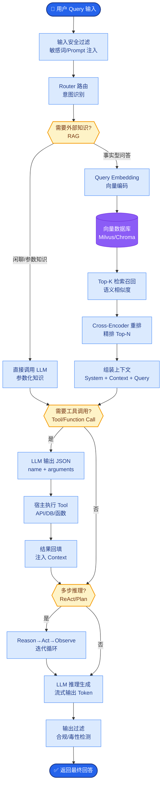

# 怎么做的版本管理和发布管理

**Situation：** 系统有多个组件(API、Worker、MCP Server 等)，需要协调版本发布。
**Task：** 建立清晰的版本管理和发布策略。
**Action：** 
1. **版本命名规范：**
**语义化版本号：** MAJOR.MINOR.PATCH
*   **MAJOR：** 不兼容的 API 变更
*   **MINOR：** 新功能(向后兼容)
*   **PATCH：** Bug 修复
2. **分支策略：**
*   main：生产分支，始终可发布，受保护（禁止直接 push）。
*   develop：开发分支，集成最新功能。
*   feature/*：功能分支，完成后合入 develop。
*   hotfix/*：紧急修复，直接合入 main 并同步回 develop。
3. **发布流程：**
release 分支创建 → 预发布环境验证 → 修复 bug → 合入 main → 打 tag (v1.2.3) → 部署 → 同步回 develop。
4. **变更日志：**
每次发版自动从 commit message 生成 changelog。
**分类：** Features、Bug Fixes、Performance、Breaking Changes。

**分支流转图：**
```text
      feature/*         hotfix/*
         │                 │
         ▼                 ▼
┌─────────────┐    ┌──────────────┐
│   develop   │◄───│     main     │
└──────┬──────┘    └──────┬───────┘
       │                  │
       │ release          │ Tag
       ▼                  ▼
  Release Branch   ┌──────────┐
 (Testing/Bugfix)  │ Deploy  │
                   └──────────┘
```

**实战案例：** 
某次紧急 Hotfix 修复线上 Bug，由于未严格遵守“同步回 develop”流程，导致下一周发版时 Bug 重新上线。引入“自动化合并不冲突分支”的 Bot 规则后，杜绝了此类人工失误。

**代码示例：** 
```yaml
# .gitlab-ci.yml (Version Check Example)
version_check:
  script:
    # 检查 tag 是否符合 SemVer，且 main 分支构建号递增
    - ./scripts/validate_version.sh $CI_COMMIT_TAG
  only:
    - tags
```


## 核心流程图



## 记忆要点

- 分支策略：Main生产、Develop开发、Feature功能、Hotfix紧急修复，GitLab Flow模式
- 版本规范：语义化版本(Major.MinOR.Patch)，自动从Commit生成Changelog
- 发布流程：Release分支预发验证->打Tag部署->自动同步回Develop，防Bug回滚遗漏


## 结构化回答

**30 秒电梯演讲：** 采用语义化版本与Git分支策略，规范化发布流程。——打个比方，像写书改版，大修换封面(Major)，小修改页码。

**展开框架：**
1. **分支策略** — Main生产、Develop开发、Feature功能、Hotfix紧急修复，GitLab Flow模式
2. **版本规范** — 语义化版本(Major.MinOR.Patch)，自动从Commit生成Changelog
3. **发布流程** — Release分支预发验证->打Tag部署->自动同步回Develop，防Bug回滚遗漏

**收尾：** 以上三点都能配合实战聊。您想深入聊哪一块？

## 视频脚本

> 预计时长：2 分钟 | 由浅入深

| 时间 | 画面/字幕 | 口播台词 | 讲解要点 |
|------|----------|----------|----------|
| 0:00 | 标题卡 | "怎么做的版本管理和发布管理，30 秒讲清楚。" | 开场钩子 |
| 0:30 | 概念定义动画 | "一句话：采用语义化版本与Git分支策略，规范化发布流程。" | 核心定义 |
| 1:00 | 分支策略图解 | "Main生产、Develop开发、Feature功能、Hotfix紧急修复，GitLab Flow模式" | 分支策略 |
| 1:30 | 总结卡 | "记好这几条，面试不慌。下期见。" | 收尾 |
