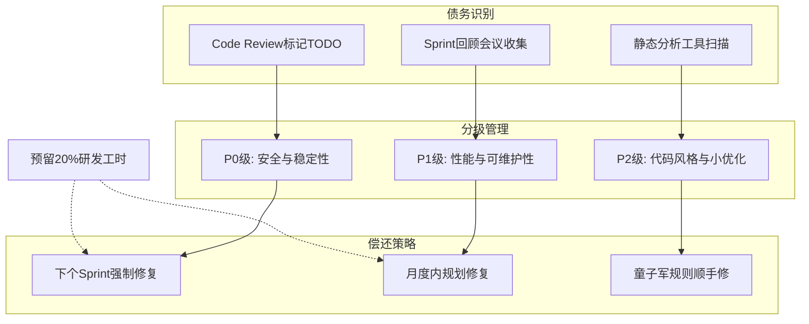

# 怎么做技术债务管理

**Situation：** 快速迭代中不可避免地产生技术债务：临时方案、代码坏味道、过时的依赖等。
**Task：** 建立技术债务的识别、记录和偿还机制。
**Action：** 
1. **技术债务识别：**
Code Review 中标记技术 debt (TODO: tech-debt 注释，关联 Issue ID)。
每次 Sprint 回顾时收集技术债务。
静态分析工具自动检测代码坏味道（如长函数、重复代码）。
2. **分级管理：**
*   **P0(紧急)：** 影响稳定性或安全性 → 下个 Sprint 必须解决。
*   **P1(重要)：** 影响可维护性或性能 → 1 个月内解决。
*   **P2(一般)：** 代码风格、小优化 → 机会主义偿还。
3. **偿还策略：**
每个 Sprint 预留 20% 的工时用于偿还技术债务。
大型重构制定专项计划。
“童子军规则”：离开营地时比你进去时更干净（碰到的小债务随手修）。

**实战案例：** 
曾因忽略过期的 JSON 序列化库依赖，导致处理特殊 Unicode 字符时 CPU 飙升 100%。引入 Dependabot 自动检测依赖漏洞后，将此类风险转化为常规 Ticket 修复。

**代码示例：** 
```javascript
// 示例：在代码中显式标记技术债，并关联 Issue
function legacyDataProcess(data) {
  // TODO: tech-debt (Issue #402)
  // 现有逻辑 O(n^2) 导致数据量大时超时，需重构为 Hash Map 查找。
  // 临时方案：限制入参 data 长度 < 1000
  if (data.length > 1000) throw new Error('Limit exceeded');
  return data.filter(...);
}
```

## 技术原理

技术债务管理的核心是**把隐性的"欠债"显性化、量化、计划化**，避免债务无序累积最终引发"利息爆炸"（系统腐化、迭代停滞）：

- **债务的分类与成因**：
  - **设计债务**：架构决策妥协（如单体没拆服务、绕过抽象层直连数据库）。
  - **代码债务**：坏味道（长函数、重复代码、上帝类）、缺少测试、魔法数字。
  - **依赖债务**：过期的三方库（安全漏洞、不兼容新版本）。
  - **文档债务**：代码与文档不一致、关键逻辑无注释。
- **债务的"利息"模型**：债务越多，每次改动的维护成本越高（改动要理解更多历史妥协、绕开更多坑）。当债务累积到"利息"超过新功能开发成本时，迭代停滞——这是技术债务必须主动管理的根本原因。
- **童子军规则的原理**：源自"离开营地时比进去时更干净"。每次改动代码时，顺手修掉一个小债务（重命名、补测试、抽方法）。这种**持续小步偿还**比"攒到崩盘再大重构"成本低得多——大重构风险高、周期长、易引入新 bug。
- **20% 工时预留的依据**：经验数据表明，技术债务的"自然产生速率"约为开发工时的 15~20%（每次迭代都会产生新的妥协）。预留 20% 偿还工时能让债务"收支平衡"，低于这个比例债务会持续累积。

## 代码示例

技术债务的显性化管理（标记 + 追踪 + 自动检测）：

```java
// 1. 在代码中显式标记技术债，关联 Issue 便于追踪
public class LegacyOrderProcessor {
    /**
     * @deprecated 临时方案，存在 O(n^2) 性能问题
     * @tech-debt Issue #402 P1 性能
     * @refactor 计划在 Q3 重构为 Hash Map 查找，预计提速 100x
     */
    public List<Order> findRelatedOrders(List<Order> all, Order target) {
        // TODO: tech-debt(#402) 现用双重循环 O(n^2)，数据量大时超时
        List<Order> result = new ArrayList<>();
        for (Order o1 : all) {
            for (Order o2 : all) {           // 嵌套循环，性能瓶颈
                if (o1.getUserId().equals(target.getUserId())
                    && o2.getParentId().equals(o1.getId())) {
                    result.add(o2);
                }
            }
        }
        return result;
    }

    // 重构后的目标实现（Hash Map 查找 O(n)）
    public List<Order> findRelatedOrdersRefactored(List<Order> all, Order target) {
        Map<Long, Order> byId = all.stream()
            .collect(Collectors.toMap(Order::getId, o -> o));
        Map<Long, List<Order>> byParent = all.stream()
            .collect(Collectors.groupingBy(Order::getParentId));
        return all.stream()
            .filter(o -> o.getUserId().equals(target.getUserId()))
            .flatMap(o -> byParent.getOrDefault(o.getId(), List.of()).stream())
            .collect(Collectors.toList());
    }
}
```

```yaml
# 2. 自动检测工具配置
# SonarQube：静态分析代码坏味道，设置质量门禁
sonar:
  qualitygate:
    - coverage > 80%           # 测试覆盖率
    - duplication < 3%         # 重复代码率
    - technical_debt_ratio < 5% # 技术债务比率

# Dependabot（GitHub）：自动检测依赖漏洞，转 PR/Ticket
# .github/dependabot.yml
version: 2
updates:
  - package-ecosystem: "maven"
    directory: "/"
    schedule:
      interval: "weekly"        # 每周扫描依赖漏洞
    labels: ["P0", "security", "tech-debt"]
```

```python
# 3. 技术债务看板（统计 TODO/tech-debt 标记，生成偿还优先级）
import subprocess, re
from collections import defaultdict

def scan_tech_debt(repo_path):
    """扫描代码库里的 tech-debt 标记，按优先级汇总"""
    result = subprocess.run(
        ["grep", "-rn", "--include=*.java", "-E", "TODO.*tech-debt|@tech-debt", repo_path],
        capture_output=True, text=True
    )
    debts = defaultdict(list)
    for line in result.stdout.strip().split('\n'):
        m = re.search(r'tech-debt\(.*?#(\d+)\s*(P\d)', line)
        if m:
            issue_id, priority = m.groups()
            debts[priority].append({"issue": issue_id, "file": line.split(':')[0]})
    return debts
# 输出：{'P0': [...], 'P1': [...], 'P2': [...]} 按优先级排偿还顺序
```

## 注意事项

- **债务要分级偿还，别一刀切**：P0（安全/稳定性）立即修，P1（性能/可维护性）月内修，P2（风格/小优化）机会主义修。把所有债务都当 P0 会让团队疲于奔命，都不修会让债务失控。
- **大重构要专项立项**：跨模块的大型重构（如单体拆微服务）不能靠"随手修"，要单独立项、制定迁移计划、分阶段灰度，否则风险极高。
- **童子军规则要避免过度**：顺手修小债是好的，但别在一次 PR 里混入大量"顺手改动"——会让 Code Review 难以聚焦、回滚困难。小改动可以，大改动单独开 PR。
- **依赖债务最易被忽视也最危险**：过期依赖的安全漏洞往往是线上事故的直接原因（如 Log4Shell）。用 Dependabot/Renovate 自动扫描，把依赖升级纳入常规流程。

## 流程图



## 记忆要点

- 识别：Code Review 标记 TODO、Sprint 回顾收集、静态工具自动检测。
- 分级：P0 影响安全立即修，P1 影响性能一月内，P2 代码风格机会修。
- 偿还：每 Sprint 预留 20% 工时，大型重构专项计划，童子军规则随手修。
- 实战：依赖过期导致 CPU 飙升，用 Dependabot 自动检测漏洞转 Ticket。


## 结构化回答

**30 秒电梯演讲：** 显性化管理技术债务，预留资源持续偿还以维持系统健康。——打个比方，像做家务，平时随手清理(童子军规则)，定期大扫除。

**展开框架：**
1. **识别** — Code Review 标记 TODO、Sprint 回顾收集、静态工具自动检测。
2. **分级** — P0 影响安全立即修，P1 影响性能一月内，P2 代码风格机会修。
3. **偿还** — 每 Sprint 预留 20% 工时，大型重构专项计划，童子军规则随手修。

**收尾：** 以上三点都能配合实战聊。您想深入聊哪一块？

## 视频脚本

> 预计时长：2 分钟 | 由浅入深

| 时间 | 画面/字幕 | 口播台词 | 讲解要点 |
|------|----------|----------|----------|
| 0:00 | 标题卡 | "怎么做技术债务管理，30 秒讲清楚。" | 开场钩子 |
| 0:30 | 概念定义动画 | "一句话：显性化管理技术债务，预留资源持续偿还以维持系统健康。" | 核心定义 |
| 1:00 | 识别图解 | "Code Review 标记 TODO、Sprint 回顾收集、静态工具自动检测。" | 识别 |
| 1:30 | 总结卡 | "记好这几条，面试不慌。下期见。" | 收尾 |
