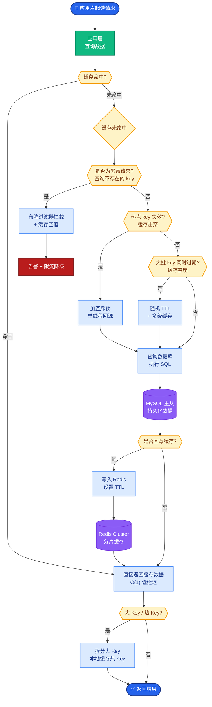

# 怎么做的配置管理

**Situation：** 系统有大量配置项(模型参数、检索参数、限流阈值、Prompt 模板等),需要灵活管理且支持热更新.
**Task：** 建立统一的配置管理方案.
**Action：** 
1. **配置分层:**
**静态配置(代码仓库):** 不常变更的配置(数据库连接参数、服务端口),随版本发布。
**动态配置(配置中心):** 需要热更新的配置(Prompt 模板、模型参数、Feature Flag)。
**敏感配置:** API Key、数据库密码等,不存普通配置中心，使用 Vault 或 K8s Secret，应用启动时注入。
2. **配置中心方案:**
使用 Nacos / Apollo 作为配置中心。
配置变更实时推送到应用(watch 机制/长轮询)。
配置变更有审计日志,记录谁、在什么时间、改了什么，支持一键回滚。
3. **环境管理:**
不同环境使用不同的配置集。
生产环境配置变更需要审批流程（双人复核）。
灰度发布能力：针对特定用户或百分比流量开启新配置。

**配置管理架构图：**
```text
┌─────────────┐      ┌──────────────┐      ┌──────────────┐
│   Dev/Ops   │─────>│ Config Center│─────>│   App Node   │
│  (Dashboard)│ Push │ (Nacos/Apollo)│ Watch │ (Local Cache)│
└─────────────┘      └──────────────┘      └──────┬───────┘
                                                   │
                                            Reload  │
                                            (No Restart)
```

**实战案例：** 
某次误操作将 LLM 的 `temperature` 参数从 0.7 配置成 100，导致生成内容乱码。通过配置中心的 Schema 校验（设置 max: 2.0）拦截了发布请求，避免了生产事故。

**代码示例：** 
```python
from pydantic import BaseModel, validator

class PromptConfig(BaseModel):
    template: str
    temperature: float

    @validator('temperature')
    def validate_temp(cls, v):
        if not 0 <= v <= 2.0:
            raise ValueError('Temperature must be between 0 and 2.0')
        return v

# 配置变更时的回调
def on_config_change(new_config):
    PromptConfig(**new_config) # 强校验，失败则不更新本地缓存
```


## 核心流程图



## 记忆要点

- 分层：静态配置随代码，动态配置热更新，敏感配置用 Vault 注入。
- 中心：Nacos/Apollo 实时推送，Watch 机制，支持审计日志与一键回滚。
- 管控：生产变更需双人复核，支持灰度发布，Schema 校验防误操作。
- 案例：温度参数误设为 100，通过 Schema 校验拦截，避免生成乱码事故。


## 结构化回答

**30 秒电梯演讲：** 将代码外置并分类管理，实现灵活控制与安全隔离。——打个比方，像开关控制灯一样，不用拆墙（改代码重发布）就能调节灯光（调整参数），钥匙（密码）单独藏好。

**展开框架：**
1. **分层** — 静态配置随代码，动态配置热更新，敏感配置用 Vault 注入。
2. **中心** — Nacos/Apollo 实时推送，Watch 机制，支持审计日志与一键回滚。
3. **管控** — 生产变更需双人复核，支持灰度发布，Schema 校验防误操作。

**收尾：** 以上三点都能配合实战聊。您想深入聊哪一块？

## 视频脚本

> 预计时长：2 分钟 | 由浅入深

| 时间 | 画面/字幕 | 口播台词 | 讲解要点 |
|------|----------|----------|----------|
| 0:00 | 标题卡 | "怎么做的配置管理，30 秒讲清楚。" | 开场钩子 |
| 0:30 | 概念定义动画 | "一句话：将代码外置并分类管理，实现灵活控制与安全隔离。" | 核心定义 |
| 1:00 | 分层图解 | "静态配置随代码，动态配置热更新，敏感配置用 Vault 注入。" | 分层 |
| 1:30 | 总结卡 | "记好这几条，面试不慌。下期见。" | 收尾 |
