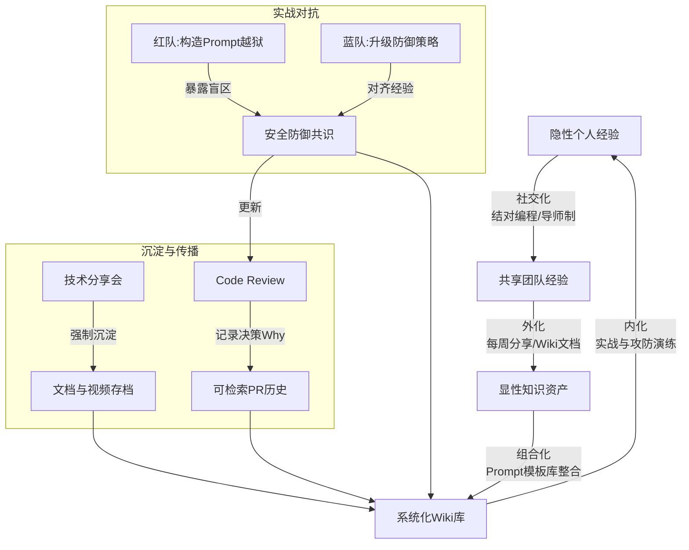

# 团队协作和知识共享是怎么做的

**Situation：** AI Agent 项目技术栈广(NLP、后端、DevOps、前端),团队成员技能背景各异,需要高效的知识共享.
**Task：** 建立团队协作和知识共享机制.
**Action：** 
1. **技术分享:**
每周一次技术分享(30 分钟),轮流主讲。
**主题涵盖：** 新技术调研、踩坑经验、最佳实践。
分享内容强制要求沉淀为文档或视频存档。
2. **结对编程:**
复杂功能开发采用结对编程(尤其是 Prompt 设计和安全模块)。
新成员 On-boarding 时与导师结对，通过实战传授隐式知识。
3. **知识库建设:**
内部 Wiki 记录所有技术决策、排障经验、操作手册。
FAQ 频繁更新,降低重复沟通成本。
使用"每日站会"同步进度，识别阻塞点。
4. **Code Review 文化:**
Review 不仅检查代码质量,也是知识传递的过程。
鼓励详细的 Review 评论,解释"为什么"而不只是"是什么"。

**实战案例：** 
Prompt Engineering 门槛高且经验难以复用。我们建立了内部的“Prompt 模板库”和“Bad Case 合集”，通过每两周一次的“攻防演练”（全员尝试Prompt越狱），将安全防御经验快速对齐。

**对比表格：**
| 共享方式 | 适用场景 | 优缺点对比 |
| :--- | :--- | :--- |
| **Wiki 文档** | 架构设计、API文档、On-boarding | **优**：检索方便，版本可追溯<br>**缺**：维护成本高，易过时 |
| **Code Review** | 代码规范、逻辑细节 | **优**：上下文强相关，实战教学<br>**缺**：沟通异步，仅覆盖代码层面 |
| **技术分享** | 新技术引进、项目复盘 | **优**：互动性强，利于激发讨论<br>**缺**：耗时，听众可能缺乏共鸣 |
| **结对编程** | 核心攻坚、新人培训 | **优**：效率极高，知识传递最直接<br>**缺**：人力成本高，无法全员覆盖 |

## 技术原理

知识共享的核心问题是**隐性知识（tacit knowledge）难以传递**——能写进文档的显性知识（API、架构）容易共享，但"为什么这么设计""踩过什么坑""如何调试"这类隐性知识只存在于个人脑中。机制化流程的作用是把隐性知识显性化、固化：

- **SECI 知识转化模型**（野中郁次郎）：知识在四个状态间转化——Socialization（社交化，隐性→隐性，通过师徒结对传递）、Externalization（外化，隐性→显性，通过分享会+文档沉淀）、Combination（组合化，显性→显性，Wiki 整合）、Internalization（内化，显性→隐性，通过实践学习）。完整的知识共享要覆盖四个状态。
- **结对编程的知识传递原理**：两人在同一屏幕前讨论"为什么这么写"，传递的是隐性知识（设计直觉、调试经验）。比读文档高效得多，因为上下文实时同步、可追问。新人 onboarding 用结对能让其在 1~2 周内掌握团队隐式规范。
- **Code Review 作为知识载体的原理**：Review 评论里解释"为什么"而非"是什么"，传递的是设计决策的 rationale。这种讨论留存在 PR 里，成为可检索的历史知识库——新人读历史 PR 就能学到团队的设计哲学。
- **攻防演练的原理**：针对安全相关领域（Prompt 防御），定期组织全员对抗演练——一部分人构造攻击，另一部分人防御。这种"红队/蓝队"模式能快速暴露认知盲区，把个人踩过的坑变成团队共识。

## 代码示例

知识共享机制的工程化落地（以 Prompt 模板库和 Bad Case 管理为例）：

```python
# Prompt 模板库：把团队经验固化为可复用的资产
class PromptTemplateLibrary:
    """管理团队沉淀的 Prompt 模板，支持版本化和效果评分"""
    def __init__(self, store):
        self.store = store   # Git/Wiki/向量库

    def add_template(self, name: str, template: str, author: str,
                     use_case: str, metrics: dict):
        """新增模板，附带使用场景和效果指标"""
        record = {
            "name": name,
            "template": template,
            "author": author,
            "use_case": use_case,
            "metrics": metrics,        # 如 {"accuracy": 0.92, "latency_ms": 800}
            "version": 1,
            "created_at": datetime.now(),
        }
        self.store.save(record)

    def search_by_intent(self, intent: str) -> list:
        """按意图检索最佳模板（向量相似度）"""
        return self.store.vector_search(intent, top_k=5)

# Bad Case 合集：记录失败案例，避免重复踩坑
class BadCaseCollection:
    """收集线上 Bad Case，分类归档供团队学习"""
    def __init__(self):
        self.cases = []

    def report(self, input_text: str, bad_output: str,
               root_cause: str, category: str, fix: str):
        """记录一个 Bad Case（含根因分析和修复方案）"""
        self.cases.append({
            "input": input_text,
            "bad_output": bad_output,
            "root_cause": root_cause,     # 如"Few-shot 示例含过时 API"
            "category": category,          # 如"prompt_injection", "hallucination"
            "fix": fix,                    # 修复方案
            "reporter": current_user(),
        })

    def export_for_training(self):
        """导出为训练数据（用 DPO 把 Bad Case 变成负样本）"""
        return [{"chosen": c["fix"], "rejected": c["bad_output"]} for c in self.cases]
```

```markdown
<!-- 技术决策记录（ADR）模板：固化团队的设计 rationale -->
# ADR-007: 选择 Milvus 而非 Pinecone 作为向量库

## 状态：已采纳（2024-03-15）
## 背景
RAG 系统需要向量库，候选有 Milvus（开源自建）和 Pinecone（SaaS）。

## 决策
选择 Milvus。理由：
1. 数据合规：私有数据不能出境，SaaS 不满足。
2. 成本：百万级向量 Milvus 自建成本仅为 Pinecone 的 1/5。
3. 可控性：支持自定义索引参数和分片策略。

## 后果
- 增加运维成本（需部署 3 节点集群）。
- 获得 HNSW/IVF/DiskANN 全套索引能力。
```

## 注意事项

- **文档易过时是最大痛点**：Wiki 文档写完没人更新，3 个月后与代码脱节。解决：文档和代码同 PR 提交（如 ADR 存代码仓库），CI 检查 API 变更是否更新了文档。
- **分享会要有"强制沉淀"机制**：光讲不存档等于没分享。要求每次分享必须产出文档或视频存档，且纳入 Wiki 检索库。
- **Code Review 评论要解释"为什么"**：只说"改成这样"的 Review 没传递知识。要求评论解释 rationale，让 Review 成为团队的设计哲学教学场。
- **别忽视隐性知识**：能写进文档的是显性知识，但调试经验、设计直觉这类隐性知识靠文档传递效率低。结对编程、结对调试是传递隐性知识最有效的手段。

## 流程图



## 核心知识点图


## 记忆要点

- 分享：每周轮流技术分享，强制沉淀文档，覆盖踩坑与最佳实践。
- 协作：复杂功能结对编程，新人 Onboarding 导师制，Code Review 传递知识。
- 沉淀：Wiki 记录决策与排障，建立 Prompt 模板库与 Bad Case 合集。
- 机制：每日站会同步进度，定期攻防演练对齐安全防御经验。


## 结构化回答

**30 秒电梯演讲：** 通过机制化流程将个人经验转化为团队资产。——打个比方，像拼图游戏，大家把各自手里的碎片拿出来拼好，才能看到完整的图画。

**展开框架：**
1. **分享** — 每周轮流技术分享，强制沉淀文档，覆盖踩坑与最佳实践。
2. **协作** — 复杂功能结对编程，新人 Onboarding 导师制，Code Review 传递知识。
3. **沉淀** — Wiki 记录决策与排障，建立 Prompt 模板库与 Bad Case 合集。

**收尾：** 以上三点都能配合实战聊。您想深入聊哪一块？

## 视频脚本

> 预计时长：2 分钟 | 由浅入深

| 时间 | 画面/字幕 | 口播台词 | 讲解要点 |
|------|----------|----------|----------|
| 0:00 | 标题卡 | "团队协作和知识共享是怎么做的，30 秒讲清楚。" | 开场钩子 |
| 0:30 | 概念定义动画 | "一句话：通过机制化流程将个人经验转化为团队资产。" | 核心定义 |
| 1:00 | 分享图解 | "每周轮流技术分享，强制沉淀文档，覆盖踩坑与最佳实践。" | 分享 |
| 1:30 | 总结卡 | "记好这几条，面试不慌。下期见。" | 收尾 |
