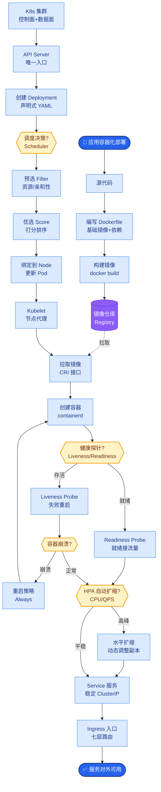

# 你觉得 AI Agent 在企业中的价值是什么

**Situation：** 面试官考察对 AI Agent 商业价值的理解深度.
**Task：** 从业务视角阐述 AI Agent 的核心价值.
**Action：** 
1. 短期价值(降本增效):
**重复性工作自动化：** 客服、数据查询、报告生成等.
**量化收益：** 节省人力 = AI处理量 × 人工单次成本.
典型 ROI:6 个月回本.
2. 中期价值(能力增强):
**知识民主化：** 让每个员工都能"查到"和"用到"企业积累的知识.
**决策辅助：** 基于数据和知识,为业务决策提供建议.
**服务标准化：** 确保服务质量的一致性.
3. 长期价值(业务创新):
**智能工作流：** AI Agent 作为工作流中的智能节点,打通信息孤岛,实现流程自动化.
**个性化服务：** 基于用户画像提供定制化的服务和推荐.
**自我进化：** 从数据和反馈中持续学习和优化.
4. 关键成功因素:
不是为了用 AI 而用 AI,必须解决真实的业务痛点.
**人机协作而非完全替代：** AI 处理简单重复,人处理复杂创意.
持续投入评估和优化,AI 系统不是一次性项目.
**Result：** 这个理解帮助团队始终围绕业务价值做技术决策,避免了"技术炫技"的陷阱.

### 价值演进模型
```text
┌──────────────┐
│  Level 3     │  价值：业务重塑与创新
│  智能体网络  │  关键：多 Agent 协作，自主决策
└──────▲───────┘
│
┌──────┴───────┐
│  Level 2     │  价值：知识增强与决策支持 (Copilot)
│  知识助手    │  关键：RAG，私有知识库，解释性
└──────▲───────┘
│
┌──────┴───────┐
│  Level 1     │  价值：降本增效 (Automation)
│  任务自动化  │  关键：脚本替代，API编排
└──────────────┘
```

**实战案例：** 我们曾尝试用 Agent 自动化生成周报，但员工认为“没人味”且容易泄露细节。后来调整为“人机协作模式”：Agent 仅负责抓取数据和拉取框架，由员工负责润色和定稿。这种“Copilot”模式既提升了效率，又保留了人的主观能动性，落地阻力反而最小。

**Copilot vs Autopilot 选型对比：**
| 维度 | Copilot (副驾驶) | Autopilot (自动驾驶) |
| :--- | :--- | :--- |
| **核心模式** | 人主导，AI 辅助生成 | AI 主导，人审核/兜底 |
| **容错率** | 高 (人有最终决定权) | 低 (依赖 AI 准确性) |
| **适用场景** | 创意写作、复杂决策、代码辅助 | 标准化报表、数据录入、简单问答 |
| **风险边界** | 内容质量风险 | 业务中断/合规风险 |

**Result：** 
技术路线图已获得管理层认可.
短期目标有 80% 在按计划推进.
路线图每季度 review 和调整.

## 常见考点
1. **Copilot vs Autopilot**：在什么场景下应该只做辅助，什么场景下可以做全自动？风险边界在哪里？
2. **落地阻力**：除了技术问题，AI Agent 落地通常面临的最大非技术阻力是什么（如员工抵触、流程僵化）？
3. **价值量化**：对于“知识民主化”这种难以直接量化的价值，通常用什么间接指标（如搜索次数、人均产出）来衡量？
4. **成本陷阱**：如果 AI 处理的成本比人工还高（例如复杂任务需要多次 GPT-4 调用），如何权衡投入产出比？


## 核心流程图



## 记忆要点

- 短期：降本增效，自动化重复工作，ROI 6 个月回本。
- 中期：知识民主化，决策辅助，服务标准化，Copilot 模式增强能力。
- 长期：智能工作流打通孤岛，个性化服务，自我进化。
- 选型：简单任务用 Autopilot，复杂决策用 Copilot，人机协作而非替代。


## 结构化回答

**30 秒电梯演讲：** 不仅是提效工具，更是重构业务流程与决策方式的引擎。——打个比方，像蒸汽机之于体力劳动，AI 是脑力劳动的放大器与倍增器。

**展开框架：**
1. **短期** — 降本增效，自动化重复工作，ROI 6 个月回本。
2. **中期** — 知识民主化，决策辅助，服务标准化，Copilot 模式增强能力。
3. **长期** — 智能工作流打通孤岛，个性化服务，自我进化。

**收尾：** 以上三点都能配合实战聊。您想深入聊哪一块？

## 视频脚本

> 预计时长：2 分钟 | 由浅入深

| 时间 | 画面/字幕 | 口播台词 | 讲解要点 |
|------|----------|----------|----------|
| 0:00 | 标题卡 | "你觉得 AI Agent 在企业中的价值是什么，30 秒讲清楚。" | 开场钩子 |
| 0:30 | 概念定义动画 | "一句话：不仅是提效工具，更是重构业务流程与决策方式的引擎。" | 核心定义 |
| 1:00 | 短期图解 | "降本增效，自动化重复工作，ROI 6 个月回本。" | 短期 |
| 1:30 | 总结卡 | "记好这几条，面试不慌。下期见。" | 收尾 |
