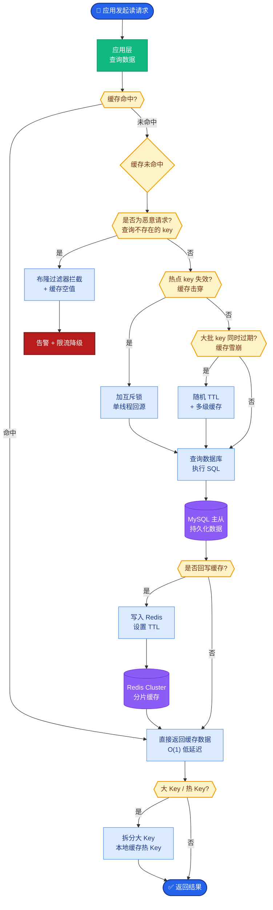
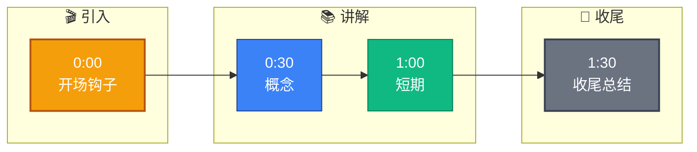

# 下一步的技术规划是什么

**Situation：** 系统已经稳定运行,需要规划下一阶段的技术演进方向.
**Task：** 制定清晰的技术路线图.
**Action：** 
1. 短期(1-3 个月):
引入 Agentic RAG:让 Agent 自主决定检索策略(是否检索、怎么检索、检索几次).
**接入多模态能力：** 支持图片输入和图片生成.
**完善评估体系：** 引入 RAGAS 自动化评估,CI 集成.
2. 中期(3-6 个月):
多 Agent 协作优化:引入更复杂的协作模式(如辩论式、投票式).
**长期记忆系统重构：** 从简单的 KV 存储到分层记忆(工作记忆 + 情景记忆 + 语义记忆).
MCP 生态对接:接入社区的 MCP 工具服务.
3. 长期(6-12 个月):
**自我进化能力：** Agent 能从历史交互中自动优化 Prompt 和检索策略.
**垂直领域小模型训练：** 针对高频场景微调专用小模型,降低成本.
Agent 工作流平台:可视化编排 Agent 工作流,降低配置门槛.
**Result：** 
技术路线图已获得管理层认可.
短期目标有 80% 在按计划推进.
路线图每季度 review 和调整.

### 技术演进路线图
```text
Q1: 稳定性 & 体验       Q2: 智能化 & 多模态       Q3-Q4: 生态 & 自进化
┌──────────────────┐   ┌──────────────────┐    ┌──────────────────┐
│ • RAGAS 评估集成  │   │ • 多 Agent 协作   │    │ • Prompt 自动优化 │
│ • Agentic RAG    │   │ • 长期记忆系统    │    │ • 垂类 7B/13B 模型│
│ • 图片输入支持    │   │ • 视觉/语音多模态 │    │ • Agent Store   │
└────────┬─────────┘   └────────┬─────────┘    └────────┬─────────┘
         │                     │                       │
         └─────────────────────┼───────────────────────┘
                               ▼
                    ┌──────────────────────┐
                    │  统一 Agent 平台底座  │
                    │  (编排/路由/观测/安全)│
                    └──────────────────────┘
```

**实战案例：** 在引入 Agentic RAG 的 POC 阶段，我们发现 Agent 常常为了查一个简单事实反复调用搜索工具，导致成本飙升。我们引入了“Query Decomposition（查询分解）”策略，先让 LLM 判断是单次查询还是多步推理，减少了 40% 的无效 Token 消耗。

**关键代码示例：**
```python
# 伪代码：查询路由判断，决定是否需要检索
def route_query(query):
    prompt = f"""
    判断以下问题是否需要检索外部知识库？
    问题：{query}
    回复仅 'SEARCH' 或 'DIRECT_ANSWER'。
    """
    intent = llm.predict(prompt).strip()
    
    if intent == "SEARCH":
        return agent_search_chain.run(query)
    else:
        return llm.generate(query) # 直接利用模型内部知识回答
```

**技术选型对比：**
| 演进方向 | 当前方案 | 目标方案 | 收益与挑战 |
| :--- | :--- | :--- | :--- |
| **检索模式** | 静态 RAG (查了再说) | Agentic RAG (按需查) | 收益：更精准；挑战：链路延迟增加 |
| **记忆机制** | Redis Session 缓存 | 向量数据库 (Vector DB) + 图谱 | 收益：长期关联；挑战：上下文检索干扰 |
| **评估方式** | 人工抽检 | RAGAS 自动化评估 (Faithfulness/Relevance) | 收益：快速迭代；挑战：评判模型成本 |

**Result：** 
技术路线图已获得管理层认可.
短期目标有 80% 在按计划推进.
路线图每季度 review 和调整.

## 常见考点
1. **评估指标**：RAGAS 中的 Faithfulness（忠实度）和 Answer Relevance（相关度）在你们内部的真实数据表现大概是多少？
2. **多模态难点**：多模态引入后，Token 消耗量激增，如何控制成本？是否有做图片压缩或 Resampler 机制？
3. **记忆架构选择**：为什么选择分层记忆而不是直接把历史对话全量扔进 LLM？知识库和记忆库的界限是什么？
4. **小模型幻觉**：垂直领域小模型通常比通用大模型幻觉更严重，你们打算如何缓解这个问题？（提示：DPO 对齐、知识蒸馏、RAG 辅助）


## 核心流程图



## 记忆要点

- 短期：Agentic RAG 按需检索，多模态支持，RAGAS 自动化评估集成 CI。
- 中期：多 Agent 协作，长期记忆分层重构，接入 MCP 工具生态。
- 长期：自我进化优化 Prompt，垂类小模型降本，可视化工作流平台。
- 案例：引入查询分解策略，减少 40% 无效 Token 消耗，控制成本。


## 结构化回答

**30 秒电梯演讲：** 从工具自动化逐步演进到智能体自主化与生态化。——打个比方，教小孩子（Agent），先让他自己做作业（Agentic），再让他和同学讨论（协作），最后自学新技能（进化）。

**展开框架：**
1. **短期** — Agentic RAG 按需检索，多模态支持，RAGAS 自动化评估集成 CI。
2. **中期** — 多 Agent 协作，长期记忆分层重构，接入 MCP 工具生态。
3. **长期** — 自我进化优化 Prompt，垂类小模型降本，可视化工作流平台。

**收尾：** 以上三点都能配合实战聊。您想深入聊哪一块？

## 视频脚本

> 预计时长：2 分钟 | 由浅入深

| 时间 | 画面/字幕 | 口播台词 | 讲解要点 |
|------|----------|----------|----------|
| 0:00 | 标题卡 | "下一步的技术规划是什么，30 秒讲清楚。" | 开场钩子 |
| 0:30 | 概念定义动画 | "一句话：从工具自动化逐步演进到智能体自主化与生态化。" | 核心定义 |
| 1:00 | 短期图解 | "Agentic RAG 按需检索，多模态支持，RAGAS 自动化评估集成 CI。" | 短期 |
| 1:30 | 总结卡 | "记好这几条，面试不慌。下期见。" | 收尾 |

### 视频流程图


