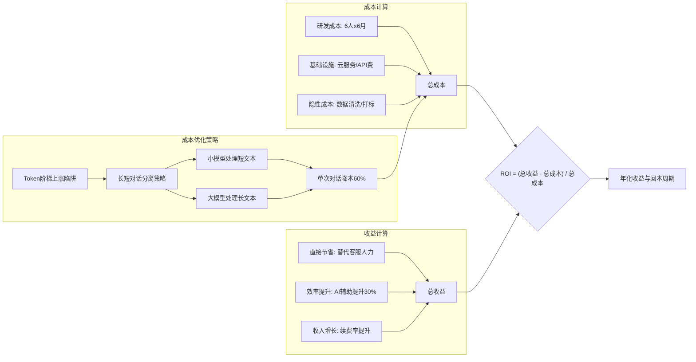
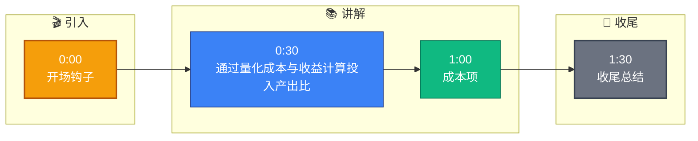

# 这个项目的 ROI 是怎么计算的

**Situation：** 面试官考察对业务价值的量化能力。
**Task：** 给出清晰的 ROI 计算逻辑。

**Action：**
1. **成本投入:**
   - **研发成本：** 6 人 × 6 个月 × 平均月薪 = X 万元。
   - **基础设施成本：** 云服务 + API 费用 = Y 万元/月。
   - **运维成本：** 1 人 × 月薪 = Z 万元/月。
   - **隐性成本（修正）：** 数据清洗与打标（2人月）、Prompt 迭代测试（0.5人月）。

2. **收益计算:**
   - **直接节省：** AI 替代 40% 客服人力 = N 人 × 月薪 = A 万元/月。
   - **效率提升：** 人工客服效率提升 30% (AI 提供上下文辅助) = B 万元/月。
   - **收入增长：** 客户满意度提升带来的续费率提升 = C 万元/月。

3. **ROI 公式:**
   \[ \text{ROI} = \frac{(\text{总收益} - \text{总成本})}{\text{总成本}} \times 100\% \]
   **典型值：** 6 个月回本，年化 ROI 约 200%。

**实战案例**：在做 ROI 预估时，我们曾忽略了 Token 成本随着用户量激增会呈“阶梯状”上涨（因为触发了更高的 API Tier）。后来我们在模型中引入了“长短对话分离策略”，简单问题用小模型（7B）本地跑，复杂问题才调用大模型（GPT-4），成功将单次对话成本降低了 60%。

**代码示例 (ROI 敏感性分析 - Python)**：
```python
roi_values = []
for growth_rate in [1.0, 1.5, 2.0]:  # 业务增长倍率
    cost = fixed_cost + (variable_cost_per_call * estimated_calls * growth_rate)
    revenue = saved_labor_cost * growth_rate
    roi = (revenue - cost) / cost
    roi_values.append(roi)
print(roi_values) # 验证不同增长规模下的盈利点
```

**Result：**
- 项目在第 7 个月实现回本。
- 年化 ROI 约 180%。
- 成功说服管理层持续投入 AI Agent 项目。

## 常见考点
1. **隐性成本计算**：除了云资源和人力，是否考虑了数据清洗打标的成本？这部分往往被低估，你是如何估算的？
2. **替代率验证**：如何证明 AI 替代了 40% 的人力？是基于对话量统计还是实际裁员/转岗数据？
3. **Token 成本陷阱**：随着用户量增长，LLM 的 API 调用成本会线性甚至超线性增长，在 ROI 模型中如何应对未来的成本上涨？
4. **A/B 测试验证**：在计算效率提升（30%）时，是否有做过严谨的 A/B 测试对比有 AI 辅助和没有 AI 辅助的客服团队？

## 流程图




## 记忆要点

- 成本项：研发+基建+运维+隐性成本(数据清洗/打标)
- 收益项：人力替代+效率提升+续费增长，需量化计算
- 公式：ROI = (总收益 - 总成本) / 总成本，典型年化 200%
- 避坑：Token 成本随量阶梯上涨，长短对话分离降本 60%


## 结构化回答

**30 秒电梯演讲：** 通过量化成本与收益计算投入产出比。——打个比方，做生意算账，花多少钱买菜能卖出多少利润。

**展开框架：**
1. **成本项** — 研发+基建+运维+隐性成本(数据清洗/打标)
2. **收益项** — 人力替代+效率提升+续费增长，需量化计算
3. **公式** — ROI = (总收益 - 总成本) / 总成本，典型年化 200%

**收尾：** 以上三点都能配合实战聊。您想深入聊哪一块？

## 视频脚本

> 预计时长：2 分钟 | 由浅入深

| 时间 | 画面/字幕 | 口播台词 | 讲解要点 |
|------|----------|----------|----------|
| 0:00 | 标题卡 | "这个项目的 ROI 是怎么计算的，30 秒讲清楚。" | 开场钩子 |
| 0:30 | 概念定义动画 | "一句话：通过量化成本与收益计算投入产出比。" | 核心定义 |
| 1:00 | 成本项图解 | "研发+基建+运维+隐性成本(数据清洗/打标)" | 成本项 |
| 1:30 | 总结卡 | "记好这几条，面试不慌。下期见。" | 收尾 |

### 视频流程图


