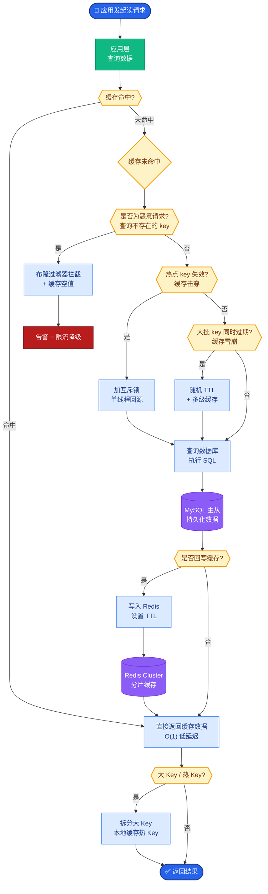
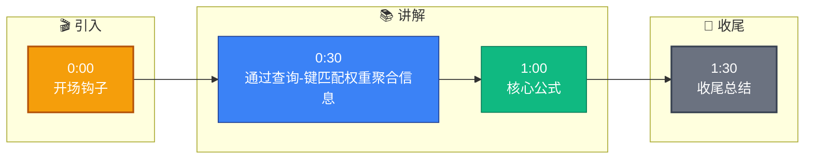

# Transformer 的 Self-Attention 怎么计算

**Self-Attention 的计算过程：**

1. **线性变换生成 Q、K、V：**
   \[ Q = X \cdot W_Q, \quad K = X \cdot W_K, \quad V = X \cdot W_V \]
   其中 $X$ 是输入序列的 embedding 矩阵 ($n \times d_{model}$)，$W_Q, W_K, W_V$ 是可学习参数矩阵。

2. **计算注意力分数：**
   \[ \text{Attention}(Q, K, V) = \text{softmax}\left(\frac{QK^T}{\sqrt{d_k}}\right)V \]
   - $QK^T$：计算每个 token 对其他所有 token 的相关性分数 ($n \times n$ 矩阵)。
   - $\sqrt{d_k}$：缩放因子，防止点积值过大导致 softmax 梯度消失 ($d_k = d_{model} / \text{num\_heads}$)。
   - softmax：归一化为概率分布。
   - 最终与 $V$ 相乘，得到加权后的输出。

3. **Multi-Head Attention：**
   多个 Head 并行计算，每个 Head 关注不同的语义子空间，最后拼接并通过线性变换。

4. **计算复杂度：** $O(n^2 \cdot d)$，其中 $n$ 是序列长度，$d$ 是维度。这是长序列处理的瓶颈。

5. **为什么 Self-Attention 有效：**
   - 能直接建模任意两个位置之间的依赖关系 (对比 RNN 的顺序传播)。
   - 计算可并行 (对比 RNN 的串行计算)。
   - 通过 Multi-Head 机制捕捉多种语义关系。

### Self-Attention 计算矩阵流
```text
输入 X (Seq_Len, d_model)
  │
  ├── W_Q ──▶ Q (Seq_Len, d_k)
  ├── W_K ──▶ K (Seq_Len, d_k)
  └── W_V ──▶ V (Seq_Len, d_v)
                  │
                  ▼
          ┌───────────────┐
          │ Scores = QK^T │  (Seq_Len, Seq_Len) - 相关性矩阵
          └───────┬───────┘
                  ▼
          ┌───────────────┐
          │ Scaling &     │  缩放因子 1/sqrt(d_k)
          │ Softmax       │  转为概率分布
          └───────┬───────┘
                  ▼
          ┌───────────────┐
          │ Output = SV   │  (Seq_Len, d_v)
          └───────────────┘
```

**实战案例**：在做长文本摘要任务时，标准 Attention 的 $O(N^2)$ 显存占用直接撑爆了 GPU。我们通过缓存 K/V 的 KV-Cache 技术将推理显存降低了 40%，但在训练阶段仍然不得不使用 FlashAttention 优化技术来加速。

**代码示例 (Scaled Dot-Product Attention - PyTorch)**：
```python
import torch
import torch.nn.functional as F

def scaled_dot_product(q, k, v, mask=None):
    d_k = q.size(-1)
    scores = torch.matmul(q, k.transpose(-2, -1)) / math.sqrt(d_k)
    if mask is not None:
        scores = scores.masked_fill(mask == 0, -1e9)
    p_attn = F.softmax(scores, dim=-1)
    return torch.matmul(p_attn, v), p_attn
```

## 常见考点
1. **为什么除以根号 d_k**：深入解释 softmax 的梯度特性，当点积很大时，梯度会趋近于 0，导致训练停滞。
2. **Positional Encoding**：Self-Attention 本身不具备位置信息（是 permutation invariant 的），Transformer 如何注入位置信息？（Sinusoidal vs Learnable）
3. **Mask 机制**：在 Decoder 阶段，如何通过 Mask 使得当前 token 只能看到之前的 token？（解释上三角矩阵掩码）
4. **复杂度优化**：针对 $O(N^2)$ 的问题，了解哪些优化方案？（如 FlashAttention 的 IO 光滑、Sparse Attention、Linear Attention 等）


## 核心流程图



## 记忆要点

- 核心公式：Softmax(QK^T / sqrt(d_k))V，计算相关性加权
- 缩放因子：除以根号 d_k 防止点积过大导致梯度消失
- 优势：并行计算+捕捉长距离依赖，对比 RNN 的串行瓶颈
- 复杂度：O(n^2)，长序列瓶颈，可用 FlashAttention 优化


## 结构化回答

**30 秒电梯演讲：** 通过查询-键匹配权重聚合信息，捕捉全局依赖。——打个比方，在聚会中每个人看一眼所有人，决定重点听谁说话。

**展开框架：**
1. **核心公式** — Softmax(QK^T / sqrt(d_k))V，计算相关性加权
2. **缩放因子** — 除以根号 d_k 防止点积过大导致梯度消失
3. **优势** — 并行计算+捕捉长距离依赖，对比 RNN 的串行瓶颈

**收尾：** 以上三点都能配合实战聊。您想深入聊哪一块？

## 视频脚本

> 预计时长：2 分钟 | 由浅入深

| 时间 | 画面/字幕 | 口播台词 | 讲解要点 |
|------|----------|----------|----------|
| 0:00 | 标题卡 | "Transformer 的 Self-Attention 怎么计算，30 秒讲清楚。" | 开场钩子 |
| 0:30 | 概念定义动画 | "一句话：通过查询-键匹配权重聚合信息，捕捉全局依赖。" | 核心定义 |
| 1:00 | 核心公式图解 | "Softmax(QK^T / sqrt(d_k))V，计算相关性加权" | 核心公式 |
| 1:30 | 总结卡 | "记好这几条，面试不慌。下期见。" | 收尾 |

### 视频流程图


