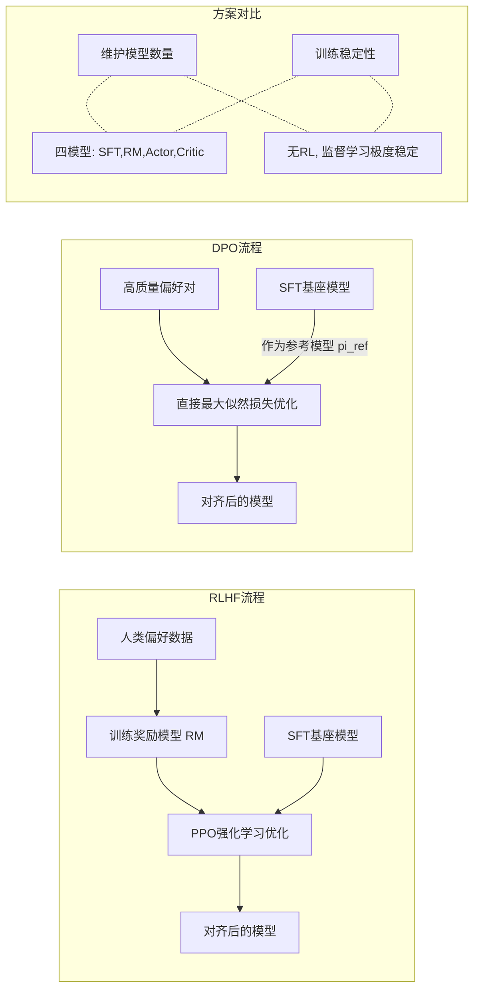
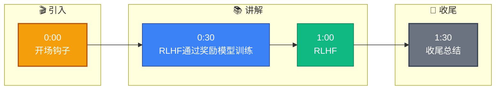

# RLHF 和 DPO 的区别

**1. RLHF (Reinforcement Learning from Human Feedback)：**
- **流程**：SFT (监督微调) → 训练 Reward Model (RM) → PPO 优化
  - **SFT**：用高质量指令数据做监督微调，让模型学会听懂指令。
  - **Reward Model**：收集人类偏好数据 (Prompt -> Output A, Output B，标注哪个更好)，训练一个奖励模型来模拟人类打分。
  - **PPO (Proximal Policy Optimization)**：用 PPO 算法优化策略模型，生成回答，通过 RM 打分，利用梯度上升最大化奖励，同时限制策略不要偏离 SFT 模型太远（KL 散度约束）。
- **优点**：效果理论基础扎实，是 ChatGPT 等模型使用的方法，能有效对齐人类价值观。
- **缺点**：
  - 流程极其复杂（需要训练 SFT, RM, Actor, Critic 四个模型）。
  - PPO 训练不稳定，超参数多，难以调优。
  - 需要构建 Reward Model，对偏好数据量要求大。

**2. DPO (Direct Preference Optimization)：**
- **核心思想**：跳过显式的 Reward Model 和强化学习循环，直接从偏好数据优化策略模型。数学上利用了最优策略的解析解，将 RLHF 的目标函数转化为一个简单的最大似然损失。
- **原理简述**：不需要训练 RM，而是使用一个冻结的 SFT 模型作为参考模型 ($\pi_{ref}$)。DPO 最大化偏好回答 ($y_w$) 相对拒绝回答 ($y_l$) 的对数几率，同时限制模型不远离参考模型。
- **损失函数**：
  $$ L_{DPO} = -\log \sigma\left(\beta(\log \frac{\pi(y_w|x)}{\pi_{ref}(y_w|x)} - \log \frac{\pi(y_l|x)}{\pi_{ref}(y_l|x)})\right) $$
  其中 $y_w$ 是偏好回答，$y_l$ 是不偏好回答，$\beta$ 是温度系数（用于控制偏离参考模型的程度）。
- **优点**：
  - 简单：只需训练一个模型（Actor），无需 RM，无需 PPO。
  - 稳定：本质上是监督学习，避免了 RL 的训练不稳定性。
  - 效果好：在许多开源基准测试中，DPO 表现优于或等同于 RLHF。
  - 超参少：主要调节 $\beta$。
- **缺点**：
  - 依赖高质量的偏好数据对（噪音数据影响较大）。
  - 缺乏显式的奖励模型，导致难以在训练过程中监控“奖励”的变化。

```text
RLHF 流程:
Data -> [SFT Model] -> [Prompts] -> Gen Samples -> Human Label -> [Reward Model]
                                                              ^
                                                              |
                                        (PPO Training Loop) ---┘

DPO 流程:
Data (Prompt, Chosen, Rejected) -> [DPO Loss] -> Update Policy (SFT Model)
```

**3. 对比总结：**

| 特性 | RLHF | DPO |
| :--- | :--- | :--- |
| **核心流程** | SFT -> RM -> PPO (三步走) | SFT -> DPO (两步走) |
| **是否需要 Reward Model** | 是 (需单独训练) | 否 (利用隐式奖励) |
| **训练稳定性** | 较低 (RL 难以收敛，需调参) | 高 (类似 SFT，易收敛) |
| **实现复杂度** | 高 (需维护 Actor, Critic, RM) | 低 (仅需修改 Loss Function) |
| **计算资源消耗** | 大 (需生成样本 & 多模型推理) | 中 (主要是前向计算) |
| **数据偏好** | 对噪音有一定鲁棒性 | 对噪音数据极敏感 |

**4. 实际选择：**
大多数场景下推荐 **DPO**，因为工程实现简单、效果接近甚至优于 RLHF。RLHF 主要在以下情况考虑：
- 需要显式的奖励分数用于监控或其他任务。
- 追求极致的对齐效果且有充足的工程资源进行调参。
- 需要 Off-policy 学习（DPO 本质是 On-policy，虽然也可以改造）。

**## 实战补充**

*   **实战案例**：在微调 7B 模型时，使用 DPO 偶尔会遇到模型“诡异简化”问题（例如用户问写代码，模型只输出“这是代码”但不写正文）。这通常是因为偏好数据中 chosen 样本过于简短，导致 DPO 优化了“简短回复”而非“正确回复”。RLHF 因有 RM 的客观打分，对此类陷阱稍好防御，但 DPO 需严格清洗数据。
*   **代码示例** (PyTorch 风格简化版 DPO Loss 计算):
```python
import torch
import torch.nn.functional as F

def dpo_loss(policy_chosen_logps, policy_rejected_logps, 
             reference_chosen_logps, reference_rejected_logps, beta=0.1):
    """计算 DPO 损失
    policy_logps: 当前策略模型的对数概率
    reference_logps: 冻结的参考模型的对数概率
    """
    # 计算隐式奖励差异
    # (pi_logps - ref_logps) 代表相对 SFT 的提升幅度
    pi_diff = policy_chosen_logps - policy_rejected_logps
    ref_diff = reference_chosen_logps - reference_rejected_logps
    
    # DPO 目标：chosen 的 (pi-ref) 差值 要大于 rejected 的
    loss = -F.logsigmoid(beta * (pi_diff - ref_diff)).mean()
    return loss
```

**## 常见考点**
1. **参考模型的作用**：DPO 中的 $\pi_{ref}$ 起什么作用？如果不加会怎样？
   - *答案*：$\pi_{ref}$ 提供了基线，防止模型在优化过程中坍缩（例如只生成简短重复的答案来最大化似然）或偏离原始语言模型的能力过远。如果不加，模型可能会通过生成高概率但低信息量的词（如无止尽的“是”）来欺骗 Loss 函数。

## 流程图




## 记忆要点

- RLHF：SFT -> 训练奖励模型(RM) -> PPO 优化，流程复杂但理论稳
- DPO：跳过 RM 和 RL，直接用偏好数据优化策略，简单且稳定
- 对比：RLHF 需维护四模型，DPO 只需训练一个，超参少
- 选择：首选 DPO，需显式奖励分数或极致对齐时选 RLHF


## 结构化回答

**30 秒电梯演讲：** RLHF通过奖励模型训练，DPO直接优化偏好对。——打个比方，RLHF像请评委打分再改进，DPO直接看哪个表现好就学哪个。

**展开框架：**
1. **RLHF** — SFT -> 训练奖励模型(RM) -> PPO 优化，流程复杂但理论稳
2. **DPO** — 跳过 RM 和 RL，直接用偏好数据优化策略，简单且稳定
3. **对比** — RLHF 需维护四模型，DPO 只需训练一个，超参少

**收尾：** 以上三点都能配合实战聊。您想深入聊哪一块？

## 视频脚本

> 预计时长：2 分钟 | 由浅入深

| 时间 | 画面/字幕 | 口播台词 | 讲解要点 |
|------|----------|----------|----------|
| 0:00 | 标题卡 | "RLHF 和 DPO 的区别，30 秒讲清楚。" | 开场钩子 |
| 0:30 | 概念定义动画 | "一句话：RLHF通过奖励模型训练，DPO直接优化偏好对。" | 核心定义 |
| 1:00 | RLHF图解 | "SFT -> 训练奖励模型(RM) -> PPO 优化，流程复杂但理论稳" | RLHF |
| 1:30 | 总结卡 | "记好这几条，面试不慌。下期见。" | 收尾 |

### 视频流程图


