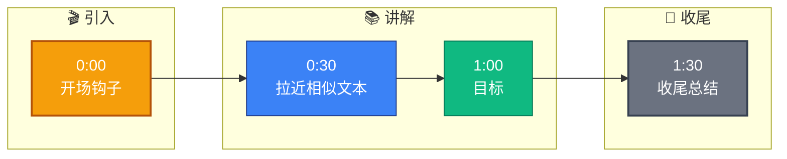

# Embedding 模型是怎么训练的?对比学习怎么做的

**1. 训练目标：**
让语义相似的文本在向量空间中距离更近，语义不同的文本距离更远。核心在于将文本映射到高维实数向量空间，通过距离度量（通常是余弦相似度）反映语义相关性。

**2. 对比学习架构与流程：**
对比学习通常采用双塔架构，分别处理 Query 和 Document，通过最大化正样本对相似度、最小化负样本对相似度来优化模型。

```text
      Query Tower                Document Tower
   (Input: Query)             (Input: Doc+ / Doc-)
         │                           │
         ▼                           ▼
   [ Encoder(BERT) ]         [ Encoder(BERT) ]
(共享权重或独立参数)         (通常共享权重参数)
         │                           │
         ▼                           ▼
   Vector_Emb(d)            Vector_Emb(d1, d2...)
         │                           │
         └─────────┬─────────────────┘
                   │
                   ▼
         [ Similarity Calculation ]
     (Cosine Similarity: q · d / ||q|| ||d||)
                   │
                   ▼
          [ InfoNCE Loss Function ]
          (计算 Loss 并反向传播)
```

**3. InfoNCE 损失函数细节：**
InfoNCE 本质上是一个 $N+1$ 分类问题，旨在区分 1 个正样本和 $N$ 个负样本。
$$ L = -\log \frac{\exp(\text{sim}(q, k^+)/\tau)}{\sum_{i=0}^{N} \exp(\text{sim}(q, k_i)/\tau)} $$
- $\text{sim}(u, v)$：余弦相似度，$\frac{u \cdot v}{\|u\| \|v\|}$，范围 [-1, 1]，经过温度系数缩放。
- $\tau$ (Temperature)：温度参数。
  - $\tau \to 0$：分布变得尖锐，模型更关注难分样本，可能过拟合。
  - $\tau \to \infty$：分布变得平滑，梯度消失，模型难以收敛。通常取值 0.01 ~ 0.1。
- 分母求和：包含 1 个正样本 $k^+$ 和 $N$ 个负样本 $k_i$。

**4. 负样本策略与数据流：**

```text
Batch Input: [Q1, Q2, Q3, Q4] (Batch Size = 4)
     │
     ├─> Q1 Target: D1 (Pos) ──┐
     │                        │
     ├─> Q2 Target: D2 (Pos) ──┤
     │                        ├──> In-batch Negatives Pool
     ├─> Q3 Target: D3 (Pos) ──┤     (对于 Q1: D2, D3, D4 为负样本)
     │                        │
     └─> Q4 Target: D4 (Pos) ──┘

Hard Negatives Mining:
通过弱模型检索或规则挖掘得到的“看起来很像但其实不同”的样本。
例如：Query: "苹果手机价格"
      Pos: "iPhone 15 Pro 报价"
      Hard Neg: "苹果 15 英寸 MacBook 价格" (主题相关但意图不符)
```

- **In-batch Negatives：** 利用 GPU 并行计算特性，Batch 内其他样本的正样本自动作为当前样本的负样本，无需额外 IO。
- **Hard Negatives：**
  - **False Negative 风险：** 如果挖掘到的负样本实际上是正样本（语义相同），模型会学习错误的约束，导致效果下降。需要人工校验或去重。

### 实战深化

**实战案例：**
在电商搜索排序优化中，我们发现简单的 In-batch Negatives 对提升长尾查询的效果有限。引入基于 BM25 挖掘的难负样本后，模型能更好地区分“新款 iPhone”和“二手 iPhone”，但也遇到了模型崩塌的问题，原因是负样本中混入了标注错误的正样本（False Negatives），导致 Loss 爆炸。

**代码示例：**
```python
# 伪代码：InfoNCE Loss 计算
import torch
import torch.nn.functional as F

def info_nce_loss(q, k, temperature=0.05):
    # q: [batch, dim], k: [batch, dim] (正样本)
    # 归一化向量
    q = F.normalize(q, dim=1)
    k = F.normalize(k, dim=1)
    
    # 计算相似度矩阵 [batch, batch]
    logits = torch.mm(q, k.transpose(0, 1)) / temperature
    
    # 标签：对角线为正样本 (0, 1, ..., batch-1)
    labels = torch.arange(logits.size(0), device=q.device)
    
    # 交叉熵损失
    loss = F.cross_entropy(logits, labels)
    return loss
```

**对比表格：负样本策略选型**
| 策略 | 实现难度 | 训练效果 | 计算开销 | 适用场景 |
| :--- | :--- | :--- | :--- | :--- |
| **In-batch Negatives** | 低 (免费获取) | 基准效果 | 低 | 通用预训练，大规模 Batch 训练 |
| **Random Negatives** | 低 | 较差 (太容易区分) | 低 | 冷启动，数据极度匮乏 |
| **Hard Negatives** | 高 (需挖掘) | 极高 (提升区分度) | 高 (需预处理) | 精排模型，语义相似度要求高 |
| **Curriculum Learning** | 中 | 稳定 (渐进式) | 中 | 解决 Hard Negatives 带来的训练不稳定性 |


## 核心流程图

```mermaid
flowchart TD
    Start([🚀 SpringBoot 启动<br/>main 方法]):::start
    SpringApplication[SpringApplication.run<br/>启动入口]:::process
    PrepareEnv[准备 Environment<br/>加载 application.yml]:::process
    ContextQ{{应用上下文?<br/>Servlet/Reactive}}:::decision
    ServletCtx[AnnotationConfigCtx<br/>传统 MVC]:::process
    ReactiveCtx[ReactiveWebCtx<br/>WebFlux]:::process
    Refresh[refresh 刷新容器<br/>核心入口]:::process
    BeanFactory[BeanFactory<br/>IoC 容器]:::store
    BeanDef[BeanDefinition<br/>扫描 @Component/@Bean]:::process
    ScanQ{{配置方式?<br/>注解/XML}}:::decision
    AnnoScan[ComponentScan<br/>ClassPathBeanDefinitionScanner]:::process
    XmlScan[XmlBeanDefinitionReader<br/>解析 XML]:::process
    Instantiate[实例化 Bean<br/>反射 newInstance]:::process
    Populate[属性填充<br/>依赖注入 @Autowired]:::process
    AwareQ{{实现 Aware 接口?}}:::decision
    Aware[BeanNameAware / ContextAware<br/>回调注入]:::process
    InitQ{{自定义初始化?}}:::decision
    PostConstruct[@PostConstruct<br/>初始化方法]:::process
    AOPQ{{需要 AOP 增强?<br/>切面 @Aspect}}:::decision
    Proxy[创建动态代理<br/>JDK/CGLIB]:::process
    ProxyChain[代理链<br/>MethodInvocation]:::process
    Final([✅ Bean 就绪 可用]):::start

    Start --> SpringApplication --> PrepareEnv --> ContextQ
    ContextQ -->|传统| ServletCtx --> Refresh
    ContextQ -->|响应式| ReactiveCtx --> Refresh
    Refresh --> BeanFactory --> BeanDef --> ScanQ
    ScanQ -->|注解| AnnoScan --> Instantiate
    ScanQ -->|XML| XmlScan --> Instantiate
    Instantiate --> Populate --> AwareQ
    AwareQ -->|是| Aware --> InitQ
    AwareQ -->|否| InitQ
    InitQ -->|是| PostConstruct --> AOPQ
    InitQ -->|否| AOPQ
    AOPQ -->|是| Proxy --> ProxyChain --> Final
    AOPQ -->|否| Final

    classDef start fill:#2563eb,stroke:#1e3a8a,color:#fff,stroke-width:2px;
    classDef process fill:#dbeafe,stroke:#3b82f6,color:#1e3a8a;
    classDef decision fill:#fef3c7,stroke:#f59e0b,color:#78350f,stroke-width:2px;
    classDef store fill:#8b5cf6,stroke:#6d28d9,color:#fff;

```

## 记忆要点

- 目标：拉近正样本距离，推远负样本距离，优化向量空间
- 架构：双塔结构，InfoNCE Loss 本质是 N+1 分类问题
- 负样本：In-batch Negatives 利用并行，Hard Negatives 提升区分度
- 参数：温度系数 Tau 控制分布平滑度，通常取 0.01~0.1


## 结构化回答

**30 秒电梯演讲：** 拉近相似文本，推远不相似文本，学习向量表示。——打个比方，把意思相近的书放同一个书架，意思远的分开。

**展开框架：**
1. **目标** — 拉近正样本距离，推远负样本距离，优化向量空间
2. **架构** — 双塔结构，InfoNCE Loss 本质是 N+1 分类问题
3. **负样本** — In-batch Negatives 利用并行，Hard Negatives 提升区分度

**收尾：** 以上三点都能配合实战聊。您想深入聊哪一块？

## 视频脚本

> 预计时长：2 分钟 | 由浅入深

| 时间 | 画面/字幕 | 口播台词 | 讲解要点 |
|------|----------|----------|----------|
| 0:00 | 标题卡 | "Embedding 模型是怎么训练的，30 秒讲清楚。" | 开场钩子 |
| 0:30 | 概念定义动画 | "一句话：拉近相似文本，推远不相似文本，学习向量表示。" | 核心定义 |
| 1:00 | 目标图解 | "拉近正样本距离，推远负样本距离，优化向量空间" | 目标 |
| 1:30 | 总结卡 | "记好这几条，面试不慌。下期见。" | 收尾 |

### 视频流程图


