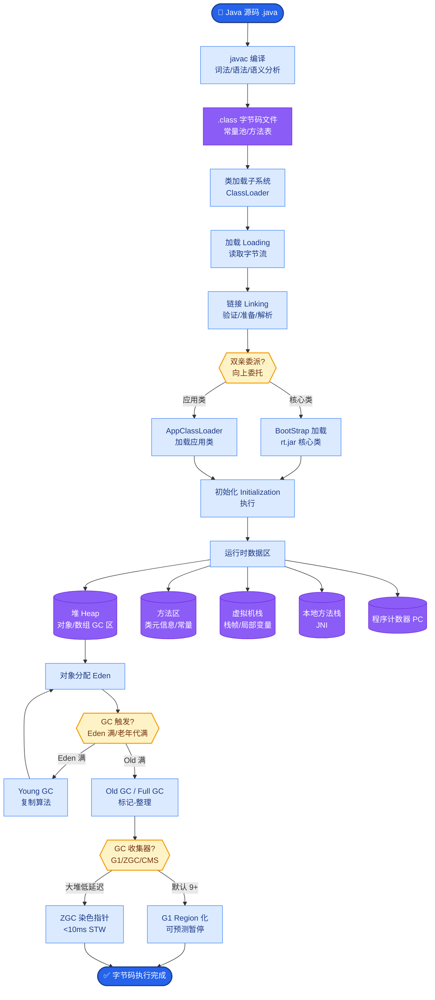

# 大模型的 Context Window 限制怎么突破

**回答：**

**1. 当前主流模型的 Context Window：**
- GPT-4o：128K
- Claude 3.5：200K
- Gemini 1.5 Pro：2M
- Qwen2.5：128K

**2. 长上下文的挑战：**
- **"Lost in the Middle" 现象**：模型对中间位置的信息关注度低，更倾向于关注开头和结尾。
- **计算成本**：Attention 机制的显存占用和计算量随序列长度平方增长 ($O(n^2)$)。
- **效果衰减**：即使模型支持长上下文，实际效果在超长文本（如 >100k）时会出现"大海捞针"失败率上升。

**3. 突破方法：**
- **RAG (最推荐)**：不把所有信息放入 context，只检索最相关的部分。大幅降低成本并提高准确性。
- **Map-Reduce**：
    - Map：将长文本分块，并行让 LLM 处理每个块。
    - Reduce：将 Map 的结果汇总，再次由 LLM 整合。
- **滑动窗口 + 摘要**：保留最近窗口的完整内容，历史内容用摘要替代。适合多轮对话历史记忆。
- **Recursive Summarization**：递归摘要长文本。先总结段落，再总结章节，最后总结全书。

**4. 工程实践中的策略：**
- 优先使用 RAG，只将最相关的 5 个 chunk 放入 context，并计算 RAG 的置信度。
- 长文档分析时使用 Map-Reduce 避免单次 Context 溢出。
- 多轮对话使用滑动窗口 + 摘要压缩，控制 Prompt 总 Token 数。
- **位置优化**：尽量将关键信息（如指令、检索到的关键证据）放在 context 的开头和结尾 (利用 primacy/recency bias)。

---

### 深化补充

**实战案例**：
在做企业级知识库问答时，曾遇到把全量 500 页操作手册塞入 128K Context 导致模型“胡言乱语”且 Latency 高达 30s 的问题。后改用 RAG（检索 Top-5 相关片段），Latency 降至 1.5s，且准确率从 60% 提升至 90%。**踩坑点**：RAG 召回存在误差，对于需要全文档理解的“总结全文”类任务，单纯 RAG 会遗漏关键信息，此时必须结合 Long Context 进行验证。

**代码示例 (Python - LangChain 滑动窗口摘要)**：
```python
from langchain.chains.summarize import load_summarize_chain
from langchain.docstore.document import Document

# 模拟长文档分片
docs = [Document(page_content=f"Segment {i} content...") for i in range(100)]

# 使用 Map-Reduce 模式处理长文本，突破单次 Context 限制
chain = load_summarize_chain(llm, chain_type="map_reduce")

# 自动将 docs 分发给 LLM 处理(Map)，然后汇总(Reduce)
summary = chain.run(docs)
```

**对比表格 (RAG vs Long Context)**：

| 维度 | RAG (检索增强) | Long Context (长上下文) |
| :--- | :--- | :--- |
| **成本** | 低 (仅处理相关片段) | 高 (Attention O(n^2)) |
| **时效性** | 高 (易更新向量库) | 低 (需重新训练/微调) |
| **准确性** | 依赖检索质量，可能遗漏 | 理论全局信息无遗漏 |
| **适用场景** | 事实问答、知识库搜索 | 全文摘要、代码分析、复杂推理 |
| **延迟** | 毫秒级~秒级 | 秒级甚至更高 |

```text
Strategy: RAG vs Long Context

      ┌──────────────────┐
      │  Raw Data (Docs) │
      └────────┬─────────┘
               │
      ┌────────▼─────────┐      ┌───────────────────────┐
      │ Indexing (Embed) │      │ Direct Context Input  │
      └────────┬─────────┘      │ (Limited Capacity)     │
               │               └───────────┬───────────┘
      ┌────────▼─────────┐                  │
      │ Vector Search    │                  │
      └────────┬─────────┘                  │
               │                           │
      ┌────────▼─────────┐                  │
      │ Top-k Chunks    │                  │
      └────────┬─────────┘                  │
               │                           │
               └───────────┬───────────────┘
                           │
                ┌──────────▼───────────┐
                │       LLM Context    │
                │ [System] + [Query]   │
                │ + [Chunks/Full Text]│
                └──────────────────────┘
```

**## 常见考点**
1. **RAG vs Long Context 的选择**：何时用长窗口模型？（如需要全局连贯性、改写全文）；何时用 RAG？（如事实问答、知识库检索）。二者是否可以结合？（Yes, RAG + Long Context 用于验证）。
2. **KV Cache 优化**：在长上下文推理中，KV Cache 占用大量显存，有哪些优化手段？（如 PagedAttention


## 核心流程图



## 记忆要点

- 核心挑战：Attention计算量O(n²)及Lost in the Middle现象
- 首选方案RAG：只检索相关片段，降本且提效
- 长文处理：Map-Reduce分块并行，滑动窗口用摘要替代历史
- 位置优化：关键指令放首尾，利用首尾效应提升关注度


## 结构化回答

**30 秒电梯演讲：** 结合RAG、摘要和窗口策略绕过长度限制。——打个比方，书太厚记不住，只看目录找重点章节，或者看每章的总结。

**展开框架：**
1. **核心挑战** — Attention计算量O(n²)及Lost in the Middle现象
2. **首选方案RAG** — 只检索相关片段，降本且提效
3. **长文处理** — Map-Reduce分块并行，滑动窗口用摘要替代历史

**收尾：** 以上三点都能配合实战聊。您想深入聊哪一块？

## 视频脚本

> 预计时长：2 分钟 | 由浅入深

| 时间 | 画面/字幕 | 口播台词 | 讲解要点 |
|------|----------|----------|----------|
| 0:00 | 标题卡 | "大模型的 Context Window 限制怎么突破，30 秒讲清楚。" | 开场钩子 |
| 0:30 | 概念定义动画 | "一句话：结合RAG、摘要和窗口策略绕过长度限制。" | 核心定义 |
| 1:00 | 核心挑战图解 | "Attention计算量O(n²)及Lost in the Middle现象" | 核心挑战 |
| 1:30 | 总结卡 | "记好这几条，面试不慌。下期见。" | 收尾 |
